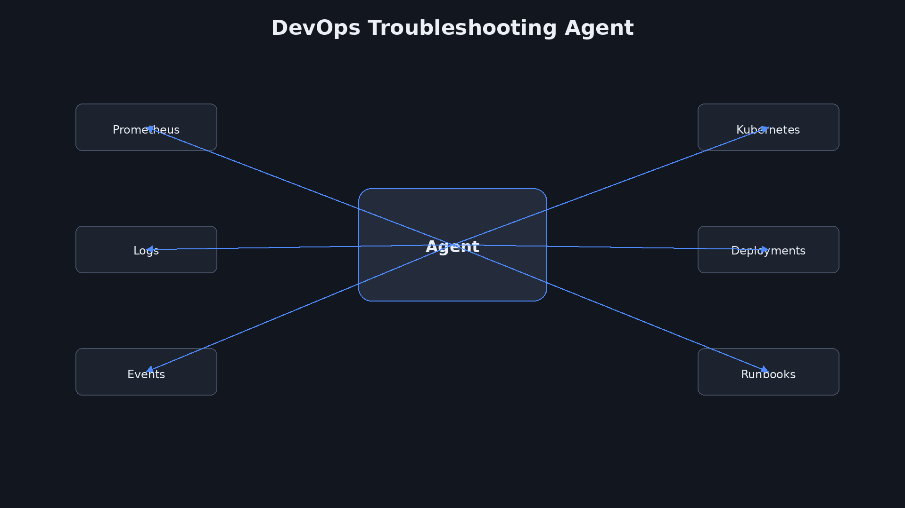
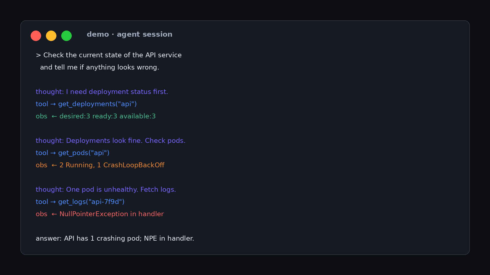
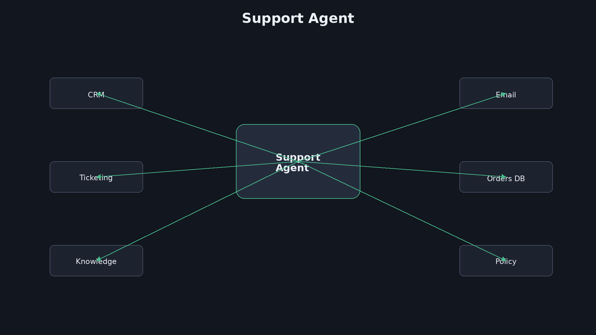
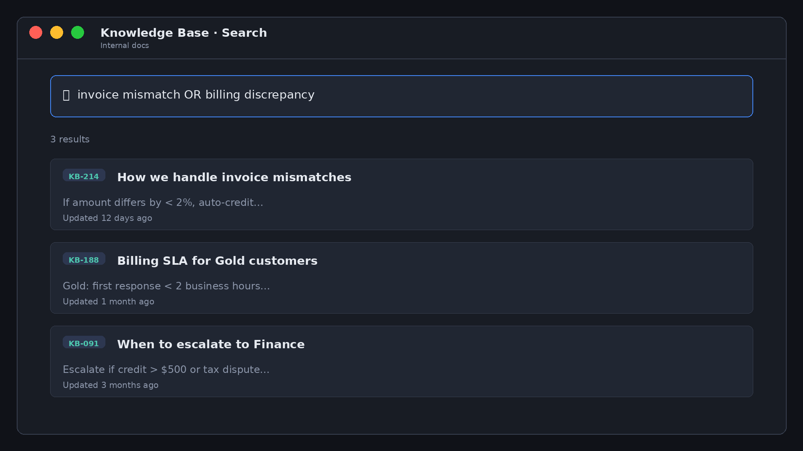

<div dir="rtl">

# מפגש 1 — מבוא לסוכני AI ו-Agentic Workflows
## קובץ מרצה (תסריט מלא להקלטה)

> **משך מיועד:** כ־2.5–3 שעות תוכן מוקלט + עצירות, הדגמות, שאלות ותרגילים  
> **מיקום בקורס:** מפגש 1 מתוך 10  
> **מטרת המפגש:** להבין מהו AI Agent, במה הוא שונה מצ׳אטבוט או Workflow רגיל, איך נראה Agentic Loop, ואיך לחשוב על אוטונומיה, כלים ובקרה.  
> **מצגת סטודנטים:** [`01-students-slides.md`](01-students-slides.md)  
> **נכסים:** `assets/01/`

> **הערת הקלטה:** צילומי המסך להדגמות נמצאים ב־`assets/screens/`.  
> בהקלטה עברו ביניהם לפי סדר ה־Agent Loop.  
> יצירה מחדש: `python3 scripts/gen_mock_uis.py`

# הנחיות למרצה

בהקלטה: **מקריאים מכאן** ומציגים במקביל את [`01-students-slides.md`](01-students-slides.md).

הסימון **`[סטודנטים · N]`** = עברו לשקופית N במצגת הסטודנטים.  
מספור המרצה (שקופית 1…101) מפרק את ההקראה; מספור הסטודנטים הוא מה שעל המסך בהקלטה.

המסמך בנוי כמו מצגת־תסריט. הטקסט שמתחת לכותרות מיועד להקראה, עם פסקאות קצרות לנשימה ומעברי מצלמה.

- **[סטודנטים · N]** — שקופית N במצגת הסטודנטים.
- **[מצלמה]** — הצעה לצילום/מעבר זווית.
- **[תמונה]** — תמונה או דיאגרמה להצגה.
- **[הדגמה]** — מעבר למסך או לקוד.
- **[שאלה]** — שאלה לקהל.
- **[עצירה]** — מקום טבעי לעצירה.
- **[תרגיל]** — פעילות קצרה.
- **[B-ROLL]** — ויזואל שרץ בזמן ההסבר.

---

# חלק א׳ — פתיחה: למה בכלל מדברים על Agents?

## שקופית 1 — הכותרת

[סטודנטים · 1]

**על המסך:**

> AI Agents ומערכות אוטונומיות  
> מפגש 1: להבין מהו Agent ומה הופך Workflow ל-Agentic


> אדם במרכז, ולידו מערכת AI שמחוברת ל־Email, Database, CRM, Web ו־Calendar.


## שקופית 2 — פתיחה להקראה

[סטודנטים · 2]

[מצלמה: פריים בינוני. להתחיל בלי שקופית, ואז לעבור לכותרת.]

כשאנחנו שומעים היום את המילה AI, רוב הסיכויים שאנחנו חושבים על משהו כמו ChatGPT.

אנחנו כותבים שאלה.

המערכת חושבת.

היא מחזירה תשובה.

ואז אנחנו שואלים משהו נוסף.

עוד תשובה.

זה מודל מאוד שימושי. למעשה, הוא שינה את הדרך שבה אנשים מחפשים מידע, כותבים טקסט, מנתחים מסמכים ואפילו כותבים קוד.

אבל היום אנחנו הולכים לקחת צעד אחד קדימה.

כי יש הבדל גדול בין מערכת שיודעת **לענות לי** לבין מערכת שיודעת **לעבוד בשבילי**.

וזה בערך הרעיון שמאחורי AI Agents.

[עצירה]

במקום להגיד למערכת:

״סכם לי את המייל הזה״,

אני יכול להגיד:

״בדוק את המיילים שקיבלתי היום, מצא את הדברים שדורשים ממני פעולה, סדר אותם לפי דחיפות, בדוק האם יש מידע נוסף במערכת ה־CRM, והכן לי רשימת משימות.״

עכשיו כבר לא ביקשתי תשובה אחת.

נתתי מטרה.

וזה הבדל מאוד חשוב.

## שקופית 3 — תשובה מול משימה

[סטודנטים · 3]


| מערכת קלאסית | Agent |
|---|---|
| ״ענה לי״ | ״בצע עבורי״ |
| פעולה בודדת | סדרת פעולות |
| קלט → פלט | מטרה → תהליך |
| לרוב ללא כלים | שימוש בכלים |
| מעט החלטות ביניים | החלטות במהלך הביצוע |
| המשתמש מנהל את התהליך | המערכת מנהלת חלק מהתהליך |

תחשבו על עובד אנושי.

אם אני אומר לעובד:

״תחשב לי כמה עלו ההוצאות בחודש יוני״,

זו משימה די סגורה.

אבל אם אני אומר:

״תבדוק למה ההוצאות שלנו עלו בחודש יוני ותכין לי הצעה איך להוריד אותן״,

זו כבר משימה הרבה יותר פתוחה.

העובד צריך להחליט מה לבדוק.

אולי הוא יפתח דוחות.

אולי יסתכל על חשבוניות.

אולי ישווה למאי.

אולי ישאל מישהו.

אולי יגלה שהסיבה היא ספק מסוים.

כלומר, נתתי לו מטרה — לא הוראות שלב־אחר־שלב.

Agent מנסה לעשות משהו דומה.

## שקופית 4 — ארבעת הרעיונות הראשונים

[סטודנטים · 4]

**על המסך:**

> **Goal → Decide → Act → Observe**

זה המשפט הראשון שכדאי לזכור בקורס הזה.

Agent מקבל מטרה.

הוא מחליט מה לעשות.

הוא מבצע פעולה.

הוא רואה מה קרה.

ואז הוא מחליט אם להמשיך או לעצור.


```text
GOAL → DECIDE → ACT → OBSERVE → CONTINUE? → DECIDE / DONE
```

---

# חלק ב׳ — לפני Agents: מה LLM לבד באמת עושה?

## שקופית 5 — Prompt → LLM → Response

[סטודנטים · 5]

**על המסך:**

```text
User
  |
  v
Prompt
  |
  v
LLM
  |
  v
Response
```

לפני שאנחנו בונים Agents, צריך להבין למה בכלל צריך אותם.

LLM בפני עצמו לא בהכרח יודע לבצע פעולה בעולם החיצוני.

הוא יודע לייצר פלט.

טקסט.

קוד.

סיכום.

המלצה.

JSON.

אבל כדי שהפלט הזה יהפוך לפעולה, אנחנו צריכים לחבר אותו למשהו.

ופה נכנסים Tools.

אבל לפני Tools, בואו נראה את המודל הכי בסיסי.

## שקופית 6 — למה LLM לבד מוגבל?

נניח שאני אומר:

״מצא לי את כל הלקוחות שלא שילמו החודש.״

LLM שמקבל רק את המשפט הזה לא באמת יכול לדעת מי לא שילם.

למה?

כי המידע נמצא כנראה במערכת אחרת.

ב־ERP.

ב־Database.

ב־CRM.

או אולי בקובץ.

המודל יכול להסביר איך לבצע את החיפוש.

הוא אפילו יכול לכתוב שאילתה.

אבל הוא לא בהכרח יכול לבצע אותה.

עכשיו נוסיף כלי.

## שקופית 7 — LLM + Tool

[סטודנטים · 6]


**על המסך:**

```text
             ┌───────────────┐
User ───────→│      LLM      │
             └───────┬───────┘
                     │
                 Tool Call
                     │
                     v
             ┌───────────────┐
             │   Database    │
             └───────┬───────┘
                     │
                   Result
                     │
                     v
             ┌───────────────┐
             │      LLM      │
             └───────────────┘
```

עכשיו משהו מעניין קורה.

המודל לא חייב לדעת את הנתונים מראש.

הוא יכול לבקש ממערכת חיצונית להביא אותם.

למשל:

״אני צריך רשימת לקוחות עם חוב פתוח.״

האפליקציה שלנו מתרגמת את ההחלטה הזאת לקריאה ל־API או ל־Database.

ה־Database מחזיר מידע.

והמידע חוזר למודל.

עכשיו המודל יכול להמשיך.

זה כבר הרבה יותר קרוב ל־Agent.

## שקופית 8 — מה באמת עושה ה־LLM?

[סטודנטים · 7]

חשוב להפריד בין שני דברים.

ה־LLM בדרך כלל לא ״מבצע״ בעצמו את הפעולה.

הוא יכול להחליט:

> ״אני רוצה לקרוא ל־get_customer.״

אבל האפליקציה שלנו היא זאת שמבצעת בפועל את הקריאה.

זו הבחנה חשובה מאוד בארכיטקטורה.

מי מוודא שהכלי קיבל פרמטרים נכונים?

מי בודק הרשאות?

מי מוודא שאי אפשר למחוק Database?

מי עושה Retry?

מי מגביל כמה פעמים Agent יכול לקרוא לכלי?

מי מתעד מה קרה?

מי עוצר לולאה אינסופית?

לא ה־LLM לבדו.

זו אחריות המערכת.

---

# חלק ג׳ — Workflow מול Agent

## שקופית 9 — שתי מילים שמבלבלות

[סטודנטים · 8]


> **Workflow**
>
> **Agent**

אחד הדברים הכי חשובים בקורס הזה הוא לא להשתמש במילה Agent על כל דבר.

לא כל אוטומציה היא Agent.

לא כל Workflow עם LLM הוא Agent.

ולפעמים בכלל לא צריך Agent.

## שקופית 10 — Workflow

תחשבו על Workflow כמו מתכון.

יש לנו סדר פעולות ידוע.

לדוגמה:

1. קבל מסמך.
2. חלץ ממנו טקסט.
3. שלח אותו ל־LLM.
4. קבל סיכום.
5. שמור את הסיכום ב־Database.
6. שלח Email.

הכול מוגדר מראש.

המערכת לא באמת צריכה להחליט מה לעשות.

היא פשוט מבצעת סדרת צעדים שתכננו.

זה חשוב.

יש כאן אוטומציה.

יש כאן AI.

אולי אפילו יש כאן LLM.

אבל לא בהכרח יש כאן Agent.

## שקופית 11 — Agent

עכשיו נשנה את הדרישה.

במקום:

״כל פעם שמגיע מסמך, תעשה בדיוק את ששת השלבים האלה.״

נגיד:

> ״טפל במסמך שהגיע והכן את הפעולות הנדרשות.״

עכשיו המערכת צריכה להבין מה יש במסמך.

אולי היא תחליט שזה מסמך חשבונית.

אולי תחפש מידע נוסף.

אולי תגלה שחסר מספר הזמנה.

אולי תחליט שצריך אישור של בן אדם.

הסדר כבר לא בהכרח קבוע.

המערכת צריכה לקבל החלטות.

זה כבר הרבה יותר Agentic.

## שקופית 12 — הגדרה שימושית

> **Agent = מערכת שמקבלת מטרה ויכולה לבחור פעולות כדי להגיע לתוצאה, תוך שימוש בהקשר, בכלים ומשוב מהעולם.**

Agent הוא לא LangChain.

Agent הוא לא CrewAI.

Agent הוא לא GPT.

כל אלה יכולים להיות חלק ממערכת Agentic.

אבל הרעיון הבסיסי הוא:

**מטרה → החלטות → פעולות → תצפיות → המשך או עצירה.**

# חלק ד׳ — רמות אוטונומיה (AI Agent Spectrum)

עכשיו, אחרי שהבחנו בין Workflow ל־Agent, צריך סולם משותף.

כי בשוק קוראים להרבה דברים ״Agent״.

לא הכול באמת Agent.

נשתמש בספקטרום מעשי — מ־Level 0 עד Level 6.

## שקופית 13 — AI Agent Spectrum

[סטודנטים · 9]


**על המסך:**

```text
L0 Rules  →  L1 Assist  →  L2 Custom Assistant  →  L3 AI Workflow
                                                      |
                                              agency line
                                                      |
L4 Task Agent  →  L5 Multi-Agent  →  L6 Agent Ecosystems
```

הקו החשוב ביותר הוא בין **L3 ל־L4**.

מתחתיו: תסריטים עם AI בנקודות מסוימות.

מעליו: מערכות שרודפות מטרה עם אוטונומיה אמיתית (מוגבלת).

## שקופית 14 — למה הספקטרום חשוב?

[סטודנטים · 10]

[מצלמה: פריים בינוני.]

יש המון ״agent washing״.

מוצר ישן מקבל שם חדש.

הציפיות עולות.

ואז מגיעה אכזבה — לא כי Agents לא עובדים, אלא כי קנינו משהו שלא היה Agent.

לכן השאלה העסקית וההנדסית היא לא:

״האם אנחנו צריכים Agents?״

אלא:

> **איזו רמת יכולת AI התהליך שלנו באמת דורש — והאם אנחנו משקיעים בהתאם?**

## שקופית 15 — חמישה מאפיינים ל־Agent אמיתי

[סטודנטים · 11]

לפי המסגרת הזו, Agent אמיתי צריך את **כולם**:

1. **Goal-orientation** — רודף מטרה, לא רק תסריט  
2. **Autonomous planning** — מחליט בעצמו על הגישה  
3. **Tool use & action** — פועל בעולם (APIs, מערכות)  
4. **Self-evaluation & adaptation** — מתקן כשלא עבד  
5. **Meaningful autonomy** — מחליט בתוך גבולות, בלי אישור על כל צעד

מבחן פשוט:

> אם אפשר לתאר מראש **כל** צעד, כל ענף וכל החלטה — זה Workflow, לא Agent.

## שקופית 16 — Level 0: Rules-Based Automation

[סטודנטים · 12]

אין כאן AI בכלל.

If/then.

Scheduled jobs.

סקריפטים.

דוגמה:

הזמנה חדשה → אימייל אישור קבוע.

זה אוטומציה מצוינת למקרים יציבים.

רק אל תשלמו מחיר של Agent על Level 0.

## שקופית 17 — Level 1: AI-Assisted Tools

AI כ־feature בתוך מוצר.

מסכם.

מציע טקסט.

מסווג הוצאה.

האדם עדיין נוהג בכל החלטה.

זה שימושי מאוד.

זה לא Agent.

## שקופית 18 — Level 2: Custom AI Assistants

Custom GPT / Gem / Claude Project וכו׳.

ידע מותאם.

הוראות מערכת.

לפעמים כלי בסיסי.

אבל לרוב: **ריאקטיבי** — מחכה שתשאלו.

יועץ חכם בחדר.

לא עובד שיוצא ומבצע.

## שקופית 19 — Level 3: AI-Powered Workflows

כאן קורה רוב ה־agent washing.

שרשרת צעדים קבועה.

בנקודות מסוימות יש LLM: סיווג, ניסוח, routing.

זה יכול להיות ROI אדיר.

אבל הנתיבים תוכננו מראש.

כשמשהו מחוץ לתסריט קורה — נכשלים או יורדים ל־fallback.

Agent אמיתי היה ממציא גישה חדשה.

## שקופית 20 — הקו בין L3 ל־L4

[סטודנטים · 13]

**זו הגבול החשוב ביותר בספקטרום.**

שאלו ספק / שאלו את עצמכם:

> ״אם אתן מטרה חדשה שלא הוגדרה מראש ב־Workflow — מה קורה?״

L3: נכשל / ברירת מחדל.

L4+: מנסה לתכנן ולהתאים.

## שקופית 21 — Level 4: Task Agents

כאן מתחילה agency אמיתית.

מקבל מטרה.

מתכנן.

משתמש בכלים.

מעריך תוצאות ביניים.

מתקן כיוון.

אוטונומיה **מוגבלת** לתחום / משימה.

דוגמה בקורס שלנו:

Incident Agent שחוקר תקלה ב־API בתוך גבולות הרשאה.

## שקופית 22 — Level 5: Collaborative Agent Systems

כמה Agents מתמחים.

Orchestrator מחלק עבודה.

Handoffs.

סינתזה של תוצאות.

מורכבות, סיכון ו־governance עולים יחד.

## שקופית 23 — Level 6: Autonomous Agent Ecosystems

אקוסיסטם תמיד־פעיל.

מגלה יכולות.

מתקשר עם Agents אחרים.

מטרות ארוכות טווח.

זו חזית — לא נקודת הפתיחה של רוב הארגונים.

## שקופית 24 — שאלות לחיתוך רעש

[סטודנטים · 14]

כששומעים ״יש לנו Agent״, שאלו לפחות:

1. הוא רודף מטרה או רץ על תסריט?  
2. מי קובע את הצעדים — המערכת או מתכנן ה־Workflow?  
3. מה קורה כשהגישה הראשונה נכשלת?  
4. אילו החלטות הוא מקבל לבד מול מה שמגיע לאישור אדם?  
5. מה הדבר הגרוע ביותר שיכול לקרות — ומה ה־Guardrails?

## שקופית 25 — Takeaway לבונים

- לא כל תהליך צריך L4+  
- הרבה ערך יושב ב־L1–L3  
- L4+ דורש Observability, Policy, HITL  
- בחרו רמה לפי סיכון, שונות המשימה, וערך ההחלטות  
- בהמשך המפגש נראה Planning, Loop ו־Guardrails — הכלים שמאפשרים L4 בבטחה

---

# חלק ה׳ — ארבעת מרכיבי ה-Agent

## שקופית 26 — Goal

[סטודנטים · 15]

Agent צריך לדעת לאן הוא מנסה להגיע.

זה נשמע טריוויאלי, אבל זו נקודה חשובה.

תחשבו על ההבדל בין:

״כתוב לי Email.״

לבין:

״דאג שהלקוח יקבל עדכון ברור לגבי התקלה, בלי להבטיח תאריך שאנחנו לא בטוחים בו.״

המשפט השני נותן מטרה.

הוא לא מכתיב בדיוק את הטקסט.

Agentic systems עובדות טוב במיוחד כשאפשר להגדיר מה התוצאה הרצויה, ולא רק רשימה קשיחה של צעדים.

## שקופית 27 — Decision

אחרי שיש מטרה, המערכת צריכה להחליט מה לעשות.

לקוח שלח בקשה.

מה עושים?

אולי מחפשים את הלקוח.

אולי בודקים Ticket קודם.

אולי מחפשים במסמכי Knowledge Base.

אולי פותחים Ticket חדש.

אולי עונים ישירות.

אולי עוצרים ומבקשים אישור.

הבחירה הזאת היא לב ה־Agent.

## שקופית 28 — Action

בחירה בלי פעולה לא עוזרת לנו הרבה.

לכן Agent צריך לבצע פעולות בעולם.

זה יכול להיות:

```text
API call
Database query
File read/write
Message
Ticket
Command
Cloud operation
```

ככל שאנחנו נותנים ל־Agent יותר Tools, אנחנו מגדילים את מה שהוא מסוגל לעשות.

אבל בו־זמנית אנחנו גם מגדילים את הסיכון.

וזו נקודה שנחזור אליה.

## שקופית 29 — Observation

זו אחת המילים הכי חשובות.

**Observation — מה קרה אחרי הפעולה?**

Agent שלח בקשה.

מה חזר?

Agent הריץ שאילתה.

מה התוצאה?

Agent ניסה לפתוח Ticket.

האם זה הצליח?

Agent שלח Email.

האם השליחה הצליחה?

בלי Observation, המערכת לא באמת יכולה לנהל לולאה.

---

# חלק ו׳ — ה-Agent Loop

## שקופית 30 — לולאה מלאה

[סטודנטים · 16]


```text
        ┌─────────┐
        │  GOAL   │
        └────┬────┘
             ↓
       ┌───────────┐
       │  REASON   │
       └─────┬─────┘
             ↓
       ┌───────────┐
       │   TOOL    │
       └─────┬─────┘
             ↓
       ┌───────────┐
       │ OBSERVE   │
       └─────┬─────┘
             ↓
       ┌───────────┐
       │   DONE?   │
       └───┬───┬───┘
          NO   YES
           │     └──→ RESULT
           ↓
         REASON
```

זה ה־Agent Loop.

לא חייבים להשתמש בדיוק בשמות האלה בכל ספרייה.

אבל הרעיון הזה נמצא מתחת להרבה מערכות Agentic.

## שקופית 31 — דוגמה אנושית

בואו ניקח עובד תמיכה.

המטרה:

> ״טפל בלקוח שמדווח שהמערכת לא עובדת.״

העובד עושה פעולה ראשונה:

מחפש את הלקוח.

Observation:

מצאנו את הלקוח.

הפעולה הבאה:

מחפשים Tickets פתוחים.

Observation:

יש Ticket מאתמול.

הפעולה הבאה:

בודקים את הבעיה.

Observation:

מתברר שיש תקלה ידועה.

הפעולה הבאה:

מחפשים אם יש Workaround.

Observation:

יש פתרון זמני.

עכשיו אפשר לענות ללקוח.

שימו לב מה קרה.

הפעולה השנייה תלויה בתוצאה של הראשונה.

הפעולה השלישית תלויה בתוצאה של השנייה.

זאת בדיוק Agentic behavior.

## שקופית 32 — אותו דבר במערכת תוכנה

```text
Goal:
"Resolve customer issue"

       ↓

Tool:
get_customer()

       ↓

Observation:
customer_id=4821

       ↓

Tool:
search_tickets(customer_id)

       ↓

Observation:
ticket=9132

       ↓

Tool:
get_ticket(9132)

       ↓

Observation:
known_incident=true

       ↓

Tool:
search_knowledge_base()

       ↓

Observation:
workaround_found=true

       ↓

Final response
```

זו צורת החשיבה שאנחנו רוצים לאמץ.

---

# חלק ז׳ — Planning

## שקופית 33 — למה צריך Planning?

[סטודנטים · 17]

משימות פשוטות לא תמיד צריכות Planning.

אם אני אומר:

> ״בדוק את הסטטוס של Ticket 123.״

לא צריך לכתוב תוכנית.

פשוט קוראים לכלי.

אבל אם אני אומר:

> ״נתח את כל התקלות של החודש, זהה בעיות חוזרות, בדוק אם יש קשר לגרסאות ששוחררו, והצע שלוש פעולות לשיפור.״

כדאי שהמערכת תבין את המשימה הגדולה.

היא צריכה לפרק אותה.

## שקופית 34 — מתי Planning כן / לא

| בלי Planning מפורש | עם Planning |
|---|---|
| משימה קצרה וסגורה | מטרה רחבה |
| כלי אחד ברור | כמה כלים / מקורות |
| תשובה מיידית | חקירה מרובת שלבים |

כלל אצבע:

אם אי אפשר לרשום במשפט אחד ״מה השלב הבא תמיד״ — כנראה צריך תוכנית.

## שקופית 35 — Task Decomposition


```text
Main Goal
   |
   +--> Gather tickets
   |
   +--> Group by problem
   |
   +--> Compare release dates
   |
   +--> Find correlation
   |
   +--> Rank root causes
   |
   +--> Recommend actions
```

המטרה הגדולה הופכת למשימות קטנות יותר.

לא מפרקים כדי להרשים — מפרקים כדי להתקדם ולבדוק.

## שקופית 36 — תוכנית היא Hypothesis

תוכנית בעולם Agentic היא השערה עבודה.

לא חוזה עם המציאות.

Agent יכול להחליט מראש על מסלול שלא מתאים.

נניח שהוא תכנן:

1. לבדוק Tickets.
2. לבדוק Logs.
3. לבדוק Releases.

אבל אחרי שלב 1 מתברר שאין כמעט Tickets.

אולי עכשיו בכלל צריך לחפש Emails.

## שקופית 37 — Re-planning

```text
PLAN
 ↓
EXECUTE
 ↓
OBSERVE
 ↓
PLAN STILL VALID?
 ├── YES → CONTINUE
 └── NO  → RE-PLAN
```


זה אחד הדברים שמבדילים מערכות Agentic מעניינות ממערכות אוטומציה פשוטות.

## שקופית 38 — Local מול Global Re-plan

**Local:** מחליפים כלי / צעד, אותה מטרה.

**Global:** משנים את אסטרטגיית החקירה כולה.

אל תעשו Global על כל כישלון קטן — זה יקר ומבולבל.

---

# חלק ח׳ — ReAct בצורה פשוטה

## שקופית 39 — Reason → Act → Observe

[סטודנטים · 18]


אחת התבניות המוכרות בעולם ה־Agentic היא:

> **Reason → Act → Observe**

לפעמים מוסיפים גם Planning.

אבל ללמידה שלנו, שלושת השלבים האלה מספיקים כדי להבין את הרעיון.

## שקופית 40 — דוגמה קצרה

המשימה:

> ״מה מזג האוויר הצפוי מחר בעיר מסוימת?״

Agent:

**Reason:** אני צריך מידע עדכני.

**Act:** קורא לכלי Weather.

**Observe:** קיבלתי תחזית.

**Reason:** יש לי מספיק מידע.

**Final answer:** מחזיר תשובה.

## שקופית 41 — אותה תבנית עם כמה כלים

עכשיו משנים את המשימה:

> ״מצא את הדרך הכי טובה להגיע לעיר הזאת מחר בבוקר ותביא לי גם תחזית מזג אוויר.״

פתאום יש כמה כלים: Maps, Weather, אולי Calendar.

המערכת צריכה לבחור סדר, ולא רק להריץ רשימה קשיחה.

## שקופית 42 — מה נותן ה־Loop?

ה־Loop מאפשר למערכת להגיב למה שקרה.

נניח שה־Weather tool נכשל.

Agent יכול:

- לנסות שוב  
- לנסות API אחר  
- להמשיך בלי המידע  
- להגיד למשתמש שחסר מידע  

התוצאה של הפעולה הופכת להיות קלט להחלטה הבאה.

## שקופית 43 — ReAct מול Plan-and-Execute (טעימה)

| ReAct | Plan-and-Execute |
|---|---|
| צעד־צעד עם חשיבה | תוכנית ואז ביצוע |
| גמיש מאוד | מסודר יותר לדיבאג |
| עלול להתפזר | עלול להישאר על תוכנית שגויה |

במפגש 2 נעמיק בארכיטקטורות האלה.

---

# חלק ט׳ — מתי Agent הוא רעיון גרוע?

## שקופית 44 — לא כל בעיה צריכה Agent

[סטודנטים · 19]

זו אחת השקופיות החשובות במפגש.

קל מאוד להתרשם מ־Agent.

ואז לחשוב: ״מעולה, בואו נעשה הכול Agent.״

זו טעות — וגם צורה של agent washing פנימי בארגון.

## שקופית 45 — Workflow דטרמיניסטי

אם יש לנו:

```text
New order
  ↓
Validate
  ↓
Charge
  ↓
Update DB
  ↓
Send confirmation
```

למה לתת ל־LLM לבחור מה לעשות?

הדרישה ברורה.

הסדר ברור.

הסיכונים ברורים.

Workflow דטרמיניסטי עדיף (בערך Level 0–3 בספקטרום).

## שקופית 46 — מתי כן Agent?

Agent מתאים יותר כאשר:

- המשימה פתוחה יחסית  
- קשה להגדיר מראש את כל השלבים  
- צריך לבחור בין מספר כלים  
- יש צורך בפרשנות  
- התהליך משתנה לפי מידע שמתגלה באמצע  
- יש ערך משמעותי להחלטות אד־הוק  

זה בערך האזור של **Level 4+**.

## שקופית 47 — מתי לא / מתי זה יקר מדי

הוא פחות מתאים כאשר:

- הכול ידוע מראש  
- חשובה התנהגות דטרמיניסטית  
- פעולה אחת קטנה פותרת  
- הסיכון גבוה בלי HITL  
- התקציב (tokens / זמן) לא סביר ללולאות  

## שקופית 48 — גישה היברידית

הרבה מערכות טובות הן **שילוב**:

- Workflow קשיח בשוליים הבטוחים  
- Agent רק בכיסי אי־ודאות  
- Approval על פעולות רגישות  

לא ״הכול Agent״ ולא ״אסור Agent״.

## שקופית 49 — כלל אצבע

> **אם אפשר לכתוב את כל התהליך בצורה ברורה, נסו קודם Workflow.**
>
> **אם יש חלקים שבהם המערכת באמת צריכה לבחור — שקלו Agent (L4) עם גבולות.**

---


# חלק י׳ — דוגמת DevOps

## שקופית 50 — Agent ל־Troubleshooting

[סטודנטים · 20]



[מצלמה: מול מסך/טרמינל.]

ניקח דוגמה שמוכרת למפתחים ולאנשי DevOps.

קיבלנו Alert:

> "API latency is high."

Workflow רגיל יכול לעשות:

1. Query ל־Prometheus.
2. Query ל־Logs.
3. בדיקת CPU.
4. בדיקת Memory.
5. שליחת דוח.

אבל Agent יכול לקבל מטרה:

> ״חקור למה ה־API איטי ותביא לי אבחון.״

## שקופית 51 — מה Agent יכול לעשות?

[סטודנטים · 21]

אולי הוא מתחיל ב־Prometheus.

מגלה ש־CPU תקין.

אז הוא בודק Memory.

גם תקין.

הוא בודק Logs.

מוצא הרבה Timeout מול Database.

עכשיו הוא משנה כיוון.

הוא לא ממשיך סתם ברשימה.

הוא מתחיל לחקור את Database.

בודק Connection Pool.

בודק Latency.

בודק אם הייתה פריסה לאחרונה.

כלומר, התהליך נבנה תוך כדי.

## שקופית 52 — הבעיה האמיתית

אם Agent יכול להריץ פקודות, מה הוא יכול לעשות?

האם מותר לו:

```bash
kubectl get pods
```

ברור.

ומה לגבי:

```bash
kubectl rollout restart deployment api
```

כבר יותר מסוכן.

ומה לגבי:

```bash
terraform apply
```

או שינוי Production Database?

כאן מגיע עיקרון חשוב:

> **אוטונומיה חייבת להיות מוגבלת על ידי הרשאות, מדיניות וגבולות.**

---

# חלק יא׳ — Tool Design

## שקופית 53 — Tools הם הכוח של ה־Agent

[סטודנטים · 22]

Agent בלי כלים יכול בעיקר לייצר מידע.

Agent עם כלים יכול להתחבר לעולם האמיתי.

דוגמאות:

```text
search_web()
query_database()
get_customer()
create_ticket()
send_email()
run_tests()
get_kubernetes_logs()
read_file()
write_file()
```

## שקופית 54 — Tool הוא API עם משמעות

מבחינת Agent, Tool הוא בערך פעולה עם:

- שם.
- תיאור.
- פרמטרים.
- תוצאה.

לדוגמה:

```json
{
  "name": "get_customer",
  "description": "Get a customer by ID",
  "parameters": {
    "customer_id": "string"
  }
}
```

ה־LLM יכול לבחור את הכלי ולמלא את הפרמטר.

## שקופית 55 — למה Description חשוב?

כי המודל בוחר לפי התיאור.

אם נכתוב:

```text
run()
```

זה לא ממש אומר לו משהו.

אם נכתוב:

```text
get_kubernetes_logs(
    namespace,
    deployment,
    minutes
)
```

המודל מבין הרבה יותר.

תיאור Tool הוא חלק מהממשק בין העולם שלנו לבין ה־LLM.

## שקופית 56 — Tool רחב מדי

נניח שאנחנו נותנים Agent Tool כזה:

```text
run_shell_command(command)
```

זה Tool מאוד חזק.

אבל הוא גם מאוד מסוכן.

עכשיו המודל יכול לייצר כל פקודה.

במקום זה, לפעמים עדיף Tools צרים יותר:

```text
get_pod_status()
get_pod_logs()
restart_deployment()
scale_deployment()
```

כך אנחנו יכולים לשלוט במה שמותר.

---

# חלק יב׳ — Human in the Loop

## שקופית 57 — האם Agent חייב לעבוד לבד?

[סטודנטים · 23]

לא.

אחת הטעויות הנפוצות היא לחשוב ש־Agent טוב הוא כזה שלא שואל אף אחד.

במערכות אמיתיות, לפעמים בדיוק ההפך.

Agent יכול לבצע עבודה רבה לבד.

ואז לעצור בנקודה קריטית.

ולהגיד:

> ״מצאתי את הבעיה. אני מוכן לבצע פעולה שמשפיעה על Production. לאשר?״

## שקופית 58 — שלוש רמות פעולה

### פעולה בטוחה

קריאת Metrics.

אפשר אוטומטית.

### פעולה בינונית

פתיחת Ticket.

אפשר אולי אוטומטית לפי Policy.

### פעולה מסוכנת

שינוי Production.

צריך אישור.

העיקרון:

> **לא כל פעולה צריכה אותה רמת אוטונומיה.**

## שקופית 59 — Approval Flow


---

# חלק יג׳ — Failure Modes ו־Guardrails

## שקופית 60 — Agents יכולים לטעות

Agent יכול להיות משכנע מאוד ועדיין לטעות.

הוא יכול:

- לבחור Tool לא נכון.
- להעביר פרמטר לא נכון.
- לפרש תוצאה לא נכון.
- להמשיך אחרי כישלון.
- לחזור על אותה פעולה.
- להמציא מידע שלא קיים.
- לחשוב שהמשימה הושלמה כשהיא לא.

## שקופית 61 — לולאה אינסופית

דוגמה:

Agent:

״אני צריך למצוא את הלקוח.״

Tool:

״לא נמצא לקוח.״

Agent:

״אנסה שוב.״

Tool:

״לא נמצא.״

Agent:

״אנסה שוב.״

וכן הלאה.

לכן צריך Guards.

## שקופית 62 — Guardrails

[סטודנטים · 24]


```text
MAX_ITERATIONS
TIMEOUT
TOKEN LIMIT
TOOL ALLOWLIST
RATE LIMIT
PERMISSION CHECK
HUMAN APPROVAL
```

אלו לא תוספות נחמדות.

אלו חלק מהמערכת.

Agent חייב גבולות.

## שקופית 63 — Stop Conditions

Agent צריך לדעת מתי לעצור.

לדוגמה:

- השלים את כל המשימות.
- קיבל תשובה מספקת.
- אין עוד מידע שימושי.
- הגיע למספר ניסיונות מקסימלי.
- התגלה סיכון.
- דרוש אישור.
- אין מספיק מידע.

---

# חלק יד׳ — Context

## שקופית 64 — מאיפה Agent יודע מה קורה?

[סטודנטים · 25]


Agent צריך Context.

Context יכול לכלול:

```text
User request
Conversation history
Tool results
Files
Database results
Previous decisions
System instructions
Policies
Memory
```

זה מה שהופך את המערכת ליותר מסתם Prompt אחד.

## שקופית 65 — Context הוא משאב

יש לנו מגבלות.

יותר מדי מידע יכול לבלבל.

מידע ישן יכול להיות לא רלוונטי.

מידע סותר יכול ליצור החלטות גרועות.

ולכן בהמשך הקורס נלמד על State, Memory, Retrieval ו־Context Management.

כרגע מספיק לזכור:

> **Agent מקבל החלטות על סמך מה שנמצא מולו ב־Context.**

---

# חלק טו׳ — Memory בקצרה

## שקופית 66 — זיכרון הוא לא דבר אחד

המילה Memory יכולה לבלבל.

במערכת Agentic יכולים להיות כמה סוגי זיכרון.

**Conversation memory** — מה נאמר בשיחה.

**Working state** — מה קורה כרגע במשימה.

**Long-term memory** — מידע שנרצה לשמור גם בעתיד.

**External knowledge** — מסמכים ומידע שהמערכת יכולה לאחזר.

נעמיק בזה במפגש של State Management ו־Memory.

---

# חלק טז׳ — Demo רעיוני

## שקופית 67 — נבנה Agent קטן

[הדגמה]




בהקלטה: עברו בין הצילומים לפי סדר ה־Loop. הציגו כהדגמה חיה — בלי לציין שמדובר בצילומים.


המשימה:

> ״בדוק מה מצב השירותים ב־Kubernetes והסבר אם יש בעיה.״

Tools:

```text
get_deployments()
get_pods()
get_logs()
get_events()
```

## שקופית 68 — User Request

```text
Check the current state of the API service
and tell me if anything looks wrong.
```

המערכת לא מקבלת Workflow קשיח.

היא מקבלת מטרה.

## שקופית 69 — Agent Decision

ה־Agent עשוי להחליט:

```text
I need deployment status first.
```

ואז לקרוא:

```text
get_deployments("api")
```

## שקופית 70 — Observation

התוצאה:

```text
desired: 3
ready: 3
available: 3
```

הכול נראה תקין.

אבל אולי זה לא מספיק.

ה־Agent יכול להחליט:

> ״Deployment looks healthy. I should check recent logs.״

## שקופית 71 — Tool Call נוסף

```text
get_logs(
    service="api",
    minutes=10
)
```

התוצאה:

```text
timeout connecting to database
```

עכשיו המסקנה משתנה.

## שקופית 72 — Reasoning

ה־Agent יכול להחליט:

> ״The deployment is healthy, but logs show database timeouts.
> I should investigate the database connection issue.״

עכשיו הוא יכול להשתמש בכלי נוסף.

זו בדיוק הלולאה.

## שקופית 73 — מה ראינו?

```text
Goal
 ↓
Tool
 ↓
Observation
 ↓
Decision
 ↓
Tool
 ↓
Observation
 ↓
Conclusion
```

זה Agentic Workflow פשוט.

הוא לא צריך להיות ענק.

הרעיון הבסיסי כבר קיים.

---

# חלק יז׳ — למה Agents מעניינים?

## שקופית 74 — מעבר מ־Chat ל־Systems

פעם שאלנו בעיקר:

> ״איך כותבים Prompt טוב?״

היום שאלה חשובה לא פחות היא:

> ״איך בונים מערכת שבה מודל יכול לפעול בצורה מבוקרת?״

זה מעבר מ־Prompt Engineering בלבד ל־AI Systems Engineering.

וזו בדיוק הסיבה שהקורס הזה לא יהיה רק על Prompts.

אנחנו הולכים לדבר על Architecture, Tools, State, Memory, Multi-Agent, Testing, Security ו־Observability.

## שקופית 75 — Agent Architecture

[סטודנטים · 28]


```text
USER → AGENT RUNTIME → LLM → TOOLS / STATE / MEMORY / POLICY
```

## שקופית 76 — Agent הוא לא Magic

כשנותנים למודל הרבה כלים, קל להסתכל עליו ולחשוב:

״הוא פשוט יודע מה לעשות.״

אבל מתחת לזה יש מערכת תוכנה.

יש קוד.

יש APIs.

יש Authentication.

יש Permissions.

יש State.

יש Logs.

יש Retry.

יש Limits.

יש Database.

וה־LLM הוא רכיב אחד בתוך המערכת.

זו נקודת מבט מאוד חשובה למפתחים.

## שקופית 77 — Agent הוא Software System

על המסך:

> **LLM ≠ Agent**

ומתחת:

> **Agent = LLM + Runtime + Tools + State + Rules + Feedback**

זו לא נוסחה מתמטית רשמית.

זו דרך חשיבה.

---

# חלק יח׳ — Multi-Agent בקצרה

## שקופית 78 — האם Agent אחד מספיק?


לפעמים לא.

נניח שיש משימה גדולה.

אפשר ליצור Agent אחד שעושה הכול.

אבל אפשר גם לפצל:

```text
             Manager Agent
              /     |                  /      |              Research   Coding   Testing
         Agent      Agent    Agent
```

זה Multi-Agent System.

במפגש על CrewAI ניכנס לזה הרבה יותר לעומק.

## שקופית 79 — למה לפצל?

לפעמים בגלל:

- התמחות.
- הפרדת אחריות.
- הפרדת הרשאות.
- עבודה במקביל.
- קוד פשוט יותר.

אבל Multi-Agent לא תמיד טוב יותר.

לפעמים הוא רק הופך Agent אחד מסובך לשלושה Agents מסובכים.

## שקופית 80 — דוגמה

משימה:

> ״חקור האם כדאי לנו לאמץ טכנולוגיה חדשה.״

Agents:

**Research Agent** — מחפש מידע.

**Analyst Agent** — משווה.

**Risk Agent** — בודק סיכונים.

**Writer Agent** — מכין מסמך.

**Manager Agent** — מתאם.

היתרון של Multi-Agent הוא לא ״יותר AI״.

היתרון הוא חלוקת אחריות.

---

# חלק יט׳ — Cost, Latency ו־Security

## שקופית 81 — Agent יכול להיות יקר

Workflow קבוע יכול לבצע חמש פעולות.

Agent יכול לבצע שלוש, חמש, עשר או עשרים איטרציות.

כל איטרציה יכולה לכלול קריאת מודל.

לפעמים יש Tool Calls, Retrieval ועוד עיבוד.

לכן צריך לחשוב על:

- Token usage.
- Number of iterations.
- Tool costs.
- Latency.
- Model selection.

## שקופית 82 — Latency

Workflow:

```text
LLM
 ↓
Tool
 ↓
Response
```

לעומת Agent:

```text
LLM
 ↓
Tool
 ↓
LLM
 ↓
Tool
 ↓
LLM
 ↓
Tool
 ↓
LLM
 ↓
Response
```

יכול להיות הבדל משמעותי בזמן התגובה.

אז השאלה היא:

> האם הערך של האוטונומיה מצדיק את המחיר בזמן?

## שקופית 83 — Security

נניח שיש Agent שיכול:

```text
read_database
write_database
send_email
deploy_service
delete_resource
```

זו כבר מערכת עם כוח אמיתי.

ולכן צריך לחשוב על:

- Least privilege.
- Identity.
- Secrets.
- Authentication.
- Authorization.
- Audit.
- Allowlist.
- Approval.

## שקופית 84 — Agent לא צריך הרשאות Admin


כלל אצבע טוב:

> **תנו ל-Agent בדיוק את ההרשאות שהוא צריך.**

אם Agent צריך לקרוא Logs, הוא לא צריך הרשאת Cluster Admin.

אם Agent צריך לפתוח Ticket, הוא לא צריך הרשאה למחוק Tickets.

זה נשמע ברור כשאומרים את זה.

בפועל, זה אחד הדברים שקל מאוד לפספס.

---

# חלק כ׳ — תרגיל ראשון

## שקופית 85 — Agent או Workflow?

[סטודנטים · 29]

[תרגיל]

לכל תרחיש נסו לענות:

**Workflow / Agent / שילוב** — וגם **רמה משוערת בספקטרום (L0–L6)**

### 1

כל Email עם חשבונית נשמר אוטומטית ב־S3.

### 2

המערכת קוראת Email ומחליטה האם הוא דורש טיפול של צוות Support.

### 3

כל יום ב־08:00 מערכת מריצה דוח קבוע.

### 4

מערכת חוקרת Alert ומנסה למצוא את מקור התקלה.

### 5

מערכת מקבלת מסמך ומחליטה אילו מערכות צריכות להתעדכן.

[עצירה]

אין צורך לחפש ״תשובה אחת נכונה״.

השאלות החשובות הן:

**איפה יש החלטה?**

**איפה יש חוסר ודאות?**

**האם השלבים ידועים מראש?**

**האם תוצאה של פעולה משנה את הצעד הבא?**

**באיזו רמת Spectrum זה יושב — ולמה לא גבוה יותר?**

## שקופית 86 — פתרון לדיון

1. חשבונית → בדרך כלל Workflow · ~L0  
2. סיווג פנייה → יכול להיות LLM/Agent קטן · ~L2–L3  
3. דוח קבוע → Workflow · ~L0  
4. חקירת Alert → מועמד חזק ל־Agentic · ~L4  
5. עדכון מערכות לפי מסמך → תלוי בשונות · לעיתים L3, לעיתים L4 עם HITL  

המטרה היא לא לתת לכל דבר תווית.

המטרה היא לבחור ארכיטקטורה שמתאימה לבעיה.

---

# חלק כא׳ — תכנון Agent בצורה נכונה

## שקופית 87 — חמש שאלות

לפני שבונים Agent, שאלו:

1. מה המטרה?
2. אילו פעולות המערכת צריכה לבצע?
3. אילו החלטות לא ניתן להגדיר מראש?
4. איזה מידע היא צריכה לראות?
5. איפה אנחנו רוצים לעצור או לבקש אישור?

אם אין לנו תשובות טובות לחמש השאלות האלה, כנראה שאנחנו עדיין לא מוכנים לבנות את המערכת.

## שקופית 88 — מתחילים מהמשימה, לא מהמודל

טעות נפוצה:

> ״יש לנו מודל חזק. מה אפשר לעשות איתו?״

דרך טובה יותר:

> ״יש לנו בעיה עסקית או טכנית. איפה החלטות אוטונומיות יכולות לעזור?״

זה שינוי קטן באופן החשיבה.

אבל הוא מונע הרבה פרויקטים מיותרים.

---

# חלק כב׳ — דוגמה עסקית מלאה

## שקופית 89 — Support Agent

[סטודנטים · 26]



[הדגמה]





נניח שיש לנו מערכת Support.

המשימה:

> ״טפל בפנייה חדשה של לקוח.״

Tools:

```text
get_customer()
search_tickets()
search_knowledge_base()
create_ticket()
send_email()
escalate_to_human()
```

## שקופית 90 — מה יכול לקרות?

[סטודנטים · 27]

לקוח אומר:

> ״אני לא מצליח להתחבר.״

Agent:

1. מזהה לקוח.
2. בודק אם יש תקלה ידועה.
3. מחפש Tickets.
4. בודק Knowledge Base.
5. בונה תשובה.
6. אם Confidence נמוך — מסלים לאדם.
7. אם יש פעולה רגישה — מבקש אישור.

זה כבר Workflow Agentic עם Guardrails.

---

# חלק כג׳ — Observability

## שקופית 91 — למה Logs לא מספיקים?

במערכת רגילה יכול להיות:

```text
INFO request received
INFO database query
INFO response sent
```

ב־Agentic system אנחנו רוצים יותר.

אנחנו רוצים לדעת:

- מה הייתה המטרה?
- איזה Tools נקראו?
- באיזה סדר?
- מה היו התוצאות?
- כמה Iterations?
- איפה הייתה שגיאה?
- למה התהליך נעצר?
- איזה Context היה זמין?

## שקופית 92 — Agent Trace


---

# חלק כד׳ — Mini Design Review

## שקופית 93 — ניתוח ארכיטקטורה

הצג לקהל:

```text
User
 ↓
LLM
 ↓
"run_shell_command"
 ↓
Production Kubernetes Cluster
```

ושאל:

> ״מה אתם לא אוהבים כאן?״

## שקופית 94 — תשובות אפשריות

אין כאן מספיק בקרה על Tool.

לא ברור איזה משתמש מפעיל אותו.

אין Allowlist.

אין Approval.

לא ברור מה נרשם.

לא ברור מה ה־LLM יכול להריץ.

אין Limit על פעולות.

זה בדיוק המקום שבו מתכנני Agents צריכים לחשוב כמו אנשי Software Engineering ולא רק כמו אנשי AI.

---

# חלק כה׳ — תרגיל מסכם למפגש

## שקופית 95 — תכנון Agent ראשון

[סטודנטים · 30]

[תרגיל]

בחרו תהליך מהעולם שלכם.

למשל:

- DevOps.
- Support.
- Sales.
- Finance.
- Security.
- HR.
- Development.

וענו על השאלות:

### 1. מה המטרה?

לא ״איזה Tool״.

מטרה.

### 2. אילו כלים צריך?

מה Agent צריך להיות מסוגל לעשות?

### 3. איפה הוא צריך לקבל החלטה?

מה לא ניתן להגדיר מראש?

### 4. מה הוא צריך לראות?

איזה Context?

### 5. מה מסוכן?

איפה חייבים Guardrail?

## שקופית 96 — דוגמה לתשובה

### Goal

״חקור Production Alert והכן אבחון.״

### Tools

```text
get_metrics()
get_logs()
get_events()
get_recent_deployments()
search_incidents()
```

### Decisions

Agent מחליט מה לבדוק קודם ומה לבדוק אחר כך.

### Context

Alert, namespace, service, recent events.

### Guardrails

Agent יכול לקרוא נתונים.

Agent לא משנה Production.

אם נדרש שינוי — Human approval.

---

# חלק כו׳ — שאלות שהקהל צריך לדעת לענות עליהן

## שקופית 97 — בדיקת הבנה

[סטודנטים · 31]

**שאלה 1:** מה ההבדל העיקרי בין Workflow ל־Agent?

תשובה צפויה: ב־Workflow התהליך ידוע יחסית מראש; ב־Agent יש החלטות דינמיות לגבי הפעולות וההמשך.

**שאלה 2:** האם כל LLM הוא Agent?

לא.

**שאלה 3:** למה Tools חשובים?

כי הם מאפשרים למערכת לבצע פעולות ולקבל מידע מהעולם החיצוני.

**שאלה 4:** למה צריך Observation?

כדי שהפעולה שבוצעה תשפיע על ההחלטה הבאה.

**שאלה 5:** האם יותר אוטונומיה תמיד טובה יותר?

לא.

---

# חלק כז׳ — סיכום המפגש

## שקופית 98 — מה למדנו?

עברנו מ־Chat פשוט אל מערכת שיכולה לעבוד בתוך תהליך.

ראינו:

**Agent** — מערכת שמתקדמת לעבר מטרה.

**Workflow** — תהליך שמוגדר מראש.

**Agentic Workflow** — שילוב של תהליך נשלט עם קבלת החלטות דינמית.

**Tool** — הדרך של ה־Agent לפעול בעולם.

**Observation** — מה שמאפשר לו לדעת מה קרה.

**Planning** — פירוק משימה.

**Re-planning** — שינוי הכיוון כשמתגלה מידע חדש.

**Guardrails** — הגבולות שמאפשרים אוטונומיה בצורה מבוקרת.

**Human in the Loop** — אדם בנקודות שבהן צריך אישור או שיקול דעת.

## שקופית 99 — המשפט שחשוב לזכור

[מצלמה: פריים קרוב.]

> **Agent הוא Software System, לא קסם.**

יש בו מודל.

יש Runtime.

יש Tools.

יש State.

יש Context.

יש Policies.

יש Logs.

יש Limits.

ולפעמים יש בני אדם באמצע.

## שקופית 100 — ארבע המילים

על המסך, בגדול:

> **GOAL**
>
> **DECIDE**
>
> **ACT**
>
> **OBSERVE**

ואז:

> **וחוזרים להחלטה.**

---

# חלק כח׳ — מעבר למפגש הבא

## שקופית 101 — מה השאלה הבאה?

[סטודנטים · 32]

עד עכשיו שאלנו:

> מהו Agent?

עכשיו נשאל:

> **איך Agent מחליט מה לעשות?**

זה מוביל אותנו למפגש הבא:

# Agent Architecture — Planning ו־Execution

נעמיק ב־Task Decomposition, Planning, Re-planning, ReAct, Plan-and-Execute, Retry, Failure Handling ו־Execution Loops.

---

# נספח א׳ — מאגר ויזואלים למפגש

הקבצים המוכנים נמצאים תחת `assets/01/`:

| קובץ | שימוש |
|---|---|
| `01-human-agent-tools.png` | פתיחה |
| `02-chat-vs-agent.png` | Chat מול Agent |
| `03-agent-loop.png` | Agent Loop |
| `04-llm-tools.png` | LLM + Tools |
| `05-workflow-vs-agent.png` | Workflow מול Agent |
| `06-agent-spectrum-l0-l6.png` | ספקטרום אוטונומיה L0–L6 |
| `06-autonomy-spectrum.png` | עותק תואם (legacy) |
| `07-human-approval.png` | HITL / Approval |
| `08-guardrails.png` | Guardrails |
| `09-agent-trace.png` | Trace |
| `10-devops-agent.png` | DevOps |
| `11-support-agent.png` | Support |
| `12-multi-agent.png` | Multi-Agent |
| `13-context.png` | Context |
| `14-tool-permissions.png` | Permissions |
| `15-failure-loop.png` | Failure |
| `16-agent-architecture.png` | Architecture |
| `demo-k8s-agent.png` | הדגמת טרמינל |

ניתן לחדש את הדיאגרמות עם: `python3 scripts/gen_diagrams.py`


מומלץ להכין למצגת בערך 20–30 ויזואלים, גם אם לא מציגים את כולם ברצף.

### ויזואל 1 — Human vs Agent
אדם שמנהל תהליך ידני לעומת Agent שמנהל תהליך דרך מספר מערכות.

### ויזואל 2 — Chat vs Agent
צד שמאל: Prompt → Answer. צד ימין: Goal → Decide → Act → Observe → Result.

### ויזואל 3 — Agent Loop
לולאה מלאה.

### ויזואל 4 — LLM + Tools
LLM במרכז עם Database, API, Web, Email ו־Kubernetes.

### ויזואל 5 — Workflow vs Agent
Workflow קווי לעומת Agent עם החלטות ולולאות.

### ויזואל 6 — Autonomy Spectrum (L0–L6)
מ־Rules Automation עד Autonomous Ecosystems; קו agency בין L3 ל־L4.

### ויזואל 7 — Human Approval
Agent שעוצר לפני פעולה רגישה.

### ויזואל 8 — Guardrails
Agent בתוך גבולות של Policy והרשאות.

### ויזואל 9 — Agent Trace
Timeline של Agent Run.

### ויזואל 10 — DevOps Agent
Agent שמחובר ל־Prometheus, Logs ו־Kubernetes.

### ויזואל 11 — Support Agent
Agent שמחובר ל־CRM, Ticketing, Knowledge Base ו־Email.

### ויזואל 12 — Multi-Agent
Manager עם מספר Agents מתמחים.

### ויזואל 13 — Context
User Request + Tools + State + Memory + Policy.

### ויזואל 14 — Tool Permissions
אותם Tools עם רמות הרשאה שונות.

### ויזואל 15 — Failure Loop
Tool failure → Retry → Alternate tool → Escalation.

---

# נספח ב׳ — Prompts ליצירת סדרת תמונות אחידה

אפשר להוסיף לכל Prompt את הבסיס הבא:

```text
Professional AI engineering training visual,
modern enterprise technology aesthetic,
clean semi-realistic illustration,
dark neutral background,
subtle blue and violet accents,
clear composition,
high contrast,
minimal clutter,
presentation-ready,
16:9 composition,
no logos,
no watermark,
no tiny unreadable text.
```

כך התמונות ייראו כחלק מאותה מצגת.

---

# נספח ג׳ — קטעי הדגמה מומלצים

## Demo 1 — Workflow פשוט

```text
Input
 ↓
Extract
 ↓
Summarize
 ↓
Save
 ↓
Notify
```

להראות שאין כאן צורך ב־Agent.

## Demo 2 — Agent Loop

```text
Goal
 ↓
LLM
 ↓
Tool
 ↓
Result
 ↓
LLM
 ↓
Tool
 ↓
Result
 ↓
Answer
```

## Demo 3 — Tool Choice

לתת Agent שלושה Tools:

```text
search_database()
search_docs()
get_customer()
```

ואז לשאול:

> ״איזה Tool היית בוחר?״

המטרה היא להראות שהבחירה עצמה היא חלק מהעבודה.

## Demo 4 — Guardrail

Agent עם:

```text
read_logs()
read_metrics()
restart_service()
delete_resource()
```

Policy:

```text
Read operations:
Allowed automatically.

Restart:
Requires approval.

Delete:
Not allowed.
```

---

# נספח ד׳ — מילון מונחים

| מונח | משמעות |
|---|---|
| Agent | מערכת שמקבלת מטרה ויכולה לבחור ולבצע פעולות לאורך תהליך |
| Agentic | התנהגות שבה מערכת מקבלת החלטות ומתקדמת לעבר מטרה |
| Workflow | תהליך מוגדר מראש עם סדר פעולות ידוע |
| Tool | פעולה שה־Agent יכול להפעיל |
| Tool Calling | מנגנון שבאמצעותו המודל מציע קריאה לפעולה |
| Agent Loop | Decision → Action → Observation → Decision |
| Planning | יצירת תוכנית לביצוע משימה |
| Re-planning | שינוי התוכנית בעקבות מידע חדש או כשל |
| State | המצב הנוכחי של המשימה |
| Memory | מידע שנשמר ומשמש מעבר לרגע הנוכחי |
| Human in the Loop | אדם שמשתתף בנקודות מוגדרות בתהליך |
| Guardrail | כלל או מגבלה שמונעים פעולה לא רצויה |
| Multi-Agent | מערכת שבה מספר Agents עובדים יחד |
| Observability | יכולת להבין מה Agent עשה ומה קרה לאורך התהליך |

---

# נספח ה׳ — משפטי מעבר להקלטה

> ״עד עכשיו דיברנו על מה Agent עושה. עכשיו בואו נראה איך הוא בכלל מגיע להחלטה.״

> ״זה נשמע פשוט בתיאוריה. בעולם האמיתי, כאן מתחילות הבעיות.״

> ״עכשיו ניקח את אותו רעיון ונעביר אותו לעולם שאנחנו מכירים כמפתחים.״

> ״וזה מוביל אותנו לשאלה הרבה יותר חשובה: מה אנחנו מרשים ל־Agent לעשות?״

> ״לא צריך לזכור עכשיו את כל המונחים. יש ארבעה דברים שחשוב לקחת מהמפגש הזה.״

---

# נספח ו׳ — משפטי הדגשה

> ״Agent לא נמדד לפי כמה הוא מדבר. הוא נמדד לפי כמה טוב הוא מתקדם לעבר מטרה.״

> ״LLM הוא רכיב בתוך Agent, לא כל ה־Agent.״

> ״Tool נותן ל־Agent כוח. Guardrail קובע איך משתמשים בכוח הזה.״

> ״יותר אוטונומיה לא בהכרח אומרת מערכת טובה יותר.״

> ״אם אנחנו יודעים מראש בדיוק מה צריך לקרות, אולי בכלל לא צריך Agent.״

> ״Observation הוא מה שמאפשר ל־Agent לדעת מה קרה ולהחליט מה לעשות אחר כך.״

> ״Agent הוא Software System, לא קסם.״

</div>
