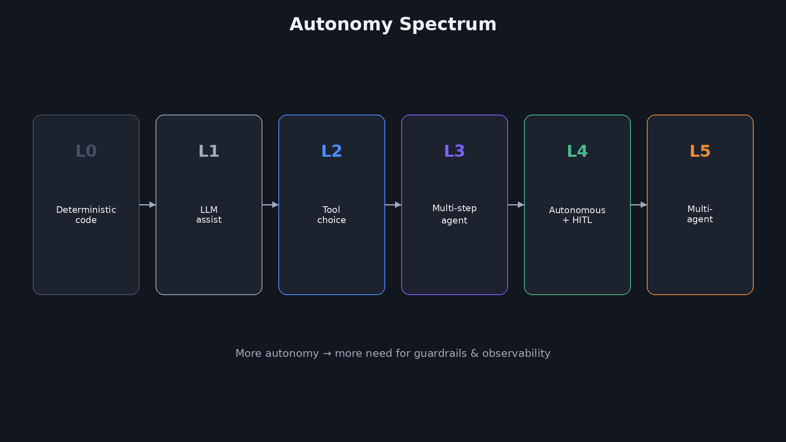

# מפגש 1 — מצגת סטודנטים
## מבוא לסוכני AI ו-Agentic Workflows

> **לסטודנטים** · מצגת קצרה לליווי השיעור  
> **משך מפגש משוער:** ~2.5–3 שעות

---

## 1. כותרת

**AI Agents ומערכות אוטונומיות**  
מפגש 1: מהו Agent ומה הופך Workflow ל-Agentic


---

## 2. מה השאלה של היום?

- ChatGPT עונה לנו.
- Agent **עובד בשבילנו** לקראת מטרה.
- ההבדל: תשובה אחת מול תהליך עם החלטות.

---

## 3. תשובה מול משימה

| מערכת קלאסית | Agent |
|---|---|
| ״ענה לי״ | ״בצע עבורי״ |
| פעולה בודדת | סדרת פעולות |
| קלט → פלט | מטרה → תהליך |
| המשתמש מנהל | המערכת מנהלת חלק |

---

## 4. ארבע מילים לזכור

**Goal → Decide → Act → Observe**


---

## 5. Chat מול Agent


- משמאל: שיחה.
- מימין: לולאה עם כלים ותצפיות.

---

## 6. מה LLM לבד באמת עושה?

```text
User → Prompt → LLM → Response
```

- LLM מייצר פלט (טקסט, קוד, JSON…).
- כדי **לפעול בעולם** צריך Tools.


---

## 7. Workflow מול Agent


- **Workflow:** נתיב קבוע מראש.
- **Agent:** בוחר צעדים לפי מה שקורה בדרך.

**כלל אצבע:** אם יודעים בדיוק את כל הצעדים מראש — אולי בכלל לא צריך Agent.

---

## 8. Agentic הוא ספקטרום



- יותר אוטונומיה ≠ תמיד יותר טוב.
- יותר אוטונומיה = יותר צורך ב־Guardrails ו־Observability.

---

## 9. ארבעת מרכיבי ה-Agent

1. **Goal** — לאן מנסים להגיע  
2. **Decision** — מה לעשות עכשיו  
3. **Action** — קריאה לכלי / פעולה  
4. **Observation** — מה חזר, ומה זה אומר

---

## 10. Planning בקצרה

- מטרה גדולה → פירוק למשימות (Task Decomposition)
- תוכנית יכולה להיות **שגויה**
- אז עושים **Re-planning** לפי Observation

---

## 11. ReAct (בצורה פשוטה)

**Reason → Act → Observe** (חוזרים)

- המודל חושב, בוחר כלי, רואה תוצאה, מחליט שוב.

---

## 12. מתי Agent הוא רעיון גרוע?

- תהליך דטרמיניסטי וקבוע
- אין צורך בהחלטות באמצע
- עלות / סיכון גבוהים בלי בקרה

---

## 13. דוגמה: DevOps Agent

מטרה לדוגמה:  
״בדוק למה ה־API לא יציב ותן המלצה.״


---

## 14. הדגמה — Agent Loop על Kubernetes


שימו לב לרצף: מחשבה → כלי → תצפית → מחשבה → תשובה.

---

## 15. Tool Design — נקודות מפתח

- Tool = API עם **שם + תיאור + הרשאות**
- תיאור טוב משפיע על בחירת הכלי
- Tool רחב מדי → בחירות גרועות / סיכון


---

## 16. Human in the Loop


שלוש רמות נפוצות:
- **Auto** — קריאה בטוחה
- **Approval** — כתיבה / שינוי / כסף
- **Blocked** — פעולות מסוכנות

---

## 17. Guardrails וכישלונות


- Retry / כלי חלופי / Escalation
- Stop conditions ו־Max iterations

---

## 18. Context, Memory, Trace


- Context הוא משאב מוגבל ויקר.
- Trace עוזר להבין **מה Agent עשה ולמה**.

---

## 19. ארכיטקטורה בגובה העיניים


**Agent הוא Software System — לא קסם.**

---

## 20. Support Agent — הדגמה


---

## 21. Multi-Agent (טעימה)


נעמיק במפגש ייעודי בהמשך הקורס.

---

## 22. תרגיל 1 — Agent או Workflow?

**הנחיה (10–15 דק׳):**

לכל תרחיש כתבו: **Agent / Workflow / לא בטוח** + משפט נימוק אחד.

1. סיכום יומי של 50 מיילים לאותו פורמט קבוע  
2. חקירת תקלה בפרודקשן שלא חוזרת על עצמה  
3. שליחת חשבונית אחרי אישור אדם  
4. מענה ללקוח עם חיפוש ב־CRM וב־Knowledge Base  
5. העתקת קבצים מתיקייה A ל־B כל לילה

**מה להגיש:** טבלה קצרה (5 שורות). אפשר בזוגות.

---

## 23. תרגיל 2 — תכנון Agent ראשון

**הנחיה (20–25 דק׳):**

בחרו משימה מהדוגמאות של השיעור (Nova Retail / ticket #8831) או מהעולם שלכם.

מלאו:

| שדה | מה לכתוב |
|---|---|
| Goal | משפט מטרה אחד |
| Tools | 3–6 כלים (שם + מה מחזירים) |
| Decisions | 2–3 החלטות שה-Agent עושה |
| HITL | איפה אדם חייב לאשר |
| Stop | מתי עוצרים / נכשלים יפה |
| Risks | סיכון אחד מרכזי |

**מה להגיש:** חצי עמוד עד עמוד. לא קוד.

---

## 24. בדיקת הבנה (שאלות מהירות)

1. במה Agent שונה מצ׳אטבוט?  
2. מה זה Observation ולמה זה קריטי?  
3. מתי עדיף Workflow?  
4. מה Guardrail אחד שחובה כמעט תמיד?  
5. למה Trace חשוב בפרודקשן?

---

## 25. סיכום

- Goal → Decide → Act → Observe  
- LLM הוא רכיב בתוך Agent  
- Tools נותנים כוח; Guardrails מגדירים גבולות  
- יותר אוטונומיה דורשת יותר בקרה  
- במפגש הבא: **Planning ו-Execution** לעומק

---

## 26. לקריאה / הכנה למפגש 2

- חזרו על ארבע המילים ועל ההבדל Workflow/Agent  
- הביאו דוגמה אחת מהעבודה שמתאימה ל-Agent (בלי לפתור עדיין)
