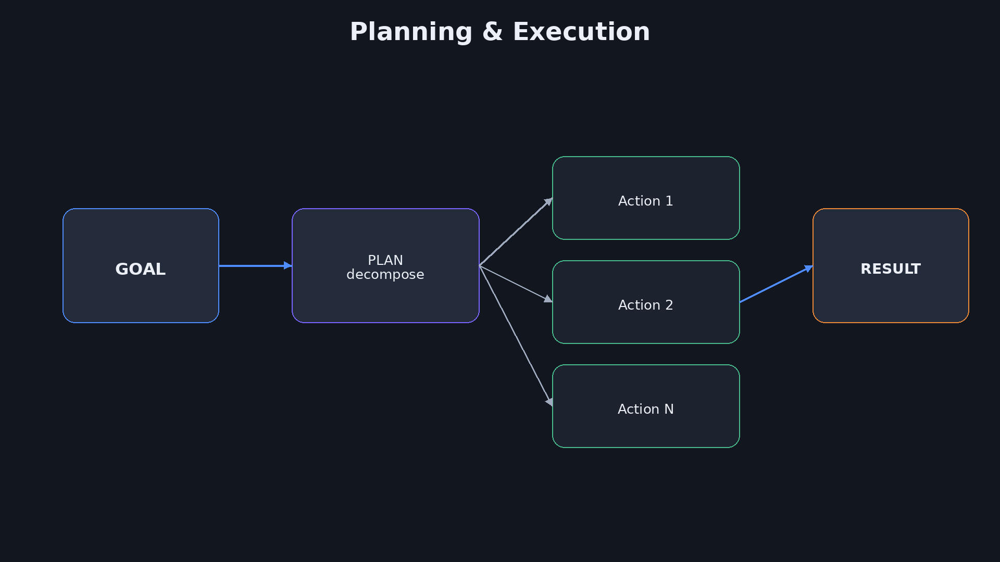
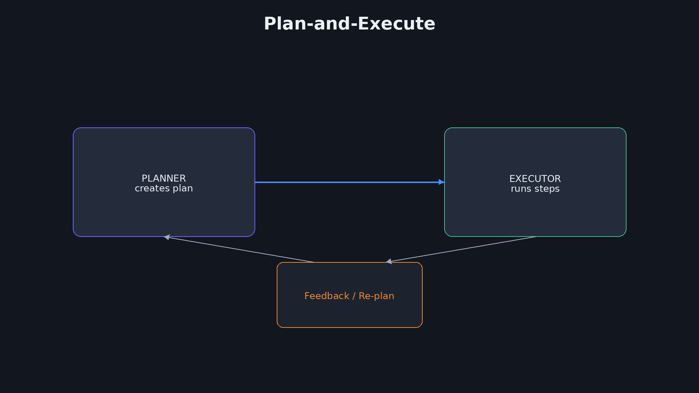
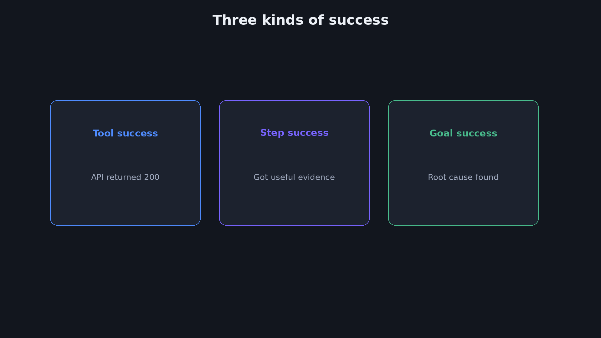
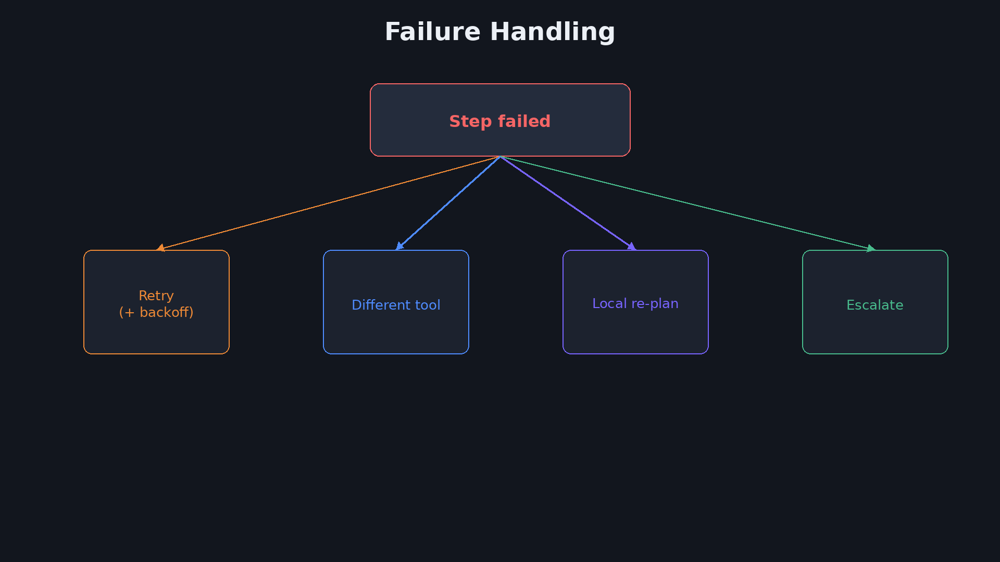
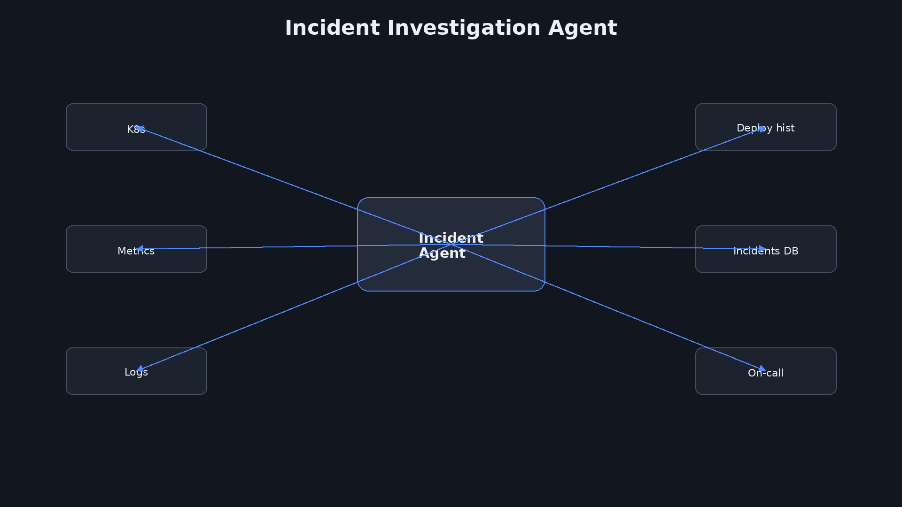
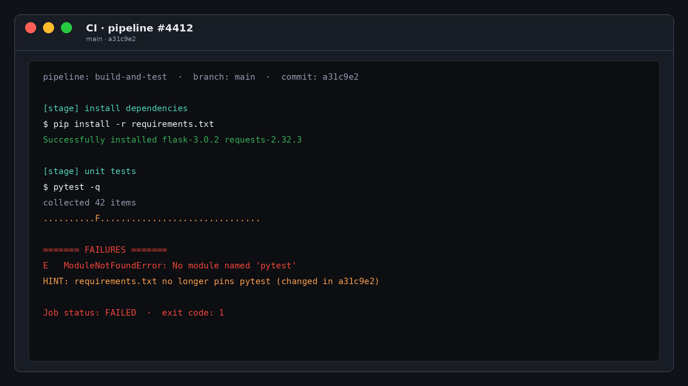
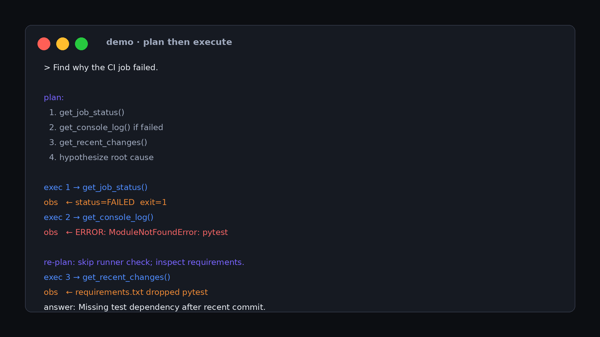
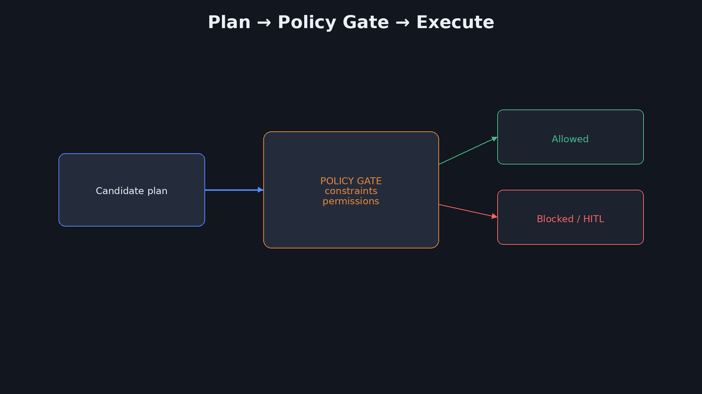
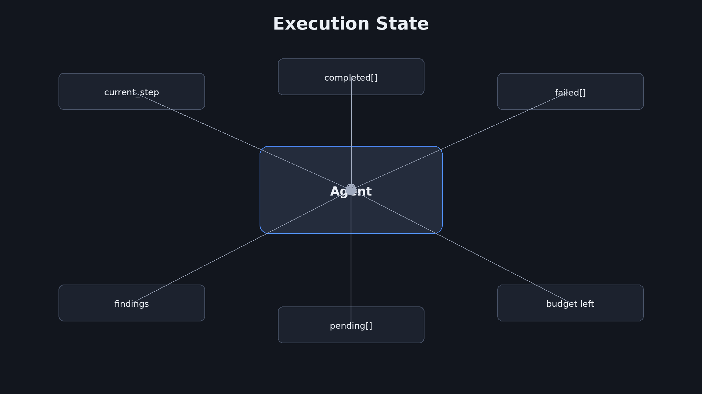

<div dir="rtl" lang="he">

<p align="center">
  
</p>

# ‏מפגש 2 — Agent Architecture: Planning ו-Execution
## ‏קובץ מרצה (תסריט מלא להקלטה)

> **משך מיועד:** ~2.5–3 שעות (הוראה + Lab חי ~20 דק׳ + תרגילים ~50 דק׳)  
> **מצגת סטודנטים:** [`02-students-slides.md`](02-students-slides.md)  
> **Lab:** [`labs/02-aws-agent-loop/`](labs/02-aws-agent-loop/)  
> **נכסים:** `assets/02/` · `assets/screens/`

> **הערת הקלטה:** לא מפרטים שוב את מפגש 1. מספור המרצה = מספור הסטודנטים (1…46).  
> Lab AWS: read-only, עלות סנטים. יצירת דיאגרמות: `python3 scripts/gen_diagrams.py`

---

# ‏הנחיות למרצה

מקריאים מכאן ומציגים את מצגת הסטודנטים במקביל.

- **`[סטודנטים · N]`** — גללו למספר N אצל הסטודנטים לפני ההקראה.
- **`[Lab חי]`** — עברו למסוף / Claude Code לפי `labs/02-aws-agent-loop/`.
- **`[מעבר]` / `[שאלה]` / `[תרגיל]` / `[עצירה]` / `[מצלמה]`** — סימוני הקלטה.
- כל בלוק קוד אצל המרצה מופיע גם אצל הסטודנטים באותו מספר.

---

# ‏חלק א׳ — פתיחה

## ‏1 — כותרת

[סטודנטים · 1]

**על המסך (מצגת סטודנטים):**

<p align="center">
  
</p>

**Agent Architecture**  
Planning ו-Execution



**להקראה:**

[מצלמה: פתיחה חמה.]

ברוכים הבאים למפגש 2.

היום אנחנו לא חוזרים על ההגדרות ממפגש 1.

אנחנו יורדים לתוך המנוע: איך Agent מתכנן, איך הוא מבצע, ואיך לא לאבד שליטה.

יהיה גם Lab חי עם Claude Code ו-AWS — קריאה בלבד, עלות של סנטים.

---

## ‏2 — מה היום (בלי חזרה על מפגש 1)

[סטודנטים · 2]

**על המסך (מצגת סטודנטים):**

| נבנה היום | לא נפרט שוב |
|---|---|
| Planning / Decomposition | מהו Agent מול Chat |
| Open/Closed · ReAct · Plan-and-Execute | Spectrum L0–L6 |
| Validation · Failure · Budget · State | HITL ברמת מבוא |
| Lab חי: Claude Code + AWS (read-only) | |

**להקראה:**

שימו לב לטבלה על המסך.

משמאל — מה שבונים היום.

מימין — מה שלא נפרט שוב.

אם משהו ממפגש 1 לא יושב לכם — תעלו שאלה קצרה — אבל ההקלטה מתקדמת קדימה.

---

## ‏3 — שאלת המפגש + תוצרים

[סטודנטים · 3]

**על המסך (מצגת סטודנטים):**

> מטרה גדולה → איך בוחרים צעד ראשון, ומתי משנים תוכנית?

בסוף המפגש תדעו:
1. לפרק מטרה ל-Hypothesis Plan  
2. להבדיל Tool / Step / Goal success  
3. לתכנן Failure + Stop + Budget  
4. להריץ לולאה חיה ולזהות Re-plan

**להקראה:**

השאלה שתלווה אותנו:

מטרה גדולה — איך בוחרים צעד ראשון, ומתי משנים תוכנית?

ארבעה תוצרים בסוף המפגש על המסך.

[עצירה]

---

# ‏חלק ב׳ — Planning לעומק

## ‏4 — Planning = גשר

[סטודנטים · 4]

**על המסך (מצגת סטודנטים):**

**הגדרה:** Planning — דרך אפשרית ממטרה לתוצאה (השערה, לא חוזה).

```text
GOAL → PLAN → ACTIONS → RESULT
```

דוגמה אנושית (קצר):
מטרה: *״חופשה ברומא באוקטובר עד ₪6,000.״*  
תוכנית: תאריכים → טיסות → מלון → אטרקציות → Buffer לביטולים.

**להקראה:**

Planning הוא גשר בין מטרה לפעולות.

הדוגמה האנושית חשובה: "חופשה ברומא" היא מטרה.

רשימת בדיקות היא תוכנית.

אותו דבר אצל Agent — רק עם Tools במקום אתרים וכרטיסים.

[עצירה]

תנו דוגמה נוספת מהעולם שלכם בקצרה: מטרה עסקית מול רשימת צעדים.

אם נותנים ל-Agent רק את המטרה בלי מסגרת — הוא עלול לבחור מסלול יקר או מסוכן.

Planning הוא גם מקום לשים Constraints מוקדם — גם אם נרחיב עליהם בהמשך.

---

## ‏5 — משימה פשוטה מול מורכבת

[סטודנטים · 5]

**על המסך (מצגת סטודנטים):**

| פשוטה | מורכבת |
|---|---|
| Ping לשרת | חקירת אי־יציבות מאז Release |
| כמעט בלי Planning | סדרת החלטות + Evidence |

תרחישי עבודה:
1. *״העתק קובץ A→B״* — Workflow  
2. *״למה הלקוח כועס על חיוב?״* — Agent  
3. *״Deploy ל־prod אחרי בדיקות״* — היברידי (Plan + Policy)

**להקראה:**

לא כל משימה צריכה Agent Planning עמוק.

Ping לשרת — כמעט Workflow.

חקירת אי־יציבות — כאן Planning מתחיל להשתלם.

שלושת תרחישי העבודה על המסך — עברו עליהם בקול והדגישו היברידי.

---

## ‏6 — תוכנית = Hypothesis + רמות פירוט

[סטודנטים · 6]

**על המסך (מצגת סטודנטים):**

```text
1. Get logs
2. Check metrics
3. Check deployments
4. Analyze
```

או כוונה מופשטת: `Investigate recent instability` + החלטות מקומיות.

רמות: **Full plan מראש** · **Skeleton** · **Step-wise (ReAct)**.

**להקראה:**

תוכנית היא Hypothesis.

אפשר רשימה מפורטת ואפשר Skeleton.

ReAct הוא קצה אחד של הספקטרום — החלטה לפני כל צעד.

הבחירה תלויה בסיכון ובאי־ודאות — לא בטרנד.

---

## ‏7 — סוגי טעויות Planning

[סטודנטים · 7]

**על המסך (מצגת סטודנטים):**

| סוג | דוגמה |
|---|---|
| Missing step | Deploy בלי Security Scan |
| Wrong order | Rollback לפני אבחון |
| Wrong assumption | ״תמיד Runner אשם״ |
| Overplanning | 40 צעדים למשימה של 5 |
| Underplanning | ״תתקן את הפרוד״ כצעד אחד |

**להקראה:**

חמשת סוגי הטעויות — זה ארגז כלים לביקורת תוכניות.

Wrong assumption הוא הנפוץ בארגונים: המודל מניח תהליך פשוט יותר ממה שיש ב-Policy.

[שאלה] איזו טעות Planning ראיתם לאחרונה בפרויקט?

---

# ‏חלק ג׳ — Task Decomposition

## ‏8 — Task Decomposition

[סטודנטים · 8]

**על המסך (מצגת סטודנטים):**


**הגדרה:** פירוק לתת־משימות שניתן לבצע, לבדוק ולהיכשל בהן בבירור.

כלל: יחידת משמעות — לא מספר יפה של שורות.

**להקראה:**

Decomposition זה לא לקשט מצגת.

זה להפוך מטרה עמומה ליחידות שאפשר לבצע ולבדוק.

פירוק דק מדי = רעש. גס מדי = אין שליטה.

---

## ‏9 — Decomposition בדוגמת Latency

[סטודנטים · 9]

**על המסך (מצגת סטודנטים):**

מטרה: *״מצא למה latency עלה.״*

```text
1. Check when latency increased
2. Compare with deployments
3. Check CPU / Memory
4. Check database latency
5. Inspect application logs
6. Correlate findings
7. Identify most likely cause
```

Hypothesis ראשונית — לא חוזה.

**להקראה:**

עברו על שבעת הצעדים לאט.

הדגישו אחרי הצעד הראשון שהכול יכול להשתנות.

זו Hypothesis — לא חוזה עם המציאות.

שאלו בקול: אחרי הצעד הראשון — מה יכול לבטל את שאר הרשימה?

למשל: העלייה הייתה spike קצר שנעלם. אז אין טעם להעמיק ב-DB.

זו המשמעות של Hypothesis.

---

## ‏10 — מיני־תרגול: Decomposition

[סטודנטים · 10]

**על המסך (מצגת סטודנטים):**

מטרה (60–90 שנ׳ חשיבה / דיון קצר):

> *״הורד את חשבון הענן החודשי ב־20% בלי לפגוע ב־SLA.״*

כתבו 5–7 צעדים. סמנו מה **חייבים** לפני מה שמותר במקביל.

**להקראה:**

[תרגיל קצר · 60–90 שנ׳]

תנו לשקט לחשוב.

אספו 2 פירוקים מהקהל.

בדקו: האם יש תלויות? האם משהו מקבילי?

---

# ‏חלק ד׳ — Open / Closed Loop

## ‏11 — Open Loop מול Closed Loop

[סטודנטים · 11]

**על המסך (מצגת סטודנטים):**


| Open | Closed |
|---|---|
| Plan → ביצוע ליניארי | Plan → Execute → Observe → Re-plan? |
| תהליכים יציבים | עולם עם הפתעות |

**שאלו:** מתי Workflow קבוע עדיף על Agent?

**להקראה:**

Open Loop = אוטומציה קלאסית.

Closed Loop = לולאה עם תצפית.

Agents חיים כמעט תמיד ב-Closed — כי העולם מפתיע.

[שאלה] מתי Workflow קבוע עדיף?

---

## ‏12 — אותה מטרה בשתי גישות

[סטודנטים · 12]

**על המסך (מצגת סטודנטים):**

מטרה: *״בדוק למה Checkout נכשל ל־3% מהמשתמשים.״*

**Open:** רשימה קבועה Metrics→Logs→DB→CDN→Report (גם אם כבר מצאתם אחרי Logs).  
**Closed:** Metrics → Observation → מקצרים ל־Payments API → Evidence → Stop מוקדם.

הערך: Adaptation חוסך זמן וכסף — אם יש Stop + Budget.

**להקראה:**

אותה מטרה — שני סיפורים.

ב-Open ממשיכים את כל הרשימה גם אחרי שיש תשובה.

ב-Closed עוצרים מוקדם אם Evidence מספיק — וחוסכים כסף.

בלי Budget זה לא קסם, זה לולאה יקרה.

---

# ‏חלק ה׳ — ReAct

## ‏13 — ReAct

[סטודנטים · 13]

**על המסך (מצגת סטודנטים):**


**הגדרה:** Reason → Act → Observe → חזרה.

יתרון: גמישות. חיסרון: יקר / thrashing בלי תקציב.

**להקראה:**

ReAct בקצרה: חושב, פועל, מתבונן, חוזר.

גמיש — ומסוכן בלי תקרה.

---

## ‏14 — ReAct בדוגמה (API 500)

[סטודנטים · 14]

**על המסך (מצגת סטודנטים):**

```text
Reason: need logs
Act:    get_logs
Observe: DB timeout
Reason: check pool
Act:    get_db_pool_metrics
Observe: pool 95% full
Reason: enough evidence? → report or dig deeper
```

**להקראה:**

הקריאו את רצף ה-500 לאט, כמו תסריט.

שימו לב שהצעד הבא נולד מה-Observation — לא מרשימה מראש.

עצרו אחרי Observe הראשון ושאלו את הקהל: מה הצעד הבא שלהם?

רק אחר כך המשיכו ל-pool.

כך ההקלטה מרגישה כמו חשיבה משותפת — לא קריאת תסריט יבש.

---

## ‏15 — כש-ReAct מתפזר

[סטודנטים · 15]

**על המסך (מצגת סטודנטים):**

סימנים:
- אותם Tools שוב ושוב  
- Confidence לא עולה  
- Tokens עולים בלי Evidence חדש  

טיפול: Iteration budget · Tool allow-list · ״אין Evidence חדש ×2 → Stop/Escalate״.

**להקראה:**

Thrashing הוא כשל מוכר ב-Production Agents.

אותו Tool שוב ושוב בלי Evidence חדש.

הפתרון הוא ארכיטקטורה: budget, allow-list, וכלל עצירה.

---

# ‏חלק ו׳ — Plan-and-Execute

## ‏16 — Plan-and-Execute

[סטודנטים · 16]

**על המסך (מצגת סטודנטים):**



**הגדרה:** Planner בונה תוכנית · Executor מבצע · Re-plan לפי משוב.

```text
1. Inspect deployment
2. Inspect logs
3. Compare release
4. Recommend rollback
```

יתרון: Review / HITL לפני ביצוע מסוכן.

**להקראה:**

Plan-and-Execute מפריד אחריות.

Planner כותב. Executor מבצע.

מצוין כשרוצים Review לפני פעולה מסוכנת.

---

## ‏17 — אותו Incident: ReAct מול Plan-and-Execute

[סטודנטים · 17]

**על המסך (מצגת סטודנטים):**

| | ReAct | Plan-and-Execute |
|---|---|---|
| צעד ראשון | לפי Thought | לפי Plan שאושר |
| שינוי כיוון | כל Observation | Re-plan מפורש |
| מתאים ל | חקירה פתוחה | סיכון + צורך בביקורת |
| סיכון | מתפזר | נצמד לתוכנית שגויה |

**להקראה:**

הטבלה חשובה להקלטה — אל תדלגו.

אין מנצח אוניברסלי.

יש התאמה לסיכון ולסוג אי־ודאות.

תרגיל מחשבתי מהיר (30 שנ׳): אם Rollback עולה כסף רב — איזו גישה תבחרו קודם, ולמה?

רמז: Plan-and-Execute נותן נקודת HITL אחרי התוכנית ולפני הנזק.

---

## ‏18 — מתי Planner נפרד?

[סטודנטים · 18]

**על המסך (מצגת סטודנטים):**

| בלי הפרדה | עם Planner נפרד |
|---|---|
| משימות קצרות | תוכנית ארוכה לבדיקה |
| עלות נמוכה | Policy / Approval אחרי Plan |
| פחות State | Production עם סיכון |

**להקראה:**

Ticket קטן — אולי בלי Planner נפרד.

שינוי Production — כמעט תמיד רוצים נקודת ביקורת אחרי Plan.

---

# ‏חלק ז׳ — Execution ו-Validation

## ‏19 — שלושה סוגי הצלחה

[סטודנטים · 19]

**על המסך (מצגת סטודנטים):**



**הגדרה:** Execution / Validation.

1. Tool success · 2. Step success · 3. Goal success  

‏Tool success ≠ Goal success.

**שאלו:** Tool Failure מול Task Failure?

**להקראה:**

אם זוכרים משפט אחד: Tool success ≠ Goal success.

HTTP 200 יכול להיות כישלון סמנטי.

---

## ‏20 — Validation — כמה פנים

[סטודנטים · 20]

**על המסך (מצגת סטודנטים):**

```text
search_tickets() → 200 OK → { "tickets": [] }
```

| מקרה | משמעות |
|---|---|
| 200 + [] | ״לא מצאתי״ — מידע! |
| 200 + schema שבור | Step fail |
| 200 + נתונים לא רלוונטיים | Semantic fail |
| Timeout | Tool fail → typed retry |

**להקראה:**

עברו על ארבעת המקרים בטבלה.

Empty result הוא Evidence — לא בהכרח הצלחה.

---

# ‏חלק ח׳ — Failure וגבולות

## ‏21 — Failure Handling

[סטודנטים · 21]

**על המסך (מצגת סטודנטים):**



Timeout · Auth · Bad params · Empty · Rate limit · Unexpected · Model mistake

טיפול: typed retry · כלי חלופי · Local/Global re-plan · Escalation

**להקראה:**

Failure Handling הוא חלק מהמערכת — לא אפטר־thought.

Typed errors → typed responses.

---

## ‏22 — מטריצת Retry + Backoff

[סטודנטים · 22]

**על המסך (מצגת סטודנטים):**

```text
Timeout           → Retry + backoff
Rate limit        → Wait + Retry
Invalid parameter → Fix args + Retry once
Permission denied → Stop / Escalate
Dangerous op      → HITL
Empty useful data → Re-plan (not blind retry)
```

```text
Backoff: 1s → 2s → 4s → 8s (עם תקרה)
```

**להקראה:**

המטריצה + Backoff — זה Software Engineering קלאסי בתוך Agent Loop.

Empty useful data ≠ Retry עיוור — זה Re-plan.

ספרו סיפור קצר: Agent שעשה Retry עיוור על Invalid ID ויצר עומס על API.

Typed failure handling הוא ההבדל בין מערכת בוגרת לבין דמו.

---

## ‏23 — Budget, Stop, Success Criteria

[סטודנטים · 23]

**על המסך (מצגת סטודנטים):**

**הגדרה:** Iteration Limit · Stop Condition.

דוגמה למשימת דוח:
- Success: קובץ + 4 סעיפים + נתונים נבדקו  
- Fail: אין גישה למקור > 2 ניסיונות  
- Stop: 12 tool calls / 5 דק׳ / Confidence גבוהה מספיק  

**שאלו:** למה Max Iterations?

**להקראה:**

Budget ו-Stop הופכים Agent ממערכת סקרנית למערכת אחראית.

הדוגמה של הדוח — הקריאו את Success/Fail/Stop בקול.

---

# ‏חלק ט׳ — מבנה והחלטות

## ‏24 — Dependencies ו-Branches

[סטודנטים · 24]

**על המסך (מצגת סטודנטים):**

**הגדרה:** Parallel Execution.

- מקבילי כשאין תלות · זהירות מ-rate limits  
- Branches: `severity==high` → HITL (עדיף בקוד)

**להקראה:**

מקביליות חוסכת זמן ומוסיפה כאב ראש.

Policy של Severity — עדיף בקוד.

---

## ‏25 — קוד דטרמיניסטי מול LLM

[סטודנטים · 25]

**על המסך (מצגת סטודנטים):**

| בקוד | במודל |
|---|---|
| Policy, timeouts, retries טכניים | בחירת כיוון, השערות, סיכום |
| Allow-list של Tools | ניסוח / סיווג |

```python
if severity == "critical":
    require_human_approval()
```

**להקראה:**

הקוד על המסך הוא ההמחשה.

Critical לא צריך "לחשוב" — הוא צריך Policy.

---

## ‏26 — דוגמאות החלטה: קוד או מודל?

[סטודנטים · 26]

**על המסך (מצגת סטודנטים):**

1. האם Restart מותר בלי אישור בלילה? → **קוד/Policy**  
2. איזה שירות לבדוק קודם לפי תסמינים? → **מודל**  
3. האם JSON תקין? → **קוד**  
4. האם הממצאים מספיקים להמלצת Rollback? → **מודל + כללי Confidence**

**להקראה:**

ארבע הדוגמאות — עברו אחת־אחת ושאלו את הקהל לפני התשובה שלכם.

---

# ‏חלק י׳ — Incident, Demo, Lab חי

## ‏27 — Incident Agent (מלא)

[סטודנטים · 27]

**על המסך (מצגת סטודנטים):**



מטרה: latency גבוה ב-API · סיבה סבירה · המלצה.  
Tools קריאה בלבד: metrics · logs · deployments · incidents

זרימה: Confirm → Correlate deploy → Logs → Re-plan לפי Evidence


**להקראה:**

[הדגמה / B-ROLL מסכים]

Incident Agent — קריאה בלבד בהתחלה.

זה חשוב לביטחון בהקלטה.

לפני המסכים: הדגישו שוב — בשלב אבחון אין Tool שמשנה Production.

זה Pattern שכדאי לשנן: Investigate tools ⊆ read-only.

---

## ‏28 — צעדים + Re-plan בדוגמה

[סטודנטים · 28]

**על המסך (מצגת סטודנטים):**

```text
get_metrics     → p95 80ms→620ms (מאושר)
get_deployments → 3.8.1 לפני 32 דק׳ (correlation ≠ proof)
get_logs        → DB timeout
REPLAN          → pool metrics + before/after + prior incidents
```

Workflow קבוע היה ממשיך גם אחרי שיש תשובה. Agent יכול Stop מוקדם.

**להקראה:**

הקריאו את ארבעת השלבים.

Correlation אחרי Deploy הוא פיתוי — לא הוכחה.

Re-plan אחרי timeout הוא הסיפור.

---

## ‏29 — הדגמה CI + Pseudocode

[סטודנטים · 29]

**על המסך (מצגת סטודנטים):**





```python
goal = user_request
while not done:
    decision = llm(goal=goal, state=state, tools=available_tools)
    result = execute(decision)
    state = update(state, result)
    done = check_stop(state)
```

**להקראה:**

הציגו CI console ואז את ה-Pseudocode.

מה חסר בלופ ל-Production? Policy, budgets, idempotency, trace — עוד רגע.

---

## ‏30 — Lab חי: מטרה ומגבלות

[סטודנטים · 30]

**על המסך (מצגת סטודנטים):**

**מחוץ למצגת / לצד המצגת:** Claude Code + AWS.

מטרה: לאשר גישה ל-AWS ולדגום אם יש מדדי EC2 CPU (read-only).

מגבלות בהקלטה:
- אזור אחד · בלי Create/Update/Delete  
- `MAX_ITERATIONS = 5`  
- תקציב: סנטים  

קוד: `labs/02-aws-agent-loop/`

**להקראה:**

[Lab חי · התחלה]

עברו למסוף / Claude Code.

הדגישו read-only ומגבלת איטרציות.

הסטודנטים רואים את המגבלות על המסך.

---

## ‏31 — Lab חי: מה נריץ

[סטודנטים · 31]

**על המסך (מצגת סטודנטים):**

```bash
cd labs/02-aws-agent-loop
export AWS_PROFILE=nashpazformatan
export AWS_REGION=eu-north-1
python3 agent_loop.py
```

שימו לב בלייב:
1. Initial plan  
2. Observation מ-STS / CloudWatch  
3. Local re-plan אם 0 נקודות מדד  
4. Stop + findings  

אופציונלי: לשנות Plan ב-Claude Code ולהריץ שוב.

**להקראה:**

[Lab חי · הרצה ~10–15 דק׳]

הריצו:

```bash
cd labs/02-aws-agent-loop
export AWS_PROFILE=nashpazformatan
export AWS_REGION=eu-north-1
python3 agent_loop.py
```

ספרו בקול מה ה-Plan, מה ה-Observation, ומתי קורה Re-plan.

אם CloudWatch ריק — זה פיצ׳ר להוראה, לא באג.

אם credentials נכשלים — אל תיבהלו בהקלטה.

הפכו את זה לשיעור: Auth failure → Stop/Escalate, לא Retry אינסופי.

אפשר להראות את הענף הזה בקוד של `agent_loop.py`.

---

## ‏32 — Lab חי: Debrief

[סטודנטים · 32]

**על המסך (מצגת סטודנטים):**

מה ראינו?
- Plan ≠ חוזה  
- Observation ריק עדיין Evidence  
- Re-plan מקומי זול מ-Global  
- Stop condition עצר לפני לולאה מיותרת  

**שאלו:** מה הייתם מוסיפים ל-Policy לפני Production?

**להקראה:**

[Lab חי · Debrief]

חברו חזרה למושגים: Hypothesis, Evidence ריק, Local re-plan, Stop.

[שאלה] מה הייתם מוסיפים ל-Policy לפני Production?

---

# ‏חלק יא׳ — Evidence, Policy, State

## ‏33 — Evidence, Hypothesis, Confidence

[סטודנטים · 33]

**על המסך (מצגת סטודנטים):**

```text
Hypothesis → Evidence → Supports? → ↑confidence / החלף Hypothesis
```

Correlation ≠ Proof. Low / Medium / High.

**להקראה:**

אל תתאהבו בהשערה הראשונה.

Confidence יכול להיות Low/Medium/High — לא חובה מספר מדויק.

---

## ‏34 — Wrong Assumption (Release)

[סטודנטים · 34]

**על המסך (מצגת סטודנטים):**

Agent מניח: `Build → Test → Deploy`  
ארגון דורש: Scan → Approvals → Staging → Prod Approval.

בלי Constraints התוכנית ״עובדת״ במעבדה ונכשלת בפרוד.

**להקראה:**

Wrong assumption ארגוני הוא קלאסיקה.

בלי Constraints התוכנית נראית חכמה ונכשלת בפרוד.

---

## ‏35 — Local מול Global Re-plan

[סטודנטים · 35]

**על המסך (מצגת סטודנטים):**

**הגדרה:** Re-planning.

| Local | Global |
|---|---|
| צעד נכשל → חלופה | זורקים מסגרת חקירה |
| זול | יקר |

**שאלו:** מתי Local מספיק?

**להקראה:**

Local קודם. Global כשהמסגרת נשברה.

[שאלה] מתי Local מספיק?

---

## ‏36 — Constraints ו-Policy Gate

[סטודנטים · 36]

**על המסך (מצגת סטודנטים):**




**הגדרה:** Constraint / Policy.

זמן · עלות · הרשאות · ״אין נגיעה בפרוד בלי אישור״

**להקראה:**

Policy Gate עומדת בין Plan לביצוע.

Approval באמצע דורש State — כדי לא להתחיל מאפס.

---

## ‏37 — Execution State

[סטודנטים · 37]

**על המסך (מצגת סטודנטים):**



**הגדרה:** Execution State.

```json
{
  "goal": "Investigate API latency",
  "current_step": "check_logs",
  "completed_steps": ["get_metrics", "get_deployments"],
  "failed_steps": [],
  "findings": [
    "latency increased 32 minutes ago",
    "deployment 3.8.1 happened 35 minutes ago"
  ]
}
```

**להקראה:**

ה-JSON על המסך הוא חוזה עבודה של המערכת עם עצמה.

בלי State אין Resume, אין Debug, אין HITL אמיתי.

---

## ‏38 — Idempotency, Timeouts, Cost

[סטודנטים · 38]

**על המסך (מצגת סטודנטים):**

**הגדרה:** Idempotency.

- `idempotency_key` ליצירות  
- Timeouts: Tool / Agent / Task  
- Quality ↔ Cost ↔ Time · סננו Context ל-LLM

**להקראה:**

Idempotency, Timeouts, Cost — שלושה גבולות שמונעים אסונות שקטים.

Context עולה כסף: אל תשפכו 200k שורות לוג למודל.

חברו ל-Lab: גם אם נריץ שוב את הסקריפט — אין יצירת משאבים כפולים כי השתמשנו רק ב-read.

ברגע שיש create_ticket — בלי idempotency_key הסיכון קופץ.

---

# ‏חלק יב׳ — Anti-patterns ותרגילים

## ‏39 — Anti-Patterns

[סטודנטים · 39]

**על המסך (מצגת סטודנטים):**

1. 40 צעדים במקום 5  
2. Tool success = Goal success  
3. בלי Max iterations  
4. בלי HITL על מסוכן  
5. Prompt ארוך במקום State+Plan  
6. ReAct בלי Evidence gate (חדש)

**להקראה:**

שישה Anti-patterns.

אם רואים אחד מהם ב-Design Review — עצרו לפני "איזה מודל".

---

## ‏40 — תרגיל 1 — תכננו Agent ל-CI

[סטודנטים · 40]

**על המסך (מצגת סטודנטים):**

**הנחיה (20–25 דק׳):** מטרה *״מצא למה Job ב-CI נכשל.״*

Tools: `get_job_status` · `get_console_log` · `get_recent_changes` · `get_runner_info` · `search_previous_failures`

1. מה חייבים לדעת קודם? (3)  
2. חובה כל ה-Tools?  
3. אם `get_console_log` נכשל — מה עכשיו? (2+)  
4. Stop vs Escalation  

הגשה: חצי עמוד · זוגות OK.

**להקראה:**

[תרגיל · 20–25 דק׳]

הקריאו הנחיה. השאירו CI על המסך.

עברו בין משתתפים אם זה כיתה חיה; בהקלטה — B-ROLL של קונסול.

---

## ‏41 — תרגיל 1 — כיווני פתרון (אחרי הגשה)

[סטודנטים · 41]

**על המסך (מצגת סטודנטים):**

דוגמאות לדיון (לא ״תשובה יחידה״):
- קודם: job id, זמן כשל, branch/commit  
- לא חובה כל הכלים — מתחילים מ-status+log  
- Log נכשל → recent_changes / previous_failures / Escalate  
- Stop כשיש Evidence ממוקד + המלצה; Escalate כשאין גישה לנתונים

**להקראה:**

[דיון פתרון · 8–10 דק׳]

אל תציגו "תשובה יחידה".

השתמשו בכיוונים על המסך כבסיס לדיון.

---

## ‏42 — תרגיל 2 — Re-plan

[סטודנטים · 42]

**על המסך (מצגת סטודנטים):**

**הנחיה (15–20 דק׳):** הנחה Runner אשם · Observation: Runner תקין, חסר dependency ב-`requirements.txt`.

Plan מקורי · Local · מתי Global · Stop condition

**להקראה:**

[תרגיל · 15–20 דק׳]

הדגישו Local מול Global אחרי ה-Observation החדש.

---

## ‏43 — תרגיל 3 — Checklist

[סטודנטים · 43]

**על המסך (מצגת סטודנטים):**

**הנחיה (10–15 דק׳):** ✓/✗

Goal+Success · Budget · Failure · Policy · HITL · State · Trace · Timeouts · Cost

**להקראה:**

[תרגיל · 10–15 דק׳]

שאלו בסוף איזה פריט חסר הכי הרבה — לרוב Budget או Trace.

---

## ‏44 — Design Review

[סטודנטים · 44]

**על המסך (מצגת סטודנטים):**

> Incident Agent: מה ל-LLM ומה לקוד — ולמה?

תרחיש: *״מצא סיבה ב-Production ותקן.״*  
Tools: `read_logs` · `get_metrics` · `restart_service` · `scale_service` · `deploy_version` · `delete_resource`

1. אוטומטי? 2. HITL? 3. מסוכן? 4. דטרמיניסטי? 5. Stop? 6. אנטי-לולאה? 7. Trace?

דיון ~10–12 דק׳.

**להקראה:**

[דיון · 10–12 דק׳]

עברו על שבע השאלות.

restart/deploy/delete — לא אוטומטי בלי Policy.

---

## ‏45 — סיכום

[סטודנטים · 45]

**על המסך (מצגת סטודנטים):**

- Planning = Hypothesis + מגבלות  
- Closed loop + Validation + Budget/Stop  
- Tool ≠ Goal success  
- State · Policy · Idempotency שייכים לארכיטקטורה  
- Lab: ראינו Re-plan על Observation אמיתי/ריק  
- מפגש 3: **Tool Use ו-Function Calling**

**להקראה:**

סיכום בקול לפי הנקודות על המסך.

המשפט: Planning = הצעד הבא הטוב ביותר תחת מגבלות, ואז למידה מהתוצאה.

---

## ‏46 — הכנה למפגש 3

[סטודנטים · 46]

**על המסך (מצגת סטודנטים):**

- 3 Tools מהעבודה: קלט · פלט · מסוכן?/HITL  
- בונוס: סמנו איזה מהם Idempotent

</div>

**להקראה:**

הכנה למפגש 3: Tools ו-Function Calling.

בקשו גם סימון Idempotent — זה מחבר למפגש הזה.

[מצלמה: סגירה.] תודה — נתראה במפגש 3.

---

# ‏נכסים — דיאגרמות וקבצים

| קובץ | שימוש |
|---|---|
| `assets/02/*.png` | דיאגרמות המפגש |
| `assets/screens/*` | CI / Metrics / K8s / Approval |
| `labs/02-aws-agent-loop/` | Lab חי |

חידוש דיאגרמות: `python3 scripts/gen_diagrams.py`

</div>
