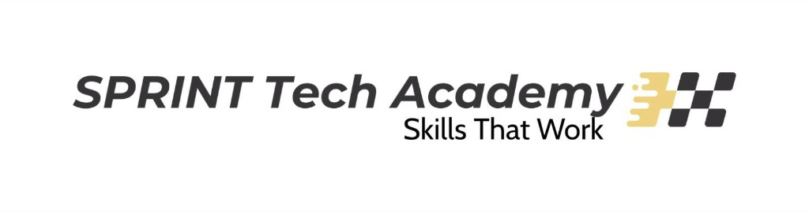
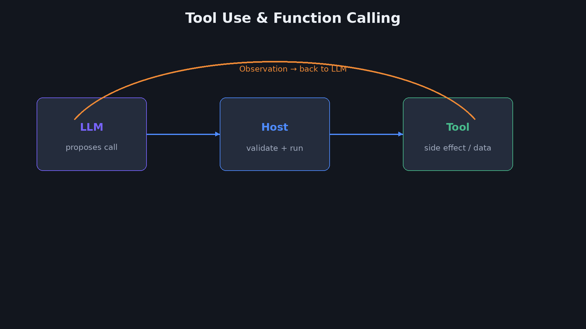
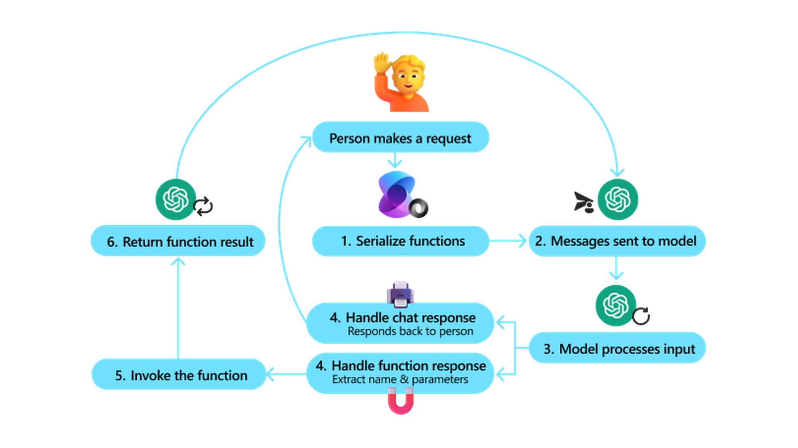
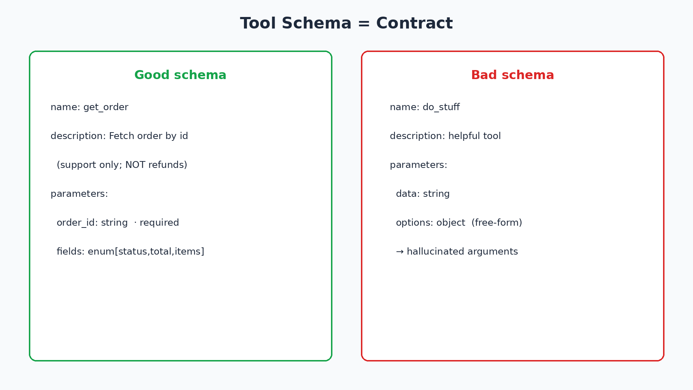
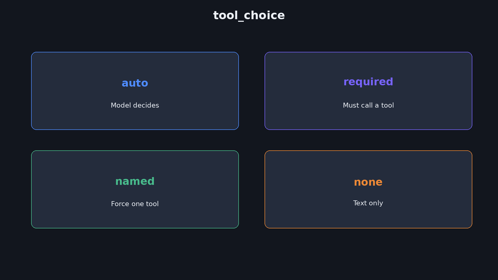
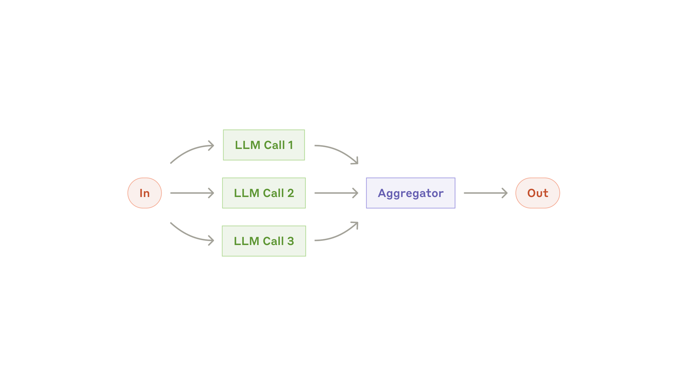
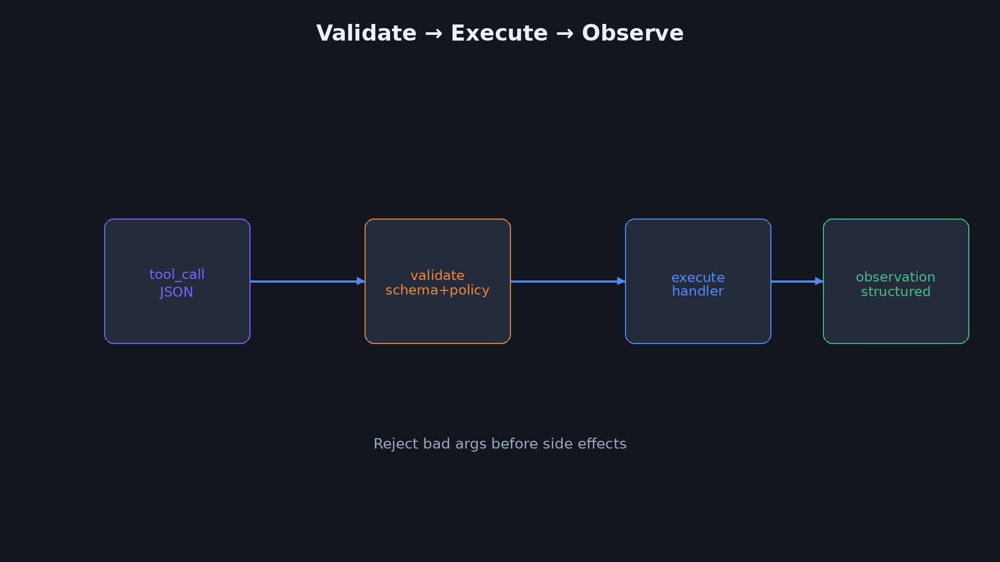
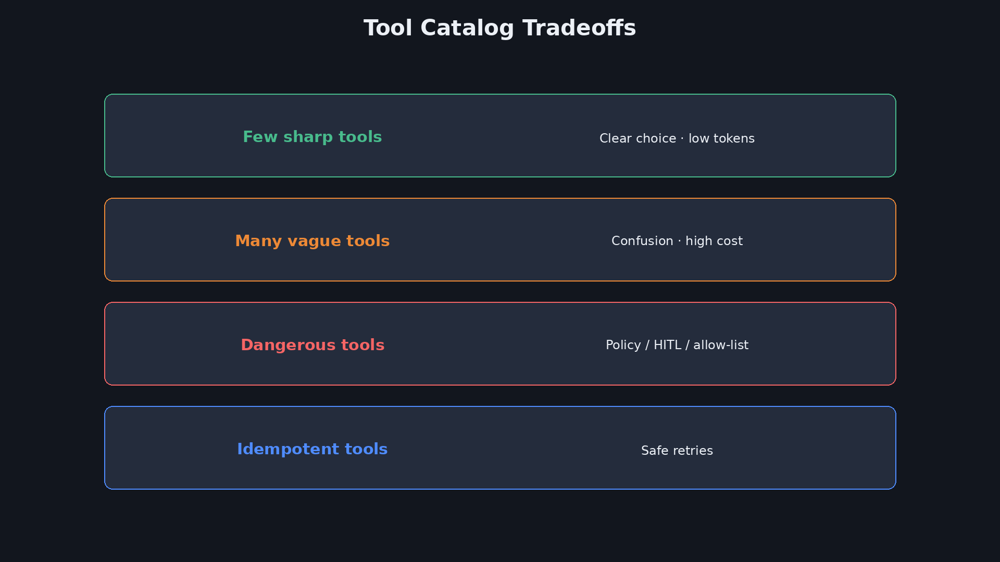
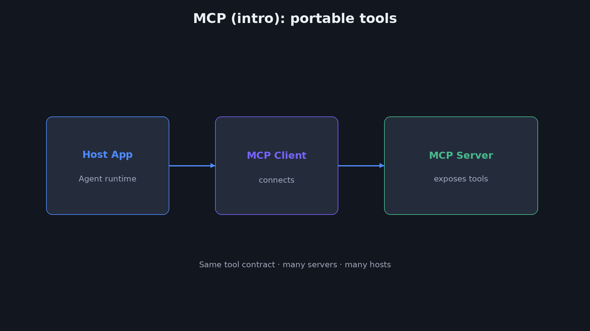

<div dir="rtl" lang="he">

<p align="center">
  
</p>

# ‏מפגש 3 — מצגת סטודנטים
## ‏Tool Use ו-Function Calling

> מספור **סטודנטים בלבד** (1…N) · מרצה: `[סטודנטים · N]` באותו מספר וכותרת.  
> **משך משוער:** ~2.5–3 שעות (הוראה + Lab חי + הדגמות פתרון).  
> חזרה קצרה על מפגש 2 (Planning / Closed Loop / Policy) — בלי פירוט מחדש.

---

# ‏חלק א׳ — פתיחה

## ‏1 — כותרת

<p align="center">
  
</p>

**Tool Use ו-Function Calling**  
איך Agent נוגע בעולם



---

## ‏2 — מה היום (+ חזרה קצרה על מפגש 2)

| נבנה היום | מפגש 2 (בקצרה) |
|---|---|
| חוזה Tool · Schema · Protocol | Planning / Decomposition |
| tool_choice · Parallel · Validate | Closed Loop · ReAct · P&E |
| Catalog · Policy · MCP + PinchTab | Budget · Stop · Policy Gate |
|‏ Lab: Host + PinchTab headed | Lab לולאת Plan→Observe |

---

## ‏3 — שאלת המפגש + תוצרים

> המודל רוצה לפעול — מי מריץ, עם איזה חוזה, ואיך לא נשברים?

בסוף המפגש תדעו:
1. לכתוב Tool Schema שעובד (ולזהות Schema גרוע)  
2. להסביר את פרוטוקול Function Calling מקצה לקצה  
3. לתכנן Validate · Errors · Parallel · tool_choice  
4. להריץ Host חי שמאמת ומריץ Tools  

---

# ‏חלק ב׳ — מהו Tool

## ‏4 — Tool = חוזה מול העולם

**הגדרה:** Tool — פעולה מוגדרת שהקוד יכול לבצע; המודל רק **מציע** אותה.

```text
GOAL → (LLM) tool_call → (HOST) execute → OBSERVE → …
```

בלי Tool: המודל מדבר.  
עם Tool: המערכת יכולה **לשנות או לקרוא** מציאות.

---

## ‏5 — Act בלי Tool מול Act עם Tool

| בלי Tool | עם Tool |
|---|---|
| טקסט / המלצה | קריאה ל-API / DB / CLI |
| אין תופעת לוואי אמיתית | יש Observation אמיתי |
| קשה לבדוק | אפשר Validate + Trace |

דוגמה: *״מה סטטוס הזמנה 9912?״*  
בלי Tool → ניחוש. עם Tool → `get_order(order_id=9912)`.

---

## ‏6 — ארבעת חלקי כלי טוב

| חלק | תפקיד |
|---|---|
| **Name** | מזהה יציב לקוד |
| **Description** | Prompt לבחירה (מתי להשתמש / מתי לא) |
| **Schema** | פרמטרים typed + required/enum |
| **Side-effects** | read / write / money / delete — ל-Policy |

---

# ‏חלק ג׳ — פרוטוקול Function Calling

## ‏7 — חמשת השלבים



1. שולחים schemas + מטרה  
2. המודל מחזיר `tool_calls` (לא תשובה סופית)  
3. **ה-Host** מריץ (לא המודל)  
4. מחזירים תוצאות עם `tool_call_id`  
5. המודל ממשיך או עונה  

---

## ‏8 — מי מבצע? המודל מציע, הקוד מריץ

```text
LLM  →  { name, arguments, id }
Host →  validate → handler(args) → result
Host →  { role: tool, tool_call_id, content }
LLM  →  answer | more tool_calls
```

כלל ברזל: **אין ביצוע בתוך המודל.**  
אם יש תופעת לוואי — היא רק אחרי Validate ב-Host.

---

## ‏9 — תפקידי הודעות (Message Roles)

|‏ Role | מה יש בפנים |
|---|---|
|‏ `user` | מטרה / הקשר |
|‏ `assistant` | טקסט ו/או `tool_calls[]` |
|‏ `tool` | תוצאת כלי + `tool_call_id` |
| (שוב) `assistant` | תשובה או קריאות נוספות |

ספקים שונים (OpenAI / Anthropic / Gemini) — אותו רעיון, סינטקס שונה.

---

## ‏10 — למה `tool_call_id` חובה

- ב-Parallel: כמה תוצאות בבת אחת  
- המודל חייב להתאים תוצאה לקריאה  
- ל-Trace ו-Debug: מי ביקש מה ומתי  

בלי id → בלבול בין תוצאות, במיוחד ב-Parallel.

---

# ‏חלק ד׳ — Schema Design

## ‏11 — JSON Schema לפרמטרים

```json
{
  "name": "get_order",
  "description": "Fetch order by id for support. Do NOT use for refunds.",
  "parameters": {
    "type": "object",
    "properties": {
      "order_id": { "type": "string", "description": "Order id, e.g. ORD-9912" },
      "fields": {
        "type": "string",
        "enum": ["status", "total", "items"],
        "description": "Which field to return"
      }
    },
    "required": ["order_id"]
  }
}
```

---

## ‏12 — Description = Prompt לכלי

המודל בוחר כלים לפי **טקסט התיאור**, לא לפי שם הקובץ בקוד.

כללי זהב:
- מתי להשתמש  
- מתי **לא** להשתמש  
- דוגמת ערך לפרמטר  
- מגבלות (support only / read-only)

---

## ‏13 — enum · required · defaults

| טכניקה | למה |
|---|---|
|‏ `enum` | חוסם `"Celsius"` / `"C"` / `"celsius"` |
|‏ `required` | רק מה שבאמת חייב |
|‏ Optional + default בקוד | פחות הזדמנות להזיה |
|‏ `type` מדויק | פחות parse errors |

---

## ‏14 — Schema טוב מול גרוע



| טוב | גרוע |
|---|---|
|‏ `get_order` + תיאור צר | `do_stuff` + "helpful" |
| `order_id` string required | `data: string` |
|‏ `fields` enum | `options: object` חופשי |

---

## ‏15 — הדגמה: שני Schemas לאותו צורך

תרחיש: *״הלקוח שואל על הזמנה 9912״*

**גרוע:**
```json
{ "name": "handle", "parameters": { "q": { "type": "string" } } }
```

**טוב:** `get_order` כמו בשקופית 11 + Policy: אין `refund` בלי HITL.

---

# ‏חלק ה׳ — tool_choice וניתוב

## ‏16 — tool_choice



| מצב | שימוש |
|---|---|
|‏ `auto` | ברירת מחדל |
|‏ `required` / `any` | חובה לגעת בכלי (אסור תשובה ריקה) |
|‏ named | כפיית כלי ספציפי |
|‏ `none` | טקסט בלבד — בלי קריאות |

---

## ‏17 — מתי `none` / מתי `required`

- ‏`none`: סיכום אחרי Evidence, שאלת הבהרה, Escalate  
- ‏`required`: חייבים Evidence לפני תשובה (*״מה הסטטוס בפרוד?״*)  
- ‏named: שלב קבוע ב-Workflow (תמיד `get_metrics` קודם)

---

## ‏18 — Router דטרמיניסטי מול בחירת מודל

| קוד | מודל |
|---|---|
|‏ if intent==billing → billing tools | בוחר מתוך catalog מלא |
|‏ allow-list לפי תפקיד | גמיש יותר, יקר יותר |
| חוסם כלים מסוכנים מראש | עלול לבחור כלי מסוכן |

היברידי נפוץ: Router מצמצם catalog → מודל בוחר בפנים.

---

# ‏חלק ו׳ — Parallel מול Sequential

## ‏19 — Parallel tool calls



המודל יכול לבקש כמה כלים באותה תשובה.  
ה-Host מריץ (לרוב במקביל) ומחזיר **את כל** התוצאות לפני הצעד הבא.

---

## ‏20 — מתי אסור Parallel

- תלות: `get_orders` צריך `customer_id` מ-`get_customer`  
- כתיבה לאותו משאב  
- סדר חשוב ל-Audit / כסף  
- כלי לא Idempotent + retry עיוור

---

## ‏21 — Fan-out / Fan-in בדוגמת Incident

```text
fan-out: get_metrics || get_logs || get_deploys
fan-in:  observe-all → hypothesis → (optional) get_trace
```

‏Parallel חוסך latency כשהקריאות **עצמאיות**.

---

# ‏חלק ז׳ — Validate, Errors, Observation

## ‏22 — Validate לפני Execute



1. Parse JSON args  
2. Schema validate (types/enum/required)  
3. Policy (allow-list, HITL, budget)  
4. רק אז handler  

‏Args לא חוקיים → Observation של שגיאה, **לא** crash של ה-Agent.

---

## ‏23 — פורמט Observation מומלץ

```json
{
  "ok": true,
  "tool": "get_order",
  "data": { "status": "shipped", "total": 249.9 },
  "meta": { "latency_ms": 120 }
}
```

כישלון:
```json
{
  "ok": false,
  "tool": "get_order",
  "error": { "code": "NOT_FOUND", "message": "order 9912" }
}
```

---

## ‏24 — Error as Observation

| גישה רעה | גישה טובה |
|---|---|
|‏ Exception בולע את הלולאה | מחזירים `ok:false` למודל |
| מסתירים stack בפרומפט | קוד קצר + הודעה לפעולה |
|‏ Retry עיוור על 403 | Stop / Escalate / כלי אחר |

חיבור למפגש 2: Failure Handling + Budget.

---

## ‏25 — Argument Hallucination

תסמינים: id מומצא, enum לא קיים, יחידות שגויות, שדות חסרים ש״הושלמו״.

הגנות:
- enum + required  
- ‏Validate ב-Host  
- דוגמאות ב-description  
- לא לתת `object` חופשי בלי schema פנימי  

---

# ‏חלק ח׳ — Catalog, Cost, Safety

## ‏26 — כמה Tools בקונטקסט



כל Schema נכנס לטוקנים **בכל** קריאה.  
יותר כלים ≠ יותר חכם. לעיתים = יותר בלבול ועלות.

כלל אצבע: **מעט כלים חדים** + Router לפי תחום.

---

## ‏27 — Allow-list + Policy Gate לכלים

| רמת סיכון | דוגמה | מדיניות |
|---|---|---|
|‏ Read | `get_logs` | אוטומטי |
| Soft write | `restart_service` | HITL |
|‏ Hard write | `delete_resource` | אסור / שני מאשרים |
| Money | `issue_refund` | HITL + audit |

חיבור ישיר ל-Policy Gate ממפגש 2.

---

## ‏28 — Idempotency של Tools

- Idempotent: `get_order`, `describe_instances`  
- לא: `charge_card`, `create_ticket` בלי idempotency key  

‏Retry בטוח רק על Idempotent (או עם key).

---

## ‏29 — Secrets ו-PII

- אל תשימו מפתחות ב-Schema / ב-Description  
- אל תדפיסו secrets ב-Observation ללוג פתוח  
- ‏Redact PII ב-Trace כשצריך  
- ‏Credentials רק ב-Host env / IAM  

---

# ‏חלק ט׳ — MCP (מבוא)

## ‏30 — למה MCP?



**MCP** = פרוטוקול לכלים ניידים: אותו Server יכול לשרת Hosts שונים.  
היום: רעיון + גבולות. עומק יישום — בהמשך הקורס / בפרודקציה.

---

## ‏31 — Host · Client · Server

| רכיב | תפקיד |
|---|---|
|‏ Host | אפליקציית ה-Agent |
|‏ Client | מתחבר ל-Servers |
|‏ Server | חושף Tools / Resources |

‏Function Calling נשאר: המודל עדיין מציע; ה-Host עדיין מריץ.

---

## ‏32 — PinchTab כ-MCP Server לדפדפן

**PinchTab** = דוגמה חיה ל-MCP: Server שחושף כלי Browser ל-Host (Cursor / Claude / סוכן שלכם).

```json
{ "mcpServers": { "pinchtab": { "command": "pinchtab", "args": ["mcp"] } } }
```

כלים לדוגמה (קידומת `pinchtab_`):  
`navigate` · `snapshot` · `click` · `fill` · `get_text` · `screenshot`

Lab: [`labs/03-pinchtab-mcp/`](labs/03-pinchtab-mcp/)

---

## ‏33 — הדגמה: headed browser (תריצו אצלכם)

```bash
cd labs/03-pinchtab-mcp
./run-headed-demo.sh
```

מה תראו:
1. ‏Chrome **גלוי** (`pinchtab server -H`) — אם השרת רץ headless, הפעילו מחדש עם `-H`  
2. ‏`nav` + `snap` → refs כמו `e5`  
3. ‏`text` + `screenshot` תחת `out/`  

אותו חוזה ב-MCP: המודל מציע `pinchtab_navigate` / `pinchtab_snapshot` — PinchTab מריץ.

זכרו: תוכן מהעמוד = untrusted · Validate/Policy עדיין חובה · אל תשתפו token מ-`~/.pinchtab/config.json`.

---

# ‏חלק י׳ — דוגמאות עבודה

## ‏34 — Support Agent: Catalog

| Tool | Side-effect | Policy |
|---|---|---|
| `get_customer` | read | auto |
| `get_order` | read | auto |
| `create_ticket` | write | auto + idem key |
| `issue_refund` | money | HITL |

מטרה לדוגמה: *״לקוח 441 על הזמנה 9912 — סטטוס ומתי הגיע?״*

---

## ‏35 — DevOps Agent: Catalog

| Tool | Parallel-safe? | Policy |
|---|---|---|
|‏ `get_metrics` | כן | auto |
|‏ `get_logs` | כן | auto |
|‏ `get_deploys` | כן | auto |
|‏ `rollback` | לא (write) | HITL |

‏Fan-out על שלושת ה-read, אחר כך החלטה על rollback.

---

## ‏36 — Anti-Patterns

1. כלי אחד ענק `do_anything`  
2. ‏Schema בלי enum/required  
3. ביצוע בלי Validate  
4. ‏Parallel על כתיבות תלויות  
5. ‏Catalog של 80 כלים בלי Router  
6. ‏Secrets בתוך Observation  
7. לבלבל Tool success עם Goal success (מפגש 2!)  

---

# ‏חלק יא׳ — Lab חי

## ‏37 — Lab חי: מטרה ומגבלות

**מטרה:** להריץ Host שמקבל `tool_calls` לפי Schema, מאמת, מריץ כלים (כולל AWS read-only), ומחזיר Observations.

מגבלות:
- ‏Read-only בלבד ל-AWS  
- פרופיל: `nashpazformatan` · אזור: `eu-north-1`  
- בלי יצירת משאבים  
- Lab: [`labs/03-tool-calling/`](labs/03-tool-calling/)

---

## ‏38 — Lab חי: מה נריץ

```bash
cd labs/03-tool-calling
export AWS_PROFILE=nashpazformatan AWS_REGION=eu-north-1
python3 host_loop.py
```

תראו:
1. ‏Catalog עם Schemas  
2. ‏`tool_calls` מסקריפט-מודל  
3. Validate → Execute → Observe  
4. ‏Parallel של שני כלי-קריאה  
5. סיכום + Stop  

---

## ‏39 — Lab חי: Debrief

Checklist:
- ‏[ ] המודל לא הרץ — ה-Host הרץ  
- ‏[ ] Args עברו Validate  
- ‏[ ] Parallel החזיר שני `tool_call_id`  
- ‏[ ] שגיאת Schema חזרה כ-Observation  
- ‏[ ] אין כתיבה ל-AWS  

---

# ‏חלק יב׳ — הדגמות פתרון

## ‏40 — הדגמה 1 — כתיבת Schema (בעיה)

תרחיש: כלי לחיפוש לוגים לפי שירות וחלון זמן.

על המסך נכתוב יחד (המרצה):
- ‏Name · Description (מתי כן/לא)  
- params: `service` enum, `minutes` int, `level` enum  
- required · side-effect = read  

---

## ‏41 — הדגמה 1 — פתרון מלא

```json
{
  "name": "search_logs",
  "description": "Search app logs by service and time window. Read-only. Not for deploy/rollback.",
  "parameters": {
    "type": "object",
    "properties": {
      "service": { "type": "string", "enum": ["api", "worker", "payments"] },
      "minutes": { "type": "integer", "description": "Lookback window 1..180" },
      "level": { "type": "string", "enum": ["error", "warn", "info"] }
    },
    "required": ["service", "minutes"]
  }
}
```

‏Policy: auto · Idempotent: כן · Parallel-safe: כן.

---

## ‏42 — הדגמה 2 — Validate דוחה Args

קריאה גרועה:
```json
{ "name": "search_logs", "arguments": { "service": "billing", "minutes": "many" } }
```

תשובת Host:
```json
{ "ok": false, "error": { "code": "SCHEMA", "message": "service not in enum; minutes not int" } }
```

המודל מתקן → קריאה חוקית → Observation עם שורות לוג.

---

## ‏43 — הדגמה 3 — Parallel Fan-out

מטרה: *״למה ה-API איטי?״*

```text
tool_calls: [get_metrics, get_logs, get_deploys]   # parallel
→ observations (3 ids)
→ hypothesis: deploy 14:02 + error spike
→ tool_choice=none → תשובה למשתמש
```

---

## ‏44 — הדגמה 4 — Design Review ל-Catalog

תרחיש: Agent תמיכה עם `get_order`, `get_customer`, `create_ticket`, `issue_refund`, `delete_customer`.

תשובות שנקריא:
1. **אוטומטי:** get_*  
2. **HITL:** issue_refund  
3. **אסור:** delete_customer (או שני מאשרים)  
4. ‏**Router:** support-intent בלבד → בלי כלי DevOps  
5. ‏**Idempotency key** ל-create_ticket  
6. ‏**Trace:** כל tool_call_id בלוג  

---

## ‏45 — הדגמה 5 — Checklist על Host

- ‏[x] Schemas בקונטקסט  
- ‏[x] Validate לפני execute  
- ‏[x] tool_call_id בתוצאות  
- ‏[ ] Budget על מספר קריאות  
- ‏[ ] Redaction ל-PII  
- [ ] Metrics: latency/error per tool  

---

## ‏46 — סיכום

- ‏Tool = חוזה; המודל מציע, הקוד מריץ  
- ‏Schema טוב = Description + enum/required  
- Validate · Observation · tool_choice · Parallel  
- ‏Catalog קטן + Policy לכתיבה/כסף  
- ‏MCP = ניידות כלים · דוגמה: PinchTab browser tools  
- ‏Lab: Host אמיתי עם Validate + AWS read-only · PinchTab headed MCP  
- מפגש 4: **LangGraph לבניית Agents**

---

## ‏47 — הכנה למפגש 4

- ציירו Graph קטן: nodes = tools/steps, edges = מעברים  
- סמנו איפה Conditional edge אחרי Observation  
- בונוס: איפה HITL נכנס כצומת  

---

## ‏48 — תרגיל בית (אחרי ההקלטה)

1. ‏3 Tools מהעבודה: Name · Schema · Side-effect · HITL?  
2. כתבו Observation format לכישלון אחד  
3. סמנו מי מהם Parallel-safe  

</div>
