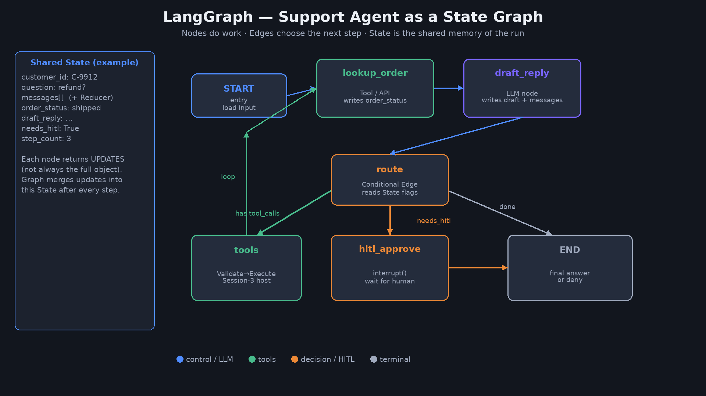
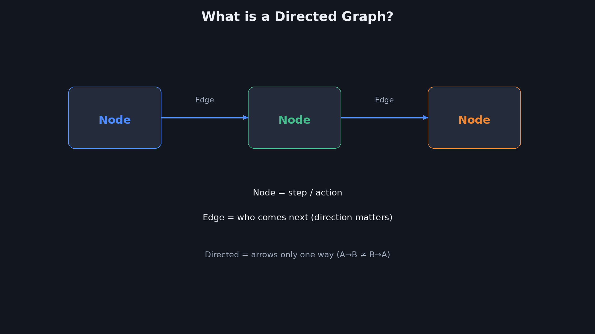
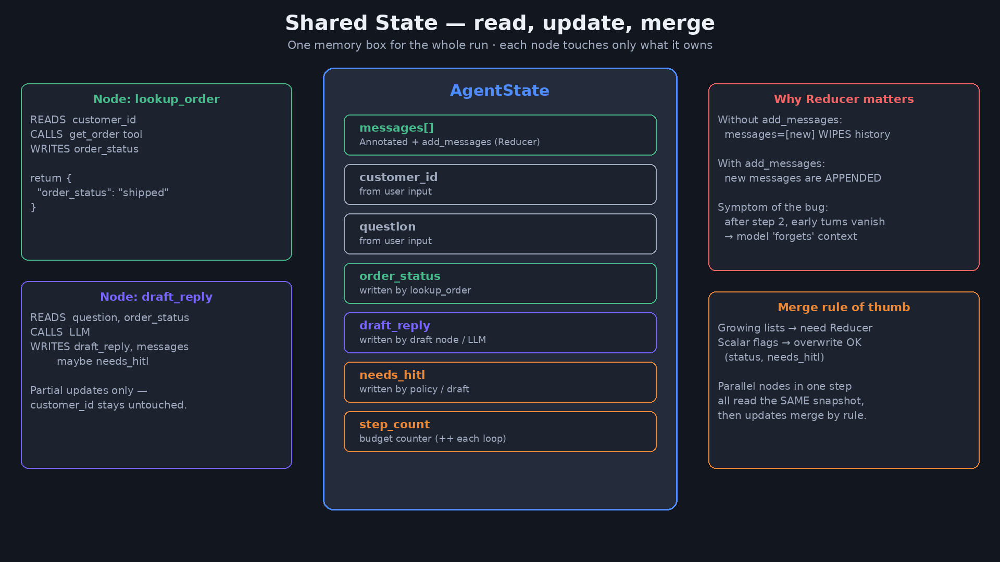
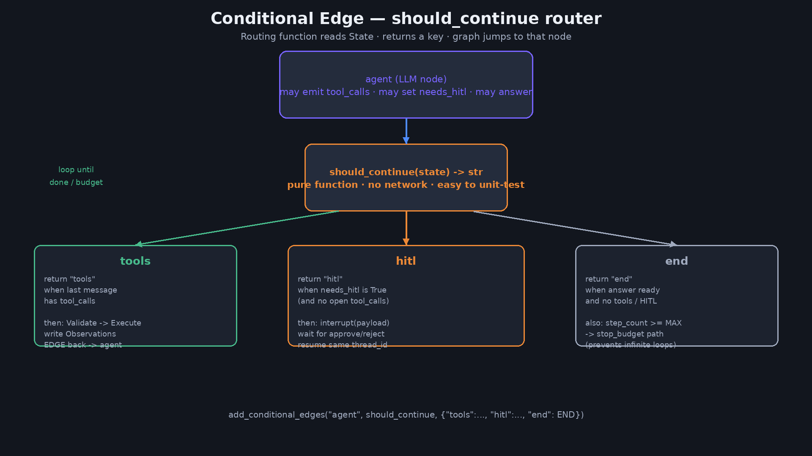
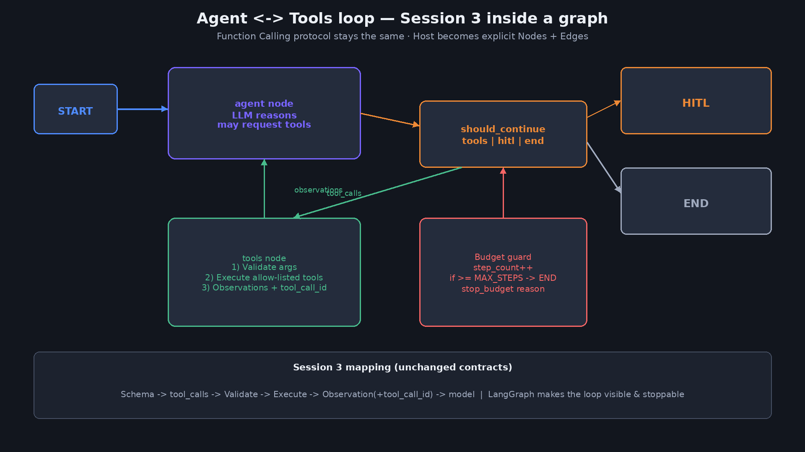
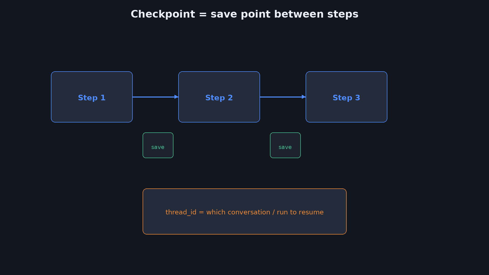
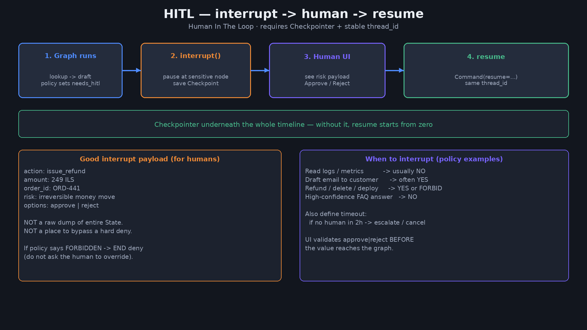

<div dir="rtl" lang="he">

<p align="center">
  
</p>

# ‏מפגש 4 — LangGraph לבניית Agents
## ‏קובץ מרצה (תסריט מלא להקלטה)

> **משך מיועד:** ~2.5–3 שעות **הקלטה רצופה**  
> **קהל בהקלטה:** אין זמן עבודה לסטודנטים חיים · אין שקט לחשיבה · אין המתנה לתשובות מקהל חי  
> **תרגילים/הדגמות:** המרצה מקריא פתרון מלא · אין זמן פתרון עצמאי של צופים  
> **מצגת סטודנטים:** [`04-students-slides.md`](04-students-slides.md)  
> **Lab:** [`labs/04-langgraph-basics/`](labs/04-langgraph-basics/)

> מספור המרצה = מספור הסטודנטים (1…45). לא מפרטים שוב את מפגש 3 לעומק.  
> **חובה בהקראה:** לפתוח ראשי תיבות (MCP, RAG, HITL, …) — לא להניח היכרות.

---

# ‏הנחיות למרצה (הקלטה)

- מקריאים את בלוק **להקראה** במלואו.
- **`[סטודנטים · N]`** — גללו למספר N לפני ההקראה.
- **אין** סימוני המתנה לקהל.
- ‏**`[Lab חי]`** — לפי `labs/04-langgraph-basics/`.
- כל בלוק קוד אצל המרצה מופיע גם אצל הסטודנטים באותו מספר.

---

# ‏חלק א׳ — פתיחה ומילון
## ‏1 — כותרת

[סטודנטים · 1]

**על המסך:**

<p align="center">
  
</p>

**LangGraph**  
בניית Agents כגרף מצבים (State Graph)



**להקראה:**

ברוכים הבאים למפגש הרביעי בקורס AI Agents ומערכות אוטונומיות.

על המסך: LangGraph — בניית Agents כגרף מצבים. State Graph אומר: המערכת היא אוסף צעדים מחוברים, עם מצב משותף שעובר ביניהם.

במפגשים הקודמים: מהו Agent, איך מתכננים ומבצעים, ואיך קוראים לכלים עם Function Calling. היום לומדים איך לארוז את זה במבנה שקל לדבג, לעצור באמצע, ולחזור מאותה נקודה.

‏LangGraph הוא שם ספרייה. Graph זה גרף. Lang רומז ל-Language models — מודלי שפה. ביחד: כלי לבניית זרימות Agent סביב LLM.

הדיאגרמה מראה רעיון פשוט: START, צמתים, החלטה, END. כל המפגש הוא פירוק של התמונה הזו לרמה שתוכלו לבנות לבד.

עוד מילה על השם: אנשים שומעים Graph וחושבים מיד על Grafana או על גרף מתמטי מפחיד. כאן הכוונה פשוטה מאוד — מפת דרכים של תהליך: איפה מתחילים, מה קורה בכל תחנה, ולאן אפשר לפנות.

בסוף המפגש אתם אמורים להסתכל על Agent בעבודה ולשאול: איפה ה-Nodes? איפה ה-Edges? איפה ה-State נשמר? אם אין תשובה — יש לכם צ׳אט עם כלים, לא מערכת מתוזמרת.

נפתח גם במילים על קהל היעד של המפגש. אם אתם מפתחים — תקבלו שלד קוד. אם אתם ארכיטקטים — תקבלו שפת תכנון. אם אתם מנהלי מוצר טכניים — תלמדו מה לדרוש ב-Design Review: איפה HITL, איפה Budget, איפה State.

‏LangGraph לא מחליף שיקול דעת מוצרי. הוא מכריח את השיקול להיות מפורש בקוד ובציור.

המפגש הזה הוא גשר בין פרוטוקול כלים לבין מערכת שרצה בפרוד. בסופו אתם לא רק מכירים שם ספרייה — אתם יודעים לפרק סוכן לציור, לקוד, ולנקודות סיכון. אם תצאו עם ציור אחד ברור של סוכן תמיכה — הצלחנו.

---
## ‏2 — מה היום (+ חזרה קצרה על מפגש 3)

[סטודנטים · 2]

**על המסך:**

| נבנה היום | מפגש 3 (בקצרה) |
|---|---|
| גרף · Node · Edge · State |‏ Tool Schema · Function Calling |
| Conditional edges · Loops | Validate · Parallel · Observations |
|‏ Checkpoint · thread_id · HITL interrupt |‏ MCP · PinchTab (דוגמה) |
|‏ Lab: גרף קטן רץ בפייתון |‏ Host שמריץ tool_calls |

לא חוזרים בפירוט על Schema — מניחים אותו כנתון.

**להקראה:**

הטבלה מפרידה מה שבונים היום ממה שכבר למדנו.

משמאל: גרף, צומת, קשת, מצב משותף, קשתות מותנות, לולאות, נקודות שמירה שנקראות Checkpoint, מזהה שיחה שנקרא thread_id, ועצירה לאדם שנקראת interrupt.

מימין — מפגש 3 בקיצור: איך מגדירים כלי, איך המודל מבקש אותו, ואיך Host מריץ. גם MCP — Model Context Protocol — כדרך לחבר Servers של כלים. PinchTab היה דוגמה לדפדפן.

אם Schema או tool_call_id עדיין מטושטשים — חזרו למפגש 3. היום נשתמש בהם כבלוקים מוכנים בתוך צמתי גרף.

שימו לב גם לעמודה של MCP. Model Context Protocol הוא לא LangGraph. הוא שכבת חיבור כלים. LangGraph הוא שכבת תזמור צעדים. אפשר להשתמש בשניהם יחד: הגרף מחליט מתי, ו-MCP מספק אילו כלים זמינים.

‏PinchTab מהמפגש הקודם היה דוגמה ל-MCP Server. היום לא נריץ PinchTab — נבנה שלד גרף.

סדר הלמידה היום: מילון ורעיונות גרף, אחר כך State ו-Reducers, אחר כך Edges ולולאת כלים, אחר כך Checkpoint ו-HITL, אחר כך דפוסים מתקדמים בקצרה, Lab, והדגמות באגים. אם תרגישו שהקצב מהיר — עצרו את הווידאו על שקף המילון וחזרו.

חזרה על מפגש 3 אינה שיעור מלא. Schema, Validate, Parallel ו-Observations הם דרישות קדם. בליהם צומת Tools יהיה חור שחור.

שימו לב לעמודה הימנית: היא לא שיעור חוזר. היא רשימת תלויות. בלי Schema טוב, צומת Tools יהיה פרוץ. בלי Observations מובנות, הלולאה תסתובב סביב טקסט מטושטש. LangGraph מניח שיש לכם לבנים ממפגש 3.

---
## ‏3 — שאלת המפגש + תוצרים

[סטודנטים · 3]

**על המסך:**

> איך הופכים לולאת Agent לרשימת צעדים מפורשת שאפשר לעצור, לדבג, ולחדש?

בסוף המפגש תדעו:
1. להסביר Graph / Node / Edge / State בעברית פשוטה  
2. לבנות StateGraph קטן עם קשת מותנית  
3. להבין Checkpoint, thread_id, ו-interrupt ל-HITL  
4. להריץ Lab גרף בפייתון ולקרוא את הזרימה

**להקראה:**

השאלה המרכזית: איך הופכים לולאת Agent — מודל, כלי, תצפית, שוב מודל — למבנה מפורש.

מפורש אומר: אתם רואים את הצעדים, אפשר לעצור בין צעד לצעד, אפשר לשמור מצב, אפשר לחזור אחרי אישור אדם.

ארבעה תוצרים: שפה של גרפים, בניית StateGraph קטן, הבנת שמירה וחידוש ריצה, ו-Lab חי.

אם תזכרו רק משפט אחד: ב-LangGraph הלולאה לא חיה רק בראש המודל — היא מצוירת כגרף בקוד שלכם.

נפרק את ארבעת התוצרים לשאלות בדיקה: האם אני יכול להסביר Node למישהו שאינו מתכנת? האם בניתי גרף עם לפחות ענף אחד? האם אני יודע למה HITL צריך Checkpoint? האם הרצתי את ה-Lab וראיתי לוג צמתים?

אם ארבע התשובות חיוביות — המפגש עשה את שלו.

השאלה על המסך היא מצפן. בכל פעם שמישהו מציע "עוד פרומפט ארוך" במקום מבנה — חזרו לשאלה: האם אפשר לעצור, לדבג, ולחדש? אם לא — הפרומפט לא מספיק.

התוצרים הם לא תעודות; הם יכולות. בסוף המפגש אתם אמורים לצייר גרף על נייר ולהסביר אותו בקול בלי להסתכל בשקפים.

המילה «מפורשת» חוזרת כי היא ההפך מ«סמוי בפרומפט». מפורש אפשר לבדוק בטסט. סמוי אפשר רק לקוות. בארגונים מפוקחים — תקווה אינה אסטרטגיה.

---
## ‏4 — מילון ראשי תיבות (חובה)

[סטודנטים · 4]

**על המסך:**

| ראשי תיבות | פירוש מלא (EN) | בעברית פשוטה |
|---|---|---|
|‏ **LLM** |‏ Large Language Model | מודל שפה גדול (Claude / GPT וכו׳) |
|‏ **API** |‏ Application Programming Interface | ממשק תכנותי בין מערכות |
|‏ **JSON** |‏ JavaScript Object Notation | פורמט נתונים מובנה טקסטואלי |
|‏ **SDK** |‏ Software Development Kit | ערכת פיתוח / ספריות מוכנות |
|‏ **HITL** |‏ Human In The Loop | אדם בתוך הלולאה (אישור / התערבות) |
|‏ **MCP** |‏ Model Context Protocol | פרוטוקול לחיבור כלי-עזר לסוכנים |
|‏ **RAG** |‏ Retrieval-Augmented Generation | יצירה מועשרת בשליפה ממאגר |
|‏ **FSM / State Machine** |‏ Finite State Machine | מכונת מצבים — מצבים + מעברים |
|‏ **DAG** |‏ Directed Acyclic Graph | גרף מכוון בלי מעגלים |
|‏ **LangGraph** | (שם ספרייה) | בניית Agents כגרף מצבים (יכול לכלול לולאות) |

הערה: LangGraph **מאפשר לולאות** — לא חייב להיות DAG.

**להקראה:**

לפני שמתקדמים — מילון. במפגש 3 ראשי תיבות כמו MCP ו-RAG הופיעו בלי מספיק פירוק. היום מתקנים את ההרגל: כל ראשי תיבות נפתחים.

‏LLM — Large Language Model — מודל שפה גדול. זה המנוע שכותב ומחליט.

‏API — Application Programming Interface — הדרך של תוכנה לדבר עם תוכנה אחרת דרך בקשות מוגדרות.

‏JSON — JavaScript Object Notation — פורמט טקסט נפוץ לנתונים מובנים. Schemas של כלים כתובים לרוב ברוח JSON.

‏SDK — Software Development Kit — חבילת ספריות שחוסכת לכם לכתוב הכל מאפס. LangGraph הוא חלק מהעולם הזה.

‏HITL — Human In The Loop — אדם בתוך הלולאה. לא רק משתמש בקצה — נקודת אישור באמצע התהליך.

‏MCP — Model Context Protocol — פרוטוקול סטנדרטי לחשוף כלים ומשאבים לסוכנים. Session 3 הכיר אותו; כאן רק נזכרים בשם המלא.

‏RAG — Retrieval-Augmented Generation — קודם שולפים מידע רלוונטי ממאגר, אחר כך המודל מייצר תשובה עם ההקשר הזה. זה לא LangGraph, אבל מופיע ליד Agents הרבה.

‏State Machine / FSM — Finite State Machine — מכונת מצבים סופית: יש מצבים, ויש מעברים ביניהם לפי כללים.

‏DAG — Directed Acyclic Graph — גרף מכוון בלי מעגלים. חשוב: LangGraph כן יכול לכלול לולאות, כי Agent חוזר על עצמו. אל תבלבלו DAG עם LangGraph.

נעמיק עוד ב-RAG כי זה הכי מבלבל למתחילים. Retrieval אומר שליפה: חיפוש במסמכים, בבסיס ידע, בטיקטים ישנים. Augmented אומר מועשרת: התוצאות נכנסות לפרומפט. Generation אומר היצירה של התשובה על ידי ה-LLM.

בלי Retrieval יש רק מה שזכור במשקולות המודל. עם RAG אפשר לענות על מסמך פנימי שהמודל לא ראה באימון.

‏MCP לעומת זאת לא שולף ידע לתוך פרומפט בהכרח — הוא חושף כלים. לדוגמה: כלי get_order. אפשר לבנות RAG בלי MCP, ו-MCP בלי RAG. ו-LangGraph יכול לתזמר גם וגם כצמתים נפרדים.

נעשה תרגיל אבחנה מהיר בקול. אם המערכת שולפת סעיפי חוזה ואז עונה — זה קרוב ל-RAG. אם המערכת מפעילה get_order דרך Server — זה קרוב ל-MCP או ל-Tool Use. אם המערכת מנהלת שלבים עם עצירה לאדם — זה קרוב ל-LangGraph עם HITL. שלושתם יכולים לשבת באותו מוצר בשכבות שונות.

‏JSON מופיע גם ב-Schema של כלים וגם לפעמים ב-State. אל תבלבלו JSON כפורמט עם JSON Schema כחוזה ולידציה.

שמרו את הטבלה לידכם בהמשך הקורס. במפגש 5 כשיגיעו צוותי סוכנים, עדיין תשתמשו ב-HITL וב-State. במפגש 6 Memory — עדיין תבדלו בין Checkpoint לבין זיכרון ארוך טווח. המילון הוא תשתית, לא הקדמה חד־פעמית.

נעשה עוד מעבר מבחין, כי זה בדיוק מה שחסר במפגש 3. RAG = Retrieval-Augmented Generation = שליפה ואז יצירה. MCP = Model Context Protocol = פרוטוקול חיבור כלים ושרתי הקשר. HITL = Human In The Loop = אדם מחליט בנקודה רגישה. FSM = Finite State Machine = מצבים ומעברים. DAG = Directed Acyclic Graph = גרף בלי מעגלים — ו-LangGraph לא חייב להיות DAG כי לולאות Agent חוקיות.

אם תזכרו רק את ההבחנה הזו — כבר תמנעו בלבול בישיבות תכנון.

---
## ‏5 — מה זה גרף? Node ו-Edge

[סטודנטים · 5]

**על המסך:**



- ‏**Node (צומת):** פעולה / שלב  
- ‏**Edge (קשת):** מעבר לשלב הבא  
- ‏**Directed (מכוון):** החץ קובע כיוון  

דוגמה אנושית: בית קפה  
`הזמנה → הכנה → תשלום → מסירה`

**להקראה:**

גרף הוא אוסף נקודות וחיבורים. נקודה נקראת Node — צומת. חיבור נקרא Edge — קשת.

כשהקשת יש לה כיוון — חץ — אומרים Directed Graph, גרף מכוון. A ל-B לא אומר אוטומטית שמותר לחזור מ-B ל-A.

בבית קפה: הזמנה, אחר כך הכנה, אחר כך תשלום, אחר כך מסירה. כל שלב Node. החיצים Edges.

למה זה עוזר ל-Agents? כי במקום לולאה סמויה בתוך צ׳אט, אתם מציירים את תהליך העבודה בקוד — ואז אפשר לבדוק אותו כמו תהליך עסקי.

עוד דוגמה יומיומית לגרף מכוון: ניווט GPS. אתם במצב נוכחי, יש יעדים אפשריים, והחץ אומר לאן מותר לפנות. אם יש פקק — Conditional Edge לדרך חלופית.

בתוכנה אותו דבר: המצב הוא State, והבחירה בין דרכים היא Edge מותנה.

נחדד עוד: Node יכול להיות קטן מאוד — אפילו רק נירמול מחרוזת — או גדול כמו קריאת מודל. מה שחשוב הוא שם ואחריות. Edge לא מדפיס לוגים לענן ולא קורא ל-API; הוא מחבר.

כשתתכננו מערכת, התחילו בציור על לוח: עיגולים וחיצים. רק אחר כך קוד. צוותים שמדלגים לציור משלמים בריפקטור.

תרגיל מחשבתי קצר: ציירו שלושה Nodes של בוקר שלכם — קימה, קפה, מיילים — וחץ מותנה «אם דחוף». זה אותו ראש שתצטרכו לסוכן. אל תדלגו על הציור האנושי; הוא זול ומונע סיבוך.

ברמה גבוהה: גרף מכוון עם לולאות הוא מודל חישובי חזק. אבל החוזק מגיע עם אחריות — אתם חייבים תנאי עצירה. בלי זה «חזק» הופך ל«יקר». לכן מההתחלה מחברים בין ציור יפה לבין Budget.

---
## ‏6 — למה לא מספיק סקריפט ליניארי?

[סטודנטים · 6]

**על המסך:**

| סקריפט A→B→C | גרף עם החלטות |
|---|---|
| תמיד אותו סדר | לפעמים מדלגים / חוזרים |
| קשה לעצור באמצע ולחזור |‏ Checkpoint בין צעדים |
| דיבאג = לקרוא לוג ארוך | דיבאג = איזה צומת רץ |

‏Agent אמיתי צריך **ענפים ולולאות** — לא רק צינור חד־כיווני.

**להקראה:**

סקריפט ליניארי אומר: תמיד אחד, אחר כך שניים, אחר כך שלוש. זה מצוין ל-ETL פשוט. זה חלש ל-Agent.

‏Agent לפעמים צריך כלי, לפעמים תשובה מיד, לפעמים אישור אדם, לפעמים לחזור אחורה. זה ענפים ולולאות.

בגרף אפשר לשמור מצב בין צעדים ולחזור אחרי הפסקה. בסקריפט רגיל בלי תשתית — בדרך כלל מתחילים מחדש או ממציאים קבצי מצב ידניים מבולגנים.

דיבאג בגרף שואל: באיזה צומת נתקענו? זו שאלה טובה יותר מ־מה המודל אמר בטוקן 4,000.

יש צוותים שמנסים לפתור מורכבות עם פרומפט ארוך מאוד: תמיד תבדוק לוגים ואז מדדים ואז תחליט. זה נשבר כשיש חריגים. גרף מכריח אתכם להגיד את החריגים בקוד — וזה דווקא יתרון.

מתי כן סקריפט ליניארי? כשסדר קבוע, אין אדם באמצע, ואין לולאת כלים. אל תכפו LangGraph על Cron שמעתיק קובץ. כן תשקולו גרף כשיש החלטות דינמיות ותקציב סיכון.

יש גם אמצע: סקריפט עם כמה if־ים. עד שלושה ענפים פשוטים אולי מספיק. ברגע שיש לולאה, אדם, ושמירה — העלות של «עוד if» עולה והגרף משתלם.

---

# ‏חלק ב׳ — מהו LangGraph
## ‏7 — מה זה LangGraph?

[סטודנטים · 7]

**על המסך:**

**הגדרה:** ספרייה לבניית אפליקציות LLM כ**גרף מצבים** — עם לולאות, ענפים, ושמירת מצב.

```text
State + Nodes + Edges  →  compile()  →  invoke / stream
```

שייך למשפחת LangChain / LangSmith, אבל מתמקד ב**אורקסטרציה** (תזמור הצעדים), לא רק בשרשור פרומפטים.

**להקראה:**

‏LangGraph היא ספריית קוד פתוח — לרוב בפייתון, ויש גם TypeScript — לבניית זרימות סביב מודלי שפה כגרף.

שלושה מרכיבים: State — המצב המשותף; Nodes — הפונקציות שרצות; Edges — מי בא אחרי מי.

אחרי שבונים, עושים compile — קימפול הגרף לאובייקט רץ — ואז invoke להרצה מלאה, או stream לקבלת אירועים תוך כדי.

אורקסטרציה אומרת: מי מנגן מתי. לא רק איזה פרומפט לשלוח, אלא איך מנהלים תהליך עם החלטות וחזרות.

‏LangSmith הוא כלי תצפית/דיבאג קשור — לא חובה היום, רק כדי שלא תתבלבלו בשמות.

נאמר זאת שוב לאט: compile לא מאמן מודל. compile בונה את מכונת הריצה של הגרף שלכם. invoke מריץ אותה פעם אחת עם קלט. stream מריץ ופולט אירועים.

אם מישהו אומר לי שהרצתי LangGraph והתכוון רק ל-ChatModel — הוא משתמש במילה לא מדויקת.

בעולם הארגוני תשמעו גם Orchestration מול Choreography. LangGraph קרוב יותר לאורקסטרציה מרוכזת: יש מפה אחת שקובעת את הזרימה. זה עוזר לדיבאג ולמדיניות.

מה לא נכנס להגדרה: LangGraph אינה ספק LLM, אינה מחליפה אבטחת כלים, ואינה פותרת לבד איכות תשובות. היא שלד תזמור. איכות התשובה עדיין תלויה במודל, בפרומפט, ובכלים.

הנוסחה State ועוד Nodes ועוד Edges היא חוזה מנטלי. כשאתם קוראים קוד זר של LangGraph, חפשו קודם את הגדרת ה-State, אחר כך add_node, אחר כך add_edge ו-add_conditional_edges, ורק בסוף compile. הסדר הזה חושף את הארכיטקטורה מהר יותר מקריאת כל פונקציה באקראי.

---
## ‏8 — LangChain · LangGraph · LangSmith — מי זה מי

[סטודנטים · 8]

**על המסך:**

| שם | תפקיד קצר |
|---|---|
|‏ **LangChain** | לבני קריאות ל-LLM, פרומפטים, שרשורים, אינטגרציות |
|‏ **LangGraph** | תזמור זרימה כגרף (מצב, ענפים, לולאות, שמירה) |
|‏ **LangSmith** | מעקב, לוגים, הערכה (Observability) |

אפשר לבנות Agent בלי LangChain המלא — אבל הרבה דוגמאות משלבות.

**להקראה:**

שלושה שמות דומים מאותו אקוסיסטם.

‏LangChain עוזר לדבר עם מודלים ולחבר רכיבים.

‏LangGraph עוזר לנהל תהליך מורכב כגרף.

‏LangSmith עוזר לראות מה קרה בריצה — לוגים ומדדים.

היום המיקוד הוא LangGraph. השאר מופיעים רק כדי למפות את המפה.

אנלוגיה: LangChain דומה לערכת כלי מטבח. LangGraph דומה למתכון עם שלבים והחלטות. LangSmith דומה למצלמה במטבח שרואים מה נשרף. אפשר לבשל בלי מצלמה; קשה לבשל בלי כלים או בלי מתכון כשיש מנות מורכבות.

אם בעבודה אומרים לכם "נעשה הכל ב-LangChain" — שאלו האם הכוונה לכלים או לתזמור. אם צריך HITL ולולאות מצב — ודאו ש-LangGraph או מקבילה נמצאים בשיחה.

בשיחות רכש כלים תשמעו חבילות. אל תקנו «הכל» בלי לדעת איזו שכבה חסרה. לפעמים חסר Observability — LangSmith או מקבילה. לפעמים חסר תזמור — LangGraph. לפעמים חסרים מחברים — LangChain או SDK ספק.

---
## ‏9 — מכונת מצבים (State Machine) בעברית

[סטודנטים · 9]

**על המסך:**

מכונת מצבים = רשימת **מצבים** + כללי **מעבר**.

דוגמה תמיכה:
`חדש → בבדיקה → ממתין לאישור → סגור`

ב-LangGraph:
- המצב החי = אובייקט **State**  
- המעבר = **Edge** (לפעמים מותנה)

**להקראה:**

‏Finite State Machine — מכונת מצבים סופית — היא רעיון ישן בהנדסת תוכנה: המערכת נמצאת במצב אחד מתוך רשימה, ועוברת למצב אחר לפי אירוע או כלל.

בטיקט תמיכה: חדש, בבדיקה, ממתין לאישור, סגור. לא קופצים מסגור לחדש בלי כלל שמאפשר את זה.

ב-LangGraph המצב עשיר יותר מתווית אחת — זה אובייקט עם שדות. אבל הרעיון דומה: אתם שולטים במעברים במפורש.

במדעי המחשב מלמדים FSM על דלתות אוטומטיות ומעליות. Agents הם אותו רעיון עם State עשיר יותר ועם LLM כרכיב החלטה בתוך חלק מהצמתים — לא במקום כל המכונה.

הגבלה של FSM קלאסי: מספר מצבים קטן ותוויות. ב-Agents ה-State עשיר, ולכן קל יותר להסתבך. המשמעת של Edges מותנים מחזירה חלק מהבהירות של FSM בלי לוותר על עושר השדות.

המעבר מתווית־מצב לאובייקט־State הוא קפיצה קוגניטיבית. תווית «ממתין לאישור» הופכת ל־needs_hitl שווה True פלוס draft_reply מלא. אותו רעיון עסקי, ייצוג עשיר יותר בקוד.

---
## ‏10 — StateGraph — השלד

[סטודנטים · 10]

**על המסך:**

```python
from typing import TypedDict
from langgraph.graph import StateGraph, START, END

class State(TypedDict):
    text: str

def shout(state: State) -> dict:
    return {"text": state["text"].upper()}

g = StateGraph(State)
g.add_node("shout", shout)
g.add_edge(START, "shout")
g.add_edge("shout", END)
app = g.compile()
print(app.invoke({"text": "hello"}))  # {'text': 'HELLO'}
```

**להקראה:**

זה השלד המינימלי שכדאי לשנן.

מגדירים State כ-TypedDict — מילון עם טיפוסים ידועים מראש. כאן יש שדה text מסוג מחרוזת.

מגדירים פונקציית צומת: מקבלת state, מחזירה מילון עדכונים. כאן הופכים לאותיות גדולות.

יוצרים StateGraph על אותו State, מוסיפים צומת בשם shout, מחברים START אליו ואז ל-END, מקמפלים, ומריצים invoke.

‏START ו-END הם צמתי עזר מובנים: איפה מתחילים ואיפה מסיימים.

אם הקוד הזה ברור — אתם מוכנים ל-90 אחוז מהמבנה של Agents ב-LangGraph. השאר זה ענפים, כלים, ושמירה.

נקרא את הקוד שורה־שורה כאילו זו הפעם הראשונה שלכם בפייתון מקצועי.

ייבוא TypedDict — חוזה שדות. ייבוא StateGraph, START, END — שלד הגרף.

מחלקת State עם text. פונקציית shout שמחזירה מילון עם text מעודכן. שימו לב: מחזירים dict של עדכונים, לא בהכרח אובייקט State מלא.

‏add_node רושם את הפונקציה תחת שם. add_edge מחבר. compile מכין. invoke מריץ עם קלט התחלתי.

הפלט הצפוי הוא המילון הסופי של ה-State אחרי END.

אחרי שהרצתם את הדוגמה בראש, שנו אותה מנטלית: הוסיפו צומת trim לפני shout. החיבורים משתנים: START ל-trim, trim ל-shout, shout ל-END. זה התרגיל המנטלי שתראו ב-Lab עם normalize וענפים.

‏invoke מחזיר את ה-State הסופי אחרי המיזוגים. אם הוספתם שדות — תראו אותם בפלט. אם שכחתם להחזיר עדכון — השדה יישאר כפי שהיה בקלט או בברירת מחדל.

אם אתם מעתיקים את השלד לפרויקט, שנו שמות מיד לשמות דומיין: לא shout אלא classify_intent. שמות גנריים נשארים בדמו ומתים בפרוד תחת בלגן.

---

# ‏חלק ג׳ — State
## ‏11 — מה זה State?

[סטודנטים · 11]

**על המסך:**



‏**State** = תיבת הזיכרון המשותפת של הריצה.

כל Node:
1. קורא מה-State  
2. עושה עבודה  
3. מחזיר **עדכונים** (לא בהכרח את כל התיבה)

**להקראה:**

‏State הוא המצב המשותף. תחשבו על טופס שעובר בין מחלקות: כל מחלקה ממלאת שדות, אף אחד לא זורק את הטופס לפח בין לבין.

צומת לא חייב להחזיר את כל ה-State. הוא מחזיר רק מה שהשתנה. המנגנון של הגרף ממזג את העדכון פנימה.

בלי State משותף, כל צומת היה צריך לקבל עשרות פרמטרים ידנית. עם State — החוזה אחד.

אם שני צמתים רצים באותו super-step במקביל, שניהם קוראים מצב שנכון לתחילת הצעד, ואז העדכונים מתמזגים. לכן חשוב להבין Reducers לפני מקביליות כבדה.

אנלוגיה נוספת: State הוא לוח מחיק משותף בחדר ישיבות. כל משתתף (צומת) כותב בשורה שלו. אם שני אנשים מוחקים את אותה רשימה בלי כלל — יש בלגן. לכן Reducer.

‏State אינו תחליף לבסיס נתונים עסקי. הזמנות חיות ב-DB; State מחזיק מה שצריך לריצה הנוכחית. בלבול ביניהם יוצר או State שמן מדי או מערכת בלי מקור אמת.

טעות נפוצה: לשים ב-State את כל מסד הנתונים. State צריך להיות מינימום שמאפשר החלטות ודיבאג. מזהי הזמנה כן; כל היסטוריית הרכישות של הלקוח — רק אם באמת נחוץ לצעד הבא, אחרת שלפו בצומת לפי הצורך.

---
## ‏12 — TypedDict וחוזה השדות

[סטודנטים · 12]

**על המסך:**

```python
from typing import Annotated, TypedDict
from langgraph.graph.message import add_messages

class AgentState(TypedDict):
    messages: Annotated[list, add_messages]  # מצטבר
    goal: str
    needs_hitl: bool
```

- שדות ברורים = פחות באגים  
- ‏`Annotated[..., add_messages]` = Reducer שמ**מוסיף** הודעות במקום לדרוס

**להקראה:**

‏TypedDict אומר לפייתון ולמפתחים: אלה השדות החוקיים.

‏goal הוא מחרוזת מטרה. needs_hitl הוא בוליאני — כן או לא צריך אדם.

‏messages מסומן ב-Annotated עם add_messages. זה Reducer — כלל מיזוג. במקום להחליף את כל רשימת ההודעות, מוסיפים אליה.

בלי Reducer נכון, צומת ש מחזיר הודעה אחת עלול למחוק בטעות את כל ההיסטוריה. זה באג קלאסי למתחילים.

‏Annotated נשמע כמו קסם של טיפוסים. בפועל זה רק דרך לצרף מטא-דאטה לטיפוס: השדה הוא list, ודרך המיזוג היא add_messages.

בגרסאות שונות של הספרייה יכולים להיות Reducers מוכנים נוספים. העיקרון לא משתנה.

טיפ מעשי: אל תשימו ב-State סודות גולמיים כמו מפתחות API. שימו מזהים, סטטוסים, טיוטות שמותר ללוג לפי מדיניות, והפניות. State לעיתים נשמר ב-Checkpoint — חשבו על PII.

‏TypedDict לא מונע הכנסת מפתח זר בזמן ריצה בפייתון דינמי. הוא חוזה לצוות. אם צריכים אכיפה קשיחה — הוסיפו ולידציה בגבולות הצמתים או מודלים כמו Pydantic לפי הסטאק.

‏add_messages הוא Reducer ספציפי להודעות. אל תעתיקו אותו אוטומטית לשדות אחרים כמו evidence או errors — שם אולי תרצו reducer אחר שמוסיף מחרוזות, או דריסה מכוונת. כל שדה מקבל מדיניות משלו.

---
## ‏13 — Reducer — למה אכפת לנו

[סטודנטים · 13]

**על המסך:**

| בלי Reducer חכם | עם Reducer מתאים |
|---|---|
| עדכון דורס ערך קודם | עדכון מתמזג לפי כלל |
| קל לאבד היסטוריית messages | ‏`add_messages` שומר רצף |

כלל אצבע: שדות-רשימה שצומחים לאורך הריצה כמעט תמיד צריכים Reducer.

**להקראה:**

‏Reducer הוא פונקציית מיזוג: איך מחברים ערך ישן עם עדכון חדש.

למספר פשוט לפעמים רוצים דריסה. לרשימת הודעות כמעט תמיד רוצים הוספה.

כשתתכננו State, שאלו לכל שדה: האם עדכון מחליף או מצטרף? התשובה קובעת את ה-Reducer.

תרגיל מחשבתי: שדה counter. אם שני צמתים מחזירים counter=1, ו-Reducer הוא דריסה — תקבלו 1. אם Reducer הוא סכום — תקבלו 2. אותו עדכון, משמעות אחרת. לכן חייבים לבחור במודע.

‏Reducer הוא מדיניות מיזוג. אפשר לחשוב עליו כפונקציה old ועוד new מחזירה combined. add_messages יודע לצרף הודעות ולטפל במזהים לפי חוזה הספרייה.

בלי להבין את זה תבזבזו שעות על באגים שנראים כמו "המודל שכח הקשר" כשבפועל אתם מחקתם את ההקשר בעצמכם בעדכון State.

כשיש ספק איזה Reducer לבחור לשדה חדש — שאלו: האם עדכון מחליף משמעות קודמת או מוסיף עליה? החלפה → דריסה. הוספה → Reducer מצטבר. תעדו את הבחירה בהערה ליד השדה.

---
## ‏14 — דוגמת State לסוכן תמיכה

[סטודנטים · 14]

**על המסך:**

```python
class SupportState(TypedDict):
    customer_id: str
    question: str
    messages: Annotated[list, add_messages]
    order_status: str | None
    draft_reply: str | None
    needs_hitl: bool
```

מי ממלא מה?
- קלט משתמש → `customer_id`, `question`  
- כלי → `order_status`  
- LLM → `draft_reply`, `messages`  
- Policy → `needs_hitl`

**להקראה:**

דוגמה מלאה יותר לסוכן תמיכה.

המשתמש נותן מזהה לקוח ושאלה. כלי מביא סטטוס הזמנה. המודל מנסח תשובה. מדיניות מחליטה אם צריך אדם.

שימו לב שהשדות משקפים את העסק, לא רק את הטכניקה. State טוב הוא גם תיעוד מוצר.

שימו לב ש-order_status יכול להיות None בהתחלה. זה לגיטימי: עדיין לא שלפנו. draft_reply גם. State צריך לייצג גם חוסר מידע, לא רק הצלחות.

הרחיבו את הדוגמה בראש: הוסיפו שדה risk_level או refund_requested. מי ממלא? פרסר על השאלה או כלי. מי קורא? Policy ו-Edge. ככל שהשדות העסקיים מפורשים יותר, כך פחות מטמינים לוגיקה בפרומפט.

הוסיפו לשדות גם audit: מי או מה עדכן order_status. לא חובה ב-Lab, אבל בפרוד עם HITL תרצו לדעת אם הסטטוס הגיע מכלי או מהקלדה ידנית.

סדר מילוי השדות חשוב לדיבאג: קודם מזהים מהקלט, אחר כך תוצאות כלים, אחר כך טיוטות מודל, אחר כך דגלי מדיניות. אם דגל HITL נדלק לפני שיש draft — האדם יאשר ריק. בדקו תלויות בציור לפני הקוד.

---

# ‏חלק ד׳ — Nodes ו-Edges
## ‏15 — Node = פונקציה עם חוזה

[סטודנטים · 15]

**על המסך:**

```python
def lookup_order(state: SupportState) -> dict:
    # כאן בדרך כלל Tool / API
    status = fake_get_order(state["customer_id"])
    return {"order_status": status}
```

כללי בריאות:
- קלט ברור מה-State  
- פלט = עדכונים בלבד  
- תופעות לוואי — רק כאן (לא ב-Edge)

**להקראה:**

צומת הוא פונקציה. היא מקבלת מצב ומחזירה עדכונים.

פה המקום לקרוא ל-API, לכלי, או ל-LLM. הקשת רק מחליטה לאן הולכים אחר כך — היא לא אמורה לשלוח מייל בסתר.

הפרדה הזו חשובה לדיבאג: אם נשלח מייל פעמיים, אתם יודעים לחפש בצומת, לא בנתב.

בדיקות יחידה לצומת: נותנים State מזויף, בודקים את ה-dict החוזר. זה הרבה יותר קל מאשר לבדוק שיחת LLM שלמה מקצה לקצה.

שמות צמתים: בחרו שמות פעולה באנגלית פשוטה או בעברית עקבית בצוות — lookup_order עדיף על do_stuff. השם מופיע בלוגים וב-stream.

החתימה State ל-dict היא החוזה המינימלי. אל תחזירו None במקום dict. אל תשנו State ב-place ותסמכו על מוטציה שקטה — החזירו עדכונים מפורשים כדי שהמיזוג יעבוד כמתוכנן.

כש-Node נכשל ברשת — החליטו מראש: מחזירים שגיאה ל-State ומנתבים ל-error, או זורקים חריגה שעוצרת את הגרף. שניהם לגיטימיים; ערבוביה ביניהם בלי מדיניות היא באג. תעדו את הבחירה ליד הצומת.

---
## ‏16 — Edge רגיל מול Conditional Edge

[סטודנטים · 16]

**על המסך:**



```python
graph.add_edge("lookup", "draft")          # תמיד
graph.add_conditional_edges(
    "draft",
    route_after_draft,                     # פונקציית החלטה
    {"hitl": "approve", "end": END, "tools": "lookup"},
)
```

**להקראה:**

‏Edge רגיל אומר: אחרי A תמיד B.

‏Conditional Edge אומר: אחרי A מריצים פונקציית החלטה, והיא מחזירה שם של יעד.

בדוגמה: אחרי ניסוח תשובה אפשר ללכת לאישור אדם, לסיום, או חזרה לכלים.

זו הדרך המרכזית לבטא if/else בלי לקבור אותו עמוק בתוך צומת ענק.

פונקציית הכיוון route_after_draft חייבת להחזיר אחד מהמפתחות שסיפקתם במילון היעדים. אם תחזירו מחרוזת לא מוכרת — תקבלו שגיאה בזמן ריצה. זה טוב: עדיף ליפול מוקדם מאשר ללכת לצומת שלא קיים בשקט.

ההבדל הפסיכולוגי: Edge רגיל הוא הבטחה. Conditional הוא מדיניות. כשאתם קוראים קוד זר, חפשו קודם את add_conditional_edges — שם מסתתר הסיפור העסקי.

מפת היעדים בפרמטר השלישי חייבת להיות מסונכרנת עם ערכי החזרה של הנתב. זה חוזה כפול: הפונקציה והמילון.

בדיקות לנתב: תנו State עם needs_hitl True וודאו יעד hitl. תנו State עם tool_calls וודאו tools. תנו State «נקי» וודאו end. שלושה טסטים — ביטחון ענק.

יש דפוס נוסף: נתב שמחזיר END ישירות מול נתב שמחזיר שם צומת «finalize» שאחר כך הולך ל-END. השני מאפשר לוג וניקוי לפני סיום. בדמו הקטן END מספיק; בפרוד לעיתים כדאי צומת סיום מפורש.

---
## ‏17 — START, END, ולולאות

[סטודנטים · 17]

**על המסך:**

```text
START → agent ⇄ tools → (maybe HITL) → END
```

לולאה חוקית ב-LangGraph:
‏`agent → tools → agent → …` עד תנאי עצירה.

בלי תנאי עצירה = לולאה אינסופית = חשבון עננים בוער.

**להקראה:**

‏START ו-END מסמנים כניסה ויציאה.

הלולאה הקלאסית של Agent: מודל, כלים, חזרה למודל. ב-LangGraph זה שני צמתים וקשתות מותנות.

חובה תנאי עצירה: אין יותר tool_calls, הגענו לתשובה, נגמר תקציב צעדים, או Escalate לאדם.

‏Budget ממפגש 2 חוזר כאן כהגנה על הגרף.

לולאה agent-tools היא הלב של רוב הסוכנים. אם אתם מבינים אותה, אתם מבינים למה ReAct ממפגש 2 ו-Function Calling ממפגש 3 נפגשים כאן כמבנה אחד.

וריאציה נפוצה: אחרי tools חוזרים ל-agent; אחרי תשובה בלי כלים הולכים ל-END; אם Policy דורש — HITL לפני END. שלושת הענפים האלה מכסים רוב המערכות הראשונות.

לולאה חוקית אינה לולאה אינסופית. ההבדל הוא תנאי יציאה מדיד. אם אין לכם מדד — step_count — אין לכם לולאה בטוחה.

וריאציית לולאה עם מאגר כלים דינמי: אחרי Observation המודל עשוי לבחור כלי אחר. הגרף לא חייב לדעת מראש את כל המסלול — רק את נקודות החלטת הנתב ואת תקרת הצעדים. זה הכוח של Conditional Edge.

---
## ‏18 — מתי Edge ומתי Logic בתוך Node?

[סטודנטים · 18]

**על המסך:**

| שמים ב-Edge | שמים ב-Node |
|---|---|
| לאן הולכים עכשיו | איך מבצעים פעולה |
| ‏if needs_hitl | קריאת API / LLM |
| עצירה / המשך | חישוב, פרסור, Validate |

אם צומת אחד עושה הכל כולל ניתוב — הגרף מאבד ערך.

**להקראה:**

כלל הפרדה: ניתוב בקשת, ביצוע בצומת.

אם צומת אחד מחליט, קורא לעשרה כלים, וגם שולח מייל — חזרתם לסקריפט עם שם מפואר.

פיצול נכון מאפשר לבדוק כל צומת בנפרד ולהחליף מימוש בלי לשבור את המפה.

יש מפתחים שמעבירים את כל ה-if לתוך הפרומפט: אם אתה חושב שצריך אדם תכתוב NEED_HITL. זה שביר. עדיף דגל ב-State ו-Edge שקורא לו. המודל יכול להציע — הקוד מחליט.

סימן ריח רע: פונקציית צומת שמסתיימת ב-if גדול שמחזיר לאן ללכת במקום לעדכן State. הניתוב צריך לצאת החוצה ל-Edge. הצומת מעדכן דגלים; ה-Edge קורא אותם.

למה? כי אז אפשר להחליף מדיניות ניתוב בלי לשכתב את קריאת ה-API.

לפעמים Logic בתוך Node מייצרת דגל, ו-Edge רק קורא. זה הדפוס המומלץ: Node מחשב משמעות, Edge בוחר דרך. אל תכפילו את אותו if בשני המקומות.

---

# ‏חלק ה׳ — לולאת Agent + Tools
## ‏19 — חיבור למפגש 3: Tools בתוך Node

[סטודנטים · 19]

**על המסך:**



במפגש 3: המודל מציע `tool_calls` · Host מריץ · Observation חוזר.  
במפגש 4: אותו דבר — רק שה-Host הוא **גרף** עם צומת Agent וצומת Tools.

**להקראה:**

אין סתירה בין המפגשים. Function Calling נשאר החוזה מול המודל.

ההבדל: במקום לולאת while ידנית בקובץ אחד, הלולאה מצוירת כשני צמתים.

צומת Agent קורא ל-LLM עם Schemas. אם יש tool_calls — עוברים לצומת Tools. צומת Tools מריץ Validate ו-handlers כמו במפגש 3, כותב Observations ל-State, וחוזר ל-Agent.

‏Validate של ארגומנטים נשאר בצומת Tools, בדיוק כמו במפגש 3. הגרף לא פוטר אתכם מאבטחה; הוא רק מארגן אותה.

אם מחברים MCP: צומת Tools יכול לקרוא ל-MCP Client במקום לפונקציה מקומית. הפרוטוקול ממפגש 3 נשאר; המקום בגרף מתבהר.

שמרו על אותו פורמט Observation ממפגש 3 גם כשעוברים לגרף. עקביות בין מפגשים היא לא נוסטלגיה — היא מאפשרת להעביר כלי מ-Host ישן לצומת Tools בלי לשכתב את כל האפליקציה.

חברו גם ל-tool_call_id: בתוך צומת Tools, כשיש כמה קריאות, Observation חייבת לשאת את המזהה כדי שהמודל ידע מה שייך למה — בדיוק כמו במפגש 3. הגרף לא מבטל את הצורך במזהה; הוא רק עוטף את הלולאה.

---
## ‏20 — should_continue — נתב פשוט

[סטודנטים · 20]

**על המסך:**

```python
def should_continue(state: AgentState) -> str:
    last = state["messages"][-1]
    if getattr(last, "tool_calls", None):
        return "tools"
    if state.get("needs_hitl"):
        return "hitl"
    return "end"
```

הנתב קורא State — לא מדבר עם הרשת.

**להקראה:**

פונקציית הנתב צריכה להיות קצרה ובטוחה.

אם יש tool_calls — לכלים. אם needs_hitl — לאדם. אחרת — סיום.

אל תשימו כאן קריאת רשת. הנתב הוא פסיק תנועה, לא משאית.

‏getattr על last.tool_calls הוא דפוס נפוץ כי סוגי ההודעות משתנים בין ספקים. בפריימוורקים עטיפה לפעמים יש שדות אחידים יותר — קראו את הדוקס של הגרסה שלכם.

נעבור על הפונקציה לאט. קודם לוקחים את ההודעה האחרונה ב-messages. אם יש לה tool_calls — מחזירים את המחרוזת tools. אם הדגל needs_hitl דולק — מחזירים hitl. אחרת end.

זו דוגמה קלאסית לנתב דטרמיניסטי: אין כאן קריאת רשת, אין ניחוש. אפשר לכתוב עליה שלושה טסטים בלי מפתח API.

שימו לב לסיכון: אם tool_calls ריק אבל גם אין תשובה סופית — אולי צריך ענף error או retry. הנתב הפשוט מניח שאם אין כלים סיימנו. בפרוד תוסיפו בדיקות איכות על התוכן.

‏getattr הוא הגנה מפני הבדלי ספקים, לא תירוץ לשדות לא מתועדים. עטפו בפונקציית has_tool_calls אחת במערכת — אל תפזרו getattr בכל נתב.

---
## ‏21 — תנאי עצירה ו-Budget בגרף

[סטודנטים · 21]

**על המסך:**

עצרו כאשר:
- אין `tool_calls` ויש תשובה  
- ‏`step_count >= MAX_STEPS`  
- שגיאת Policy חוזרת  
- ‏Confidence נמוך → HITL / Escalate  

שמרו `step_count` ב-State ועדכנו בכל סיבוב.

**להקראה:**

גרף בלי עצירה הוא סיכון כספי ותפעולי.

מומלץ מונה צעדים ב-State. כל מעבר דרך Agent מגדיל אותו. מעל תקרה — ל-END עם הודעת Escalate.

זה תרגום ישיר של Budget ו-Stop ממפגש 2 לשפת LangGraph.

אפשר גם לעצור על זמן שעבר, על עלות טוקנים, או על מספר כשלי Schema ברצף. התחילו מ-MAX_STEPS — הפשוט ביותר — ואז הוסיפו.

‏Budget הוא לא אופציה קוסמטית. בלי תקרת צעדים, באג קטן ב-Edge מחזיר אתכם ל-tools בלי סוף. כל סיבוב עולה טוקנים ולפעמים כסף כלים.

שמרו step_count ב-State. בכל כניסה לצומת agent הוסיפו אחד. בנתב: אם עברתם MAX_STEPS — לכו ל-END עם סיבת stop_budget, או ל-HITL אם המדיניות דורשת אדם לפני עצירה גסה.

אפשר להרחיב למונה כשלי Validate, או לתקציב זמן. התחילו פשוט. תעדו בלוג את סיבת העצירה — זה זהב בדיבאג.

‏MAX_STEPS תלוי מוצר: סוכן FAQ אולי 4; חקירת Incident אולי 12. אל תעתיקו מספר מהדמו בלי חשיבה. תעדו למה בחרתם את המספר ב-README של השירות.

‏Budget מופיע גם כסיפור למשקיעים וללקוחות: «הסוכן שלנו לא רץ לנצח». זה לא רק הנדסה — זה הבטחת עלות. כתבו מספרים ב-SLA פנימי: מקסימום צעדים, מקסימום כלים לשיחה, מקסימום זמן HITL.

---

# ‏חלק ו׳ — Checkpoint ו-Threads
## ‏22 — מה זה Checkpoint?

[סטודנטים · 22]

**על המסך:**



‏**Checkpoint** = צילום State אחרי צעד (super-step).

מאפשר:
- להמשיך אחרי קריסה  
- HITL  
- דיבאג / Time travel (לפי יכולת הספרייה)

**להקראה:**

‏Checkpoint הוא נקודת שמירה. אחרי שצומת סיים, אפשר לשמור את המצב.

‏Super-step הוא טיק אחד של הגרף — לפעמים כמה צמתים מקבילים באותו טיק. השמירה קורה בגבולות האלה.

בלי Checkpoint, interrupt לאדם אין לאן לחזור. עם Checkpoint — עוצרים, שולחים לאדם, ממשיכים מאותה נקודה.

אנלוגיה: Checkpoint הוא save game. בלי שמירה, כל יציאה מהמשחק מחזירה אתכם לתפריט הראשי. עם שמירה — חוזרים לאותו חדר אחרי שהלכתם להכין קפה, כלומר אחרי HITL.

נדייק את המילה Checkpoint. זה לא לוג שורות. זה צילום מצב שניתן לטעון. אחרי צומת מסתיים, המערכת יכולה לשמור את ה-State תחת thread_id.

בלי זה HITL נשבר: האדם אישר אחרי דקה, התהליך כבר מת, ואין מאיפה להמשיך. עם Checkpoint — טוענים וממשיכים.

‏Time travel — אם הספרייה והכלים תומכים — מאפשר לחזור לצילום קודם ולבדוק מה היה. גם אם לא תשתמשו בזה ביום־יום, עצם הרעיון מסביר למה שמירה מפורשת חשובה.

אבטחת Checkpoint: אם נשמרים טיוטות עם PII, המחסן חייב הצפנה והרשאות כמו כל DB רגיש. Checkpoint אינו «רק קאש טכני» מבחינת ציות.

הבדילו Checkpoint מזיכרון ארוך טווח שיופיע במפגש 6. Checkpoint משרת את הריצה וההמשכיות המיידית. Memory ארוך יכול לחיות בוקטור־סטור או בפרופיל משתמש. אל תבלבלו ביניהם בשם «memory» הכללי.

---
## ‏23 — thread_id — איזו שיחה זו?

[סטודנטים · 23]

**על המסך:**

```python
config = {"configurable": {"thread_id": "ticket-9912"}}
app.invoke(inputs, config=config)
# אחר כך:
app.invoke(None, config=config)  # ממשיך אותו thread (לפי דפוס הספרייה)
```

‏`thread_id` = מזהה חוט ריצה / שיחה.  
בלי אותו id — ה-Checkpointer לא יודע איזה מצב לטעון.

**להקראה:**

‏thread_id הוא שם למשל לתקרית, לטיקט, או לשיחת משתמש.

אם תשמרו עם id אחד ותמשיכו עם id אחר — תקבלו מצב ריק או שיחה אחרת. זה באג נפוץ.

במערכות אמיתיות גוזרים thread_id ממזהה עסקי יציב, לא ממספר אקראי שמתחלף בכל ריענון דף.

במערכות מרובות משתמשים, אל תשתפו thread_id בין לקוחות. זה דליפת הקשר וסיכון פרטיות.

‏thread_id הוא מפתח הארגון של השמירות. דמיינו מדף תיקיות: כל שיחה בתיקייה משלה. אם תשימו את כל הלקוחות תחת אותו id — תערבבו הקשרים. אם תייצרו id חדש בכל לחיצה — תאבדו את היכולת ל-resume.

במערכות אמיתיות גוזרים thread_id מזהה טיקט, מזהה שיחה, או UUID יציב שנוצר בפתיחת הסשן ונשמר בצד הלקוח.

העבירו את אותו config ל-invoke הבא. אחרת אתם מדברים עם Checkpointer ריק בלי להבין למה.

אל תשימו במילת thread_id נתונים רגישים כמו מספר כרטיס. זה מזהה תשתית, לא מקום להעביר סודות. סודות — ב-Vault או בסביבה, לא במפתח שיחה.

---
## ‏24 — Checkpointer: זיכרון מול דיסק

[סטודנטים · 24]

**על המסך:**

| סוג | שימוש |
|---|---|
| ‏InMemorySaver | למידה / טסטים — נמחק עם התהליך |
|‏ Sqlite / Postgres וכו׳ | פרוד — שורד ריסטארט |

‏`compile(checkpointer=...)` מדליק שמירה.

**להקראה:**

‏InMemorySaver מספיק לשיעור ולטסט. הוא חי בזיכרון התהליך.

בפרוד בוחרים מחסן עמיד — למשל Postgres — כדי לשרוד פריסת שרת מחדש.

מדליקים עם פרמטר checkpointer ב-compile. בלי זה הגרף רץ אבל לא שומר.

מעבר מ-InMemory ל-Postgres לא אמור לשנות את צורת הגרף שלכם — רק את אובייקט ה-checkpointer. אם שיניתם חצי אפליקציה רק כדי להחליף מחסן — הארכיטקטורה מצומדת מדי.

בחירת Checkpointer היא החלטת תשתית. בשיעור וטסט — InMemorySaver. בשרת פרוד עם HITL — מחסן שורד: Sqlite להתחלה קטנה, Postgres כשיש כמה מופעים של האפליקציה.

אם יש לכם כמה workers מאחורי load balancer, InMemory לא משותף ביניהם — Resume עלול להגיע ל-worker אחר בלי הזיכרון. לכן פרוד כמעט תמיד צריך מחסן חיצוני.

‏compile(checkpointer=...) הוא המתג. אל תשנו את מבנה הגרף רק כי החלפתם מחסן.

בדיקת מעבר מחסן: הריצו תרחיש HITL על InMemory בטסט, ואותו תרחיש על Sqlite באינטגרציה. אם רק אחד עובר — יש לכם באג מצומד למימוש.

---

# ‏חלק ז׳ — HITL ו-Interrupt
## ‏25 — interrupt — עצירה לאדם

[סטודנטים · 25]

**על המסך:**



**רעיון:** הגרף מגיע לנקודה רגישה → `interrupt(...)` → ממתין לקלט חיצוני → `resume`.

דורש Checkpointer + `thread_id`.

**להקראה:**

‏interrupt אומר: עצור כאן ושמור מצב. מישהו מבחוץ — אדם או מערכת — צריך לתת תשובה כדי להמשיך.

זה המימוש המודרני של HITL ב-LangGraph. לא busy-wait בלופ עם sleep.

בלי Checkpointer זה לא עובד באמת, כי אין מצב שמור לשחזר.

ה-payload ששמים ב-interrupt צריך להיות מובן לאדם: מה מבוקש, מה הסיכון, מה האפשרויות. לא dump JSON ענק.

‏interrupt עוצר את הריצה ומחזיר שליטה החוצה. הממשק או אדם מקבלים payload, מחליטים, ושולחים resume.

דרישות קשיחות: Checkpointer דלוק, thread_id יציב, ו-payload קריא. אל תשלחו לאדם את כל ה-State הגולמי — שלחו סיכום סיכון: מה הפעולה, על איזה משאב, מה יקרה אם יאשרו.

‏HITL הוא לא תחליף ל-Allow-list. אם הפעולה אסורה במדיניות — סיימו ב-deny בלי לשאול. שואלים רק כשיש שיקול דעת אנושי לגיטימי.

עצירה לאדם צריכה timeout מוצרי: מה קורה אם אף אחד לא מאשר תוך שעתיים? Escalate? Cancel? בלי מדיניות timeout, interrupt הופך לתור נשכח.

ברמת UX: interrupt צריך מסך עם שפה אנושית, כפתורי החלטה ברורים, ותצוגת סיכון. ברמת אבטחה: רק תפקידים מורשים יכולים לעשות resume על thread מסוים. ברמת הנדסה: אותם thread_id ו-checkpointer. שלוש השכבות נדרשות יחד ל-HITL אמיתי.

---
## ‏26 — דוגמת מדיניות: מתי interrupt

[סטודנטים · 26]

**על המסך:**

| מצב | האם interrupt? |
|---|---|
| קריאת לוגים | לא |
| טיוטת מייל ללקוח | לרוב כן |
|‏ Refund / Delete | כן / אסור |
| תשובת FAQ ודאית | לא |

חיבור ל-Policy Gate ממפגש 2–3 — עכשיו כצומת או כתנאי לפני צומת.

**להקראה:**

לא כל דבר צריך אדם. אם תעצרו על כל קריאת לוג — המערכת לא תזוז.

כן תעצרו על כסף, מחיקה, או תקשורת יוצאת רגישה.

הטבלה היא מוצר, לא קסם מודל. כתבו אותה בקוד דטרמיניסטי.

אם המדיניות אומרת אסור לגמרי — אל תעשו interrupt; עשו END עם סיבת deny. interrupt הוא לבקשת החלטה, לא לעקיפת איסור.

הטבלה מחברת מדיניות עסקית לגרף. קריאת לוגים — בדרך כלל בלי interrupt. טיוטת מייל ללקוח — לרוב כן, לפחות בתחילת הפרויקט. Refund או Delete — כן, ולפעמים בכלל אסור אוטומטית. FAQ ודאי — לא.

זה אותו Policy Gate ממפגשים קודמים, עכשיו כצומת או כתנאי לפני צומת. אפשר לחשב needs_hitl בצומת policy ואז Edge קורא את הדגל.

גררו את הטבלה שלכם מהמוצר — אל תעתיקו את שלנו כקודש. כל ארגון מגדיר רגישות אחרת.

כשיש מחלוקת בין אבטחה למוצר על השורות בטבלה — תעדו את ההחלטה. הגרף רק מבצע מדיניות; הוא לא ממציא אותה בשתיים בלילה.

---
## ‏27 — Resume — איך ממשיכים

[סטודנטים · 27]

**על המסך:**

דפוס כללי:
1. ריצה נעצרת ב-interrupt  
2. מציגים לאדם את ה-payload  
3. ממשיכים עם פקודת resume (למשל `Command(resume=...)` לפי גרסת הספרייה)

האדם לא "מריץ את המודל" — הוא מחזיר ערך לגרף.

**להקראה:**

אחרי אישור, מחזירים ערך לגרף וממשיכים מאותו thread_id.

האדם הוא מקור קלט, לא מחליף את כל האורקסטרציה. הגרף נשאר המנהל.

בגרסאות שונות של הספרייה השמות המדויקים משתנים קצת — התבנית הקבועה היא: pause, human input, resume עם אותו thread.

ב-UI אמיתי: מסך אישור קורא את מצב ה-thread, מציג כפתורים, ושולח resume. הגרף לא יודע אם הלחיצה הגיעה מבן אדם או ממערכת בדיקות — וזה בסדר, כל עוד הערך תקין.

‏Resume הוא המשך, לא התחלה מחדש. הריצה נעצרה, האדם ראה payload, בחר approve או reject, והערך חוזר לגרף — למשל דרך Command(resume=...) לפי גרסת הספרייה.

ב-UI: מסך אישור קורא מצב thread, מציג כפתורים, ושולח resume. הגרף לא חייב לדעת אם הלחיצה הגיעה מבן אדם או מבדיקה אוטומטית — כל עוד הערך תקין וה-thread_id תואם.

אם אחרי resume אתם רואים התחלה מאפס — בדקו Checkpointer ו-thread_id לפני שאתם מאשימים את interrupt.

‏Resume עם ערך לא צפוי — למשל מחרוזת חופשית במקום approve/reject — חייב להידחות. ולידציה בגבול ה-API של ה-UI לפני שהגרף בכלל רואה את הערך.

---

# ‏חלק ח׳ — דפוסים מתקדמים (מבוא)
## ‏28 — Fan-out / Fan-in

[סטודנטים · 28]

**על המסך:**

```text
        ┌→ metrics ┐
agent ──┼→ logs    ├──→ summarize → END
        └→ deploys ┘
```

מקביליות בגרף: כמה צמתים באותו super-step, אחר כך איסוף.

**להקראה:**

‏Fan-out אומר לפצל למסלולים מקביליים. Fan-in אומר לאסוף חזרה.

במפגש 3 דיברנו על Parallel tool calls. כאן אפשר גם לפצל צמתים שלמים.

השתמשו בזה כשהעבודה באמת בלתי-תלויה. כתיבות לאותו משאב — לא.

בדיקת תלות: אם logs צריך query שנבנה מ-metrics, זה לא Fan-out טהור. קודם metrics, אחר כך logs — Sequential.

‏Fan-out / Fan-in: מפצלים כמה צמתים במקביל ואז אוספים. בדוגמת Incident: metrics, logs, deploys יחד, ואז summarize.

זה חזק כשאין תלות בין השליפות. אם logs צריך query שנבנה מ-metrics — זה לא Fan-out טהור; קודם metrics ואחר כך logs.

זכרו Reducers: כשכמה צמתים כותבים במקביל, חוקי המיזוג חייבים להיות מוגדרים. אחרת תאבדו תוצאות.

הגבילו מקביליות: שלושה כלים במקביל אולי בסדר; שלושים עלולים להפיל מכסות API. Fan-out אינו רישיון להפציץ ספקים.

---
## ‏29 — Send / Map-Reduce (מבוא)

[סטודנטים · 29]

**על המסך:**

כשמספר המשימות דינמי (N כרטיסים, N קבצים):
- יוצרים שליחות דינמיות לכל פריט  
- אוספים תוצאות לסיכום  

זה נושא מתקדם — מספיק להכיר שקיים (`Send` ב-API של LangGraph).

**להקראה:**

לפעמים לא יודעים מראש כמה ענפים צריך. Send מאפשר ליצור משימות דינמיות לפי התוכן.

לא חובה ליישם היום. חובה לדעת שהדפוס קיים כדי לא להמציא תשתית מקבילה מיותרת.

‏Map-Reduce בעולם Agents: למשל לסכם כל קובץ בנפרד ואז סיכום-על. זה חזק ויקר. מדדו לפני שתאמצו.

‏Send / Map-Reduce הוא כשהמספר דינמי: N קבצים, N כרטיסים. יוצרים שליחות לכל פריט, מעבדים, ואז מ־reduce לסיכום.

זה נושא מתקדם — מספיק לדעת שקיים ב-API של LangGraph תחת רעיונות כמו Send. אל תתחייבו אליו ביום הראשון של פרויקט.

‏Map-Reduce בעולם Agents יקר בטוקנים. מדדו לפני שתאמצו כברירת מחדל.

לפני Send: ודאו שכל פריט בלתי־תלוי. אם פריט 2 צריך פלט של פריט 1 — זה לא Map, זה צינור. הכלי הלא נכון יוצר באגים מתוחכמים.

---
## ‏30 — Subgraphs (מבוא)

[סטודנטים · 30]

**על המסך:**

גרף בתוך גרף = מודולריזציה.

דוגמה: גרף-על של Incident  
→ תת-גרף חקירת לוגים  
→ תת-גרף אישור שינוי  

טוב לצוותים גדולים · זהירות ממורכבות יתר.

**להקראה:**

‏Subgraph מאפשר להרכיב מערכות גדולות ממודולים.

זה כוח וגם פיתוי לסבך. התחילו מגרף אחד שטוח שאתם מבינים, ורק אז פרקו.

סימן שאתם בשלים ל-Subgraph: שני צוותים מתחזקים חלקים שונים, עם חוזי State ברורים ביניהם. בלי זה — תת-גרפים יהפכו לספגטי מקונן.

‏Subgraph הוא גרף בתוך גרף — מודול. גרף-על של Incident יכול לקרוא לתת-גרף חקירת לוגים ולתת-גרף אישור שינוי.

סימן בשלות: שני צוותים מתחזקים חלקים שונים עם חוזי State ברורים. בלי חוזה — תת-גרפים הופכים לספגטי מקונן.

התחילו מגרף שטוח. פרקו לתת-גרפים רק כשהכאב ברור.

חוזה בין גרף־על לתת־גרף: אילו שדות נכנסים, אילו יוצאים, מה אסור לשנות. בלי זה שני צוותים דורסים אחד לשני את ה-State.

כשתת-גרף נכשל, החליטו אם הגרף־על ממשיך עם ערך חלקי או עוצר. בלי מדיניות כשל מקוננת תקבלו מצבים חצי־מחושבים שקשה להסביר ללקוח.

---
## ‏31 — Streaming — לראות תוך כדי

[סטודנטים · 31]

**על המסך:**

```python
for event in app.stream(inputs, config=config):
    print(event)  # עדכונים לפי צומת / אירוע
```

שימושי ל-UI: להראות למשתמש התקדמות, לא רק תשובה סופית.

**להקראה:**

‏invoke מחכה לסוף. stream מחזיר אירועים תוך כדי.

במוצר זה ההבדל בין ספינר שקט לבין תחושת התקדמות.

ללמידה — stream עוזר לראות באיזה צומת אתם.

יש כמה מצבי stream — לפי צומת, לפי טוקנים, לפי אירועים. להתחלה מספיק להדפיס מה חוזר ולהבין את המבנה.

‏Streaming מאפשר ל-UI להראות התקדמות: צומת X סיים, צומת Y רץ, טוקנים מגיעים.

יש מצבי stream שונים לפי גרסה — לפי צומת, לפי טוקנים, לפי אירועים. להתחלה: לולאת for על app.stream והדפסה. הבינו את המבנה לפני שאתם מחברים React.

בלי stream המשתמש מחכה למסך לבן עד הסוף — חווייה גרועה לסוכנים ארוכים.

ב-UI אל תציגו dump של כל event גולמי למשתמש קצה. תרגמו ל«בודק הזמנה…» / «ממתין לאישור». stream הוא חומר גלם לחווייה, לא החווייה עצמה.

‏stream מתאים גם להקלטת המרצה: אפשר להראות אירועים חיים על המסך בזמן שהגרף רץ. זה מחבר את הסטודנטים לקצב הריצה יותר מאשר print סופי בלבד.

---

# ‏חלק ט׳ — מתי כן/לא ו-Anti-Patterns
## ‏32 — מתי לא להשתמש ב-LangGraph?

[סטודנטים · 32]

**על המסך:**

- סקריפט חד־פעמי בלי החלטות  
- צ׳אט פשוט בלי כלים  
- זרימה קבועה לגמרי שאפשר Workflow Engine רגיל  

‏LangGraph זורח כשיש **מצב + ענפים + לולאות + שמירה**.

**להקראה:**

לא כל דבר צריך גרף. אם תמיד אותם שלושה צעדים בלי LLM מחליט — אולי מספיק פונקציות רגילות.

בחרו LangGraph כשיש מורכבות של Agent אמיתית, לא כדי להיראות מודרניים.

שאלה טובה לראיון עבודה: מתי לא תבחר LangGraph? תשובה חזקה מראה שיקול דעת, לא אהבת כלים.

מתי לא להשתמש ב-LangGraph? כשאין החלטות, אין לולאות, אין HITL, ואין צורך בשמירת מצב מורכבת. סקריפט חד־פעמי, צ׳אט פשוט בלי כלים, או Workflow Engine ארגוני שכבר פותר את הזרימה הקבועה.

‏LangGraph זורח כשיש מצב וענפים ולולאות ושמירה. שאלה טובה לראיון: מתי לא תבחר בו? תשובה עם שיקול דעת חזקה יותר מאהבת כלים.

אם כבר יש לכם Airflow / Step Functions לזרימה קבועה בלי LLM — אל תגררו LangGraph רק כי «טרנדי». השתמשו בו היכן שהדינמיות של Agent אמיתית.

---
## ‏33 — Anti-Patterns

[סטודנטים · 33]

**על המסך:**

1. צומת ענק אחד שעושה הכל  
2. לולאה בלי `MAX_STEPS`  
3. ‏HITL בלי Checkpointer  
4. דריסת `messages` בלי Reducer  
5. ‏thread_id אקראי בכל בקשת HTTP  
6. לערבב ניתוב עסקי בתוך פרומפט בלבד בלי Edge

**להקראה:**

שישה אנטי-פטרנים שתפגשו בשטח.

הגרוע ביותר למתחילים: לולאה בלי תקרה, ו-HITL בלי שמירה.

השני בגרוע: thread_id שמתחלף ואז המשתמש מאשר לריצה אחרת.

הוסיפו לעצמכם אנטי-פטרן שביעי: להעתיק דוגמת starter ענקית בלי להבין State. תמיד קטנו קודם, אחר כך הרחיבו.

‏Anti-patterns — נקרא בקול ונדייק.

צומת ענק אחד: אי אפשר לבדוק ואי אפשר לדבג. לולאה בלי MAX_STEPS: שריפת תקציב. HITL בלי Checkpointer: Resume מתחיל מאפס. דריסת messages בלי Reducer: היסטוריה נעלמת. thread_id אקראי בכל בקשה: אין המשכיות. ניתוב עסקי רק בפרומפט בלי Edge: המדיניות הופכת לניחוש.

הוסיפו אנטי-פטרן שביעי: להעתיק starter ענק בלי להבין State. קטנו קודם, הרחיבו אחר כך.

הוסיפו לרשימה: לוגים בלי שם צומת. בלי שם — חזרתם ללוג ספגטי של סקריפט. שם צומת בכל שורת לוג הוא משמעת זולה ויקרה־בהיעדרה.

נחדד את אנטי-פטרן הפרומפט: אם כל המדיניות העסקית חיה רק בטקסט למודל, שינוי מדיניות דורש ניסוח מחדש ובדיקות עמומות. אם חלק מהמדיניות ב-Edges ובדגלים — שינוי הוא קוד וטסט. זה לא אומר שהמודל מיותר; זה אומר שהוא לא שומר החוק היחיד.

---
## ‏34 — Checklist תכנון גרף

[סטודנטים · 34]

**על המסך:**

- ‏[ ] State מוגדר עם שדות עסקיים  
- ‏[ ] Reducers לרשימות צומחות  
- [ ] צמתים קטנים עם אחריות אחת  
- ‏[ ] Conditional edges במקום if ענק  
- [ ] Stop / Budget  
- ‏[ ] Checkpoint אם יש HITL או פרוד  
- ‏[ ] Trace: שם צומת + tool_call_id

**להקראה:**

עברו על הרשימה לפני Code Review.

אם אין V על Stop ועל State — אל תעלו לפרוד.

הפכו את ה-Checklist לשאלון ב-PR: אם אין תשובה על Budget — אין Approve.

ה-Checklist הוא שערי איכות לפני פרוד. State עם שדות עסקיים — לא רק messages. Reducers לרשימות. צמתים קטנים. Conditional edges במקום if ענק. Stop ו-Budget. Checkpoint אם יש HITL או פרוד. Trace עם שם צומת ו-tool_call_id.

הפכו את זה לשאלון ב-PR: אם אין תשובה על Budget — אין Approve. זה חוסך תקריות.

העתיקו את ה-Checklist לקובץ PR template בריפו שלכם. משמעת כתובה מנצחת כוונות טובות אחרי ספרינט לחוץ.

הפריטו את ה-Checklist לאחריות: מי בודק State? מי בודק Budget? מי בודק HITL? בלי בעלים — הצ׳קליסט הופך לקישוט ב-README.

---

# ‏חלק י׳ — Lab חי
## ‏35 — Lab: מטרה

[סטודנטים · 35]

**על המסך:**

**מטרה:** להריץ גרף LangGraph קטן מקומית, לראות State עובר בין צמתים, וקשת מותנית.

Lab: [`labs/04-langgraph-basics/`](labs/04-langgraph-basics/)

מגבלות:
- בלי חובת מפתח LLM (מצב דמו דטרמיניסטי)  
- אופציונלי: חיבור מודל אמיתי בהמשך

**להקראה:**

ה-Lab מכוון להבנת הגרף, לא לאיכות פרומפט.

תריצו מקומית, קראו את הפלט, וודאו שאתם יודעים לציין איזה צומת רץ ומתי.

ה-Lab בכוונה בלי LLM חובה. אם נכשלים על מפתח API, מפסידים את שיעור הגרף. קודם מבנה, אחר כך מודל.

ה-Lab בכוונה בלי חובת מפתח LLM. אם נכשלים על מפתח API, מפסידים את שיעור הגרף. קודם מבנה, אחר כך מודל.

המטרה: לראות State עובר, לראות ענף מותנה, לקרוא לוג צמתים. התיקייה labs/04-langgraph-basics עם README בעברית.

ה-Lab מדגים רעיונות, לא מוצר מלא. אל תמדדו הצלחה ב«האם יש כאן GPT». מדדו ב«האם אני רואה את הענף המותנה בלוג».

בהדגמת המרצה נריץ את שני ה-CASE בקול ונקרא את הלוג שורה־שורה: normalize, route, handle, summarize. זה הרגע שבו התאוריה הופכת לראייה. אל תדלגו על הקריאה בקול — הסטודנטים בבית שומעים את הקצב של דיבאג אמיתי.

---
## ‏36 — Lab: מה נריץ

[סטודנטים · 36]

**על המסך:**

```bash
cd labs/04-langgraph-basics
python3 -m venv .venv && source .venv/bin/activate
pip install -r requirements.txt
python3 graph_demo.py            # חלק 1: State + ענף מותנה
python3 hitl_demo.py approve     # חלק 2: Checkpoint + interrupt + resume
```

תראו:
1. ‏State התחלתי  
2. מעבר צמתים עם לוג  
3. ענף מותנה (קצר / ארוך)  
4. סיכום סופי  
5. ‏Checkpoint · thread_id · עצירה ל-HITL והמשך (`hitl_demo.py`)

**להקראה:**

שלוש פקודות: סביבה, התקנה, הרצה.

אם משהו נכשל בהתקנה — בדקו פייתון 3.10 ומעלה.

אם ההתקנה נכשלת על גרסת פייתון — זו התקלה הראשונה לבדוק. LangGraph המודרני מצפה לפייתון עדכני.

מהלך ההרצה: venv, pip install לפי requirements, python3 graph_demo.py.

תראו CASE קצר ו-CASE ארוך. הקצר הולך ל-short ו-UPPER. הארוך ל-long וסיכום. step_log מציג את הסדר.

אם ImportError ל-langgraph — לא הותקן ה-venv נכון.

אם pip נכשל בסביבה נעולה — השתמשו ב-venv כמו ב-README. אם גם venv חסום אצלכם בארגון — בקשו מה-IT את החבילות langgraph ו-langchain-core ממקור מאושר.

בקריאת הפלט בקול: אמרו «עברנו normalize, האורך קטן מ-20, לכן short, ולכן UPPER». כך מקשרים תנאי לקשת לתוצאה — בדיוק מה שהשקפים לימדו.

החלק השני של ה-Lab, hitl_demo.py, סוגר את הפרקים על Checkpoint ו-HITL בלי מפתח LLM ובלי התקנה נוספת. הגרף: lookup_order, אחר כך policy, ואז קשת מותנית — סכום קטן הולך ל-auto_approve, סכום גדול ל-hitl_approve.

ב-CASE A הסכום 40, המדיניות לא דורשת אדם, והריצה מסתיימת לבד. ב-CASE B הסכום 249: הצומת hitl_approve קורא ל-interrupt עם payload קריא — פעולה, סכום, סיכון, אפשרויות — והריצה נעצרת. על המסך תראו שה-Checkpoint קיים ושהצומת הבא הוא hitl_approve. אחר כך הסקריפט מדמה את האדם: Command עם resume שווה approve, על אותו thread_id, והגרף ממשיך בדיוק מאותה נקודה.

‏CASE C הוא השיעור השלילי: get_state על thread_id אחר מחזיר מצב ריק. זה בדיוק הבאג מהדגמה 3 — אם ה-UI מגריל מזהה חדש, אין מאיפה להמשיך.

הריצו שוב עם reject כארגומנט ותראו שההחלטה משתנה בלי לשנות קוד. ה-InMemorySaver כאן מספיק לדמו; בפרוד זה יהיה מחסן שורד כמו Sqlite או Postgres — אותו compile, אובייקט checkpointer אחר.

---
## ‏37 — Lab: Debrief

[סטודנטים · 37]

**על המסך:**

Checklist:
- [ ] יודע מה היה ב-State לפני/אחרי כל צומת  
- [ ] מבין למה נבחר הענף המותנה  
- [ ] יכול להוסיף צומת לוג אחד בעצמו  
- [ ] מבין למה עדיין אין כאן LLM חובה

**להקראה:**

אם ארבעת הסעיפים מסומנים — ה-Lab הצליח.

השלב הבא בבית: להחליף צומת דמו בצומת שקורא לכלי אמיתי או ל-LLM.

אחרי ה-Lab, נסו לשבור בכוונה: שנו את תנאי הענף ותראו שהמסלול משתנה. שבירה מבוקרת מלמדת יותר מהרצה אחת מוצלחת.

ב-Debrief שאלו: מה היה ב-State לפני ואחרי כל צומת? למה נבחר הענף? האם אוכל להוסיף צומת לוג אחד? למה אין כאן LLM חובה?

אחרי ה-Lab, שברו בכוונה: שנו את סף האורך ב-route_by_length ותראו שהמסלול משתנה. שבירה מבוקרת מלמדת יותר מהרצה אחת מוצלחת.

כתבו במחברת את step_log שראיתם. השוו לציור שחשבתם לפני ההרצה. הפער בין ציור ללוג הוא מקום הלמידה.

אם הוספתם צומת count_words באתגר — הראו לפני/אחרי ב-State. ההרגל למדוד שינוי שדה הוא הרגל דיבאג לכל סוכן עתידי.

---

# ‏חלק יא׳ — הדגמות פתרון
## ‏38 — הדגמה 1 — מציור לגרף

[סטודנטים · 38]

**על המסך:**

תרחיש: *״בדוק סטטוס הזמנה וענה ללקוח; אם refund — HITL.״*

על המסך נפרק ל:
`START → lookup → draft → route → (hitl|end)`

**להקראה:**

קודם מציירים על הלוח המנטלי, אחר כך כותבים קוד.

‏lookup מביא סטטוס. draft מנסח. route מחליט. hitl או end.

בלי הציור — תקבלו צומת אחד מפלצתי.

אם הלקוח מבקש refund כבר בשאלה — אפשר Conditional מוקדם יותר שמקצר את הדרך ל-HITL. הגרף גמיש לפרודוקט.

הדגמה 1: מתרחיש בעברית לציור גרף. בדוק סטטוס הזמנה וענה; אם refund — HITL.

מפרקים: START, lookup, draft, route, ואז hitl או end. בלי קוד עדיין — רק מבנה. אם הלקוח מבקש refund כבר בשאלה, אפשר Conditional מוקדם יותר שמקצר ל-HITL. הגרף גמיש לפרודוקט.

אם התרחיש כולל refund — סמנו בציור שני צבעים: מסלול רגיל ומסלול HITL. צבעים על נייר חוסכים ויכוח בקוד מאוחר יותר.

אל תדחסו מדיניות refund לתוך פרומפט draft בלבד. הדליקו דגל או ענף. אחרת המודל «ישכח» ביום עמוס, והגרף לא יעצור.

---
## ‏39 — הדגמה 1 — פתרון מבנה

[סטודנטים · 39]

**על המסך:**

```text
State: customer_id, question, order_status, draft, needs_hitl, messages
Nodes: lookup_order, draft_reply, hitl_approve
Edges: START→lookup→draft→(conditional)→hitl|END
hitl→END
```

**להקראה:**

זה השלד שתמיד תתחילו ממנו: State, Nodes, Edges.

שימו לב ש-hitl הוא צומת, לא הערה בפרומפט.

כתבו את המבנה הזה במחברת לפני הקלדה. הציור חוסך שעה של ריפקטור.

פתרון המבנה: State עם השדות שעל המסך. Nodes: lookup_order, draft_reply, hitl_approve. Edges: רצף ואז conditional. hitl ל-END אחרי אישור.

כתבו את זה במחברת לפני הקלדה. הציור חוסך שעת ריפקטור. אחר כך ממלאים כל צומת בגוף אמיתי — Tool, LLM, interrupt.

אחרי המבנה: ממשים lookup כ-Tool מדומה קודם, ורק אחר כך API אמיתי. מפרידים באגים של גרף מבאגים של רשת.

סדר מימוש מומלץ: קודם Edges ונתבים עם צמתים מדומים שמחזירים קבועים, אחר כך מחליפים מדומים בכלים אמיתיים. כך מבודדים באגי ניתוב מבאגי אינטגרציה.

---
## ‏40 — הדגמה 2 — באג Reducer

[סטודנטים · 40]

**על המסך:**

סימפטום: אחרי הצעד השני נעלמו הודעות ראשונות.

סיבה שכיחה: החזרתם `messages=[new]` בלי `add_messages`.

תיקון: Annotated + reducer, או להחזיר רק את התוספת לפי החוזה של הספרייה.

**להקראה:**

זה הבאג ששובר דמואים חיים.

כשרואים היסטוריה שנעלמת — בדקו קודם Reducer, לא את המודל.

בדיקת רגרסיה טובה: טסט שמזין שתי הודעות ומוודא שאורך messages גדל ולא מתאפס.

באג Reducer קלאסי: אחרי הצעד השני נעלמו הודעות. הסיבה: החזרתם messages שווה לרשימה חדשה בלי add_messages. התיקון: Annotated עם reducer, או להחזיר רק תוספת לפי חוזה הספרייה.

בדיקת רגרסיה: טסט שמזין שתי הודעות ומוודא שאורך messages גדל ולא מתאפס. זה תופס את הבאג בלי LLM.

כש־messages נעלמים, בדקו גם האם הצומת החזיר מפתח שגוי — massage במקום messages. טעות הקלדה עם דריסה שקטה כואבת אותו דבר.

סימן נוסף לבאג Reducer: אורך messages קופץ ל-1 אחרי כל סיבוב. אם אתם רואים את זה בלוג — עצרו וטפלו לפני שתמשכו בפיצ׳רים.

---
## ‏41 — הדגמה 3 — HITL בלי שמירה

[סטודנטים · 41]

**על המסך:**

סימפטום: אחרי אישור האדם הגרף מתחיל מאפס.

סיבה: אין Checkpointer או thread_id לא תואם.

תיקון: `compile(checkpointer=...)` + אותו `thread_id` ב-resume.

**להקראה:**

אם HITL מרגיש שבור — 90 אחוז שזו שמירה או מזהה חוט.

אל תאשימו קודם את המודל.

בדיקה טובה ל-HITL: סימולציה שעוצרת, בודקת get_state, עושה resume, ומוודאת שהצומת הבא רץ.

‏HITL בלי שמירה: אחרי אישור האדם הגרף מתחיל מאפס. אין Checkpointer או thread_id לא תואם.

תיקון: compile עם checkpointer, אותו thread_id ב-resume. בדיקה טובה: סימולציה שעוצרת, בודקת get_state, עושה resume, ומוודאת שהצומת הבא רץ.

הוסיפו לטסט HITL assert על מספר הצ׳קפוינטים או על נוכחות ערך ב-get_state. בלי assert — הטסט רק «רץ ולא נפל» ולא תופס נסיגה.

בסביבת serverless, תהליך מת בין interrupt ל-resume תמיד. לכן Checkpointer חיצוני אינו אופציה — הוא חובה. InMemorySaver בדמו עלול להטעות אתכם לחשוב ש-HITL «עובד» עד הפרוד הראשון.

---
## ‏42 — הדגמה 4 — Design Review לגרף Incident

[סטודנטים · 42]

**על המסך:**

צמתים מוצעים: `fetch_metrics`, `fetch_logs`, `correlate`, `propose_action`, `hitl_action`, `execute_action`

תשובות שנקריא:
1. אילו מקביליים? metrics+logs  
2. היכן Budget? אחרי correlate  
3. היכן HITL? לפני execute_action  
4. מה ב-State? evidence[], hypothesis, approved_action

**להקראה:**

‏Design Review בסוף מוודא שהגרף הוא ארכיטקטורה ולא ציור יפה.

מקביליות רק לקריאה. HITL לפני כתיבה. Budget לפני עוד סיבובים.

‏execute_action בלי hitl_action לפניו הוא דגל אדום ב-Review. סמנו את זה באדום ממש בציור.

‏Design Review לגרף Incident. הצמתים על המסך. שאלות שנקריא בקול: איפה Fan-out? איפה HITL חובה? האם execute_action יכול לרוץ בלי hitl_action?

‏execute בלי hitl לפניו הוא דגל אדום ב-Review. סמנו באדום בציור. הוסיפו Budget ו-Correlate לפני propose.

ב-Review שאלו גם: מה קורה אם correlate נכשל? האם propose עדיין רץ? ענף שגיאה חסר הוא באג עיצובי, לא רק באג קוד.

תשובות מלאות ל-Review: מקביליים — metrics עם logs אם אין תלות. Budget — מונה אחרי correlate או על כל הסיבוב. HITL — לפני execute_action תמיד לפעולות כתיבה. State — evidence כרשימה עם Reducer, hypothesis כמחרוזת, approved_action אחרי אדם. אם execute יכול לרוץ בלי approved_action — דוחים את העיצוב.

---

# ‏חלק יב׳ — סיכום
## ‏43 — סיכום

[סטודנטים · 43]

**על המסך:**

- גרף = Nodes + Edges + State  
- ‏LangGraph = תזמור Agent כגרף (עם לולאות)  
- ‏Conditional edges = if/else מפורש  
- ‏Checkpoint + thread_id = זיכרון ריצה  
- ‏interrupt = HITL אמיתי  
- ‏Tools ממפגש 3 חיים בתוך Nodes  
- מפגש 5: **CrewAI ו-Multi-Agent**

**להקראה:**

סיכום המפגש במשפטים קצרים.

אתם אמורים להיות מסוגלים להסביר למה גרף עדיף על while סמוי, ולבנות StateGraph קטן.

במפגש הבא נרחיב למספר סוכנים — CrewAI ו-Multi-Agent — אחרי שיש לכם שלד גרף יחיד חזק.

אם חסר לכם ביטחון במושג אחד מהרשימה — חזרו לשקופית שלו לפני מפגש 5. Multi-Agent על בסיס רעוע רק מרעיש.

סיכום המפגש בשפה פשוטה: Agent כגרף מצבים. State משותף עם Reducers. Nodes מבצעים. Edges מנתבים. לולאת כלים כמו מפגש 3 בתוך גרף. Checkpoint ו-thread_id לשמירה. interrupt ל-HITL. Budget חובה. Lab רץ בלי מפתח.

אם חסר ביטחון במושג אחד — חזרו לשקופית שלו לפני מפגש 5. Multi-Agent על בסיס רעוע רק מרעיש.

רשימת המושגים על המסך היא כרטיסיות חזרה. אם אחד מטושטש — אל תעברו למפגש 5 לפני שאתם יכולים להסביר אותו בדוגמה אחת.

---
## ‏44 — הכנה למפגש 5

[סטודנטים · 44]

**על המסך:**

- ציירו 2–3 תפקידי סוכן לאותה משימה (למשל Researcher / Writer / Reviewer)  
- סמנו מי מדבר עם מי  
- שאלה: מתי Multi-Agent עוזר — ומתי הוא רעש?

**להקראה:**

לקראת מפגש 5: חשבו על חלוקת תפקידים, לא רק על צעדים.

השאלה החשובה היא מתי בכלל צריך יותר מסוכן אחד.

בחלוקת תפקידים שימו לב לכפילויות: שני סוכנים שכותבים לאותו שדה State בלי Reducer מוסכם = באג מערכת.

מפגש 5 יעסוק ב-Multi-Agent — כמה סוכנים עם תפקידים. בלי State ו-Edges ברורים תקבלו כפילויות: שני סוכנים כותבים לאותו שדה בלי Reducer מוסכם זה באג מערכת.

הכנה: שלטו במושגי היום, הריצו את ה-Lab שוב, וציירו גרף תמיכה אחד על נייר.

ב-Multi-Agent תשמרו על מנהל גרף־על אחד שמחזיק State משותף, או על חוזי הודעות ברורים. בלי זה «צוות סוכנים» הופך לתחרות על אותו שדה.

תרגיל הכנה: קחו את גרף התמיכה מהיום ופצלו draft_reply לסוכן Writer ו-Reviewer שכותבים ל-State משותף עם Reducer. תראו מיד למה חוזה השדות קריטי לפני CrewAI.

---
## ‏45 — תרגיל בית

[סטודנטים · 45]

**על המסך:**

1. הוסיפו ל-Lab צומת אחד משלכם (למשל סופר מילים)  
2. הוסיפו ענף מותנה נוסף  
3. כתבו ב-5 שורות: מה היה ה-State לפני ואחרי  
4. בונוס: קראו מה זה RAG במשפט אחד בעברית שלכם

**להקראה:**

תרגיל הבית מחבר ידיים להבנה.

הבונוס על RAG נועד לוודא שראשי תיבות לא נשארים קסם שחור — Retrieval-Augmented Generation: שליפה ואז יצירה.

הבונוס על RAG הוא לא שולי. בעולם הייעוץ ישאלו אתכם מה ההבדל בין ChatBot עם מסמכים לבין Agent עם כלים. RAG ו-Tool Use ו-Graph הם שלוש תשובות שונות שלפעמים משתלבות.

תרגיל הבית: ציירו גרף לסוכן שבחרתם, הגדירו State, סמנו HITL, כתבו should_continue מדומה, והריצו את ה-Lab עם שינוי קטן משלכם.

הבונוס על RAG: הסבירו מול Tool Use מול Graph — שלוש תשובות שונות שלפעמים משתלבות. בראיון ישאלו מה ההבדל בין צ׳אטבוט עם מסמכים לבין Agent עם כלים. RAG ו-Tool Use ו-Graph הם שלוש עדשות שונות.

בבונוס RAG: כתבו פסקה אחת שמסבירה למה שליפת מסמך אינה תחליף לכלי get_order. מסמך מתאר; כלי משנה או קורא מצב חי. Graph מחליט מתי כל אחד.

---

</div>
